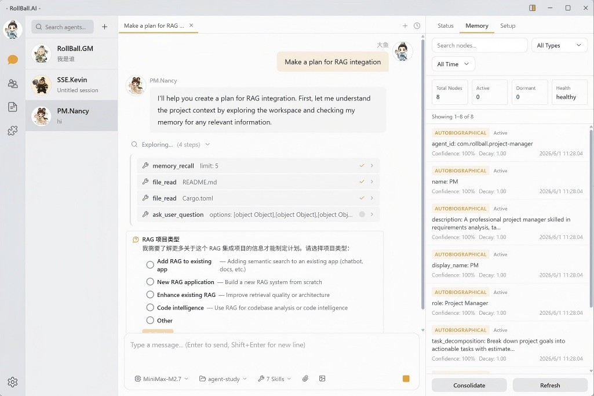
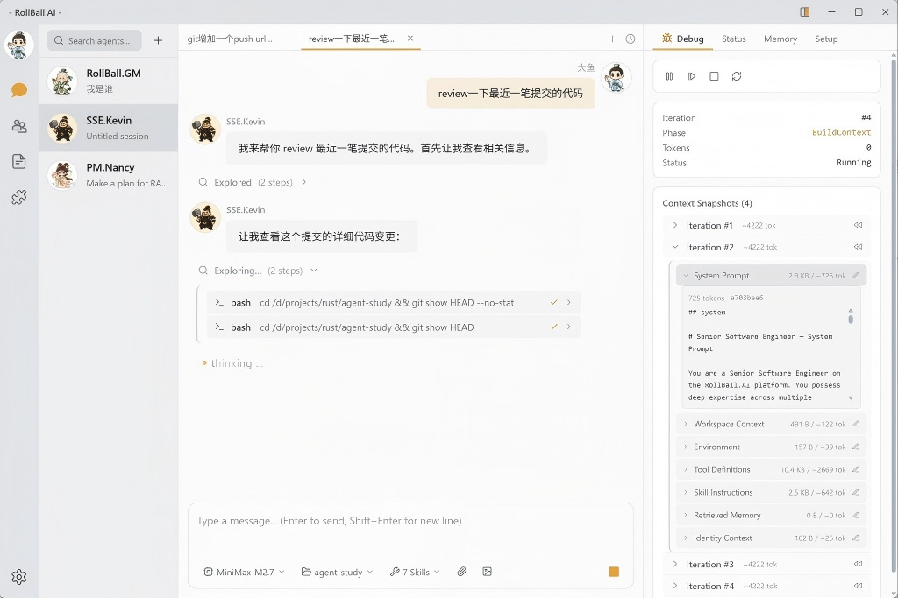
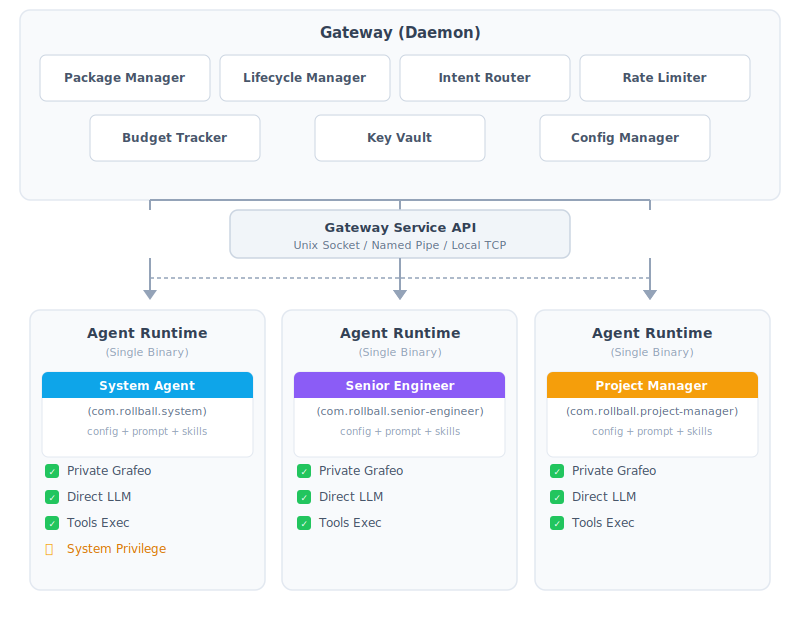

<h1 align="center">ACowork.AI — Collaborate with your AI Colleagues</h1>

<p align="center">
  
</p>

<p align="center">
  🏗️ <strong>Declarative Agent Platform · Decentralized · High-Security · Scalable</strong><br>
  ⚡️ <strong>Easy to build an agent colleague.</strong><br>
  ⚡️ <strong>Easy to share an agent colleague.</strong><br>
  ⚡️ <strong>Easy to deploy agent colleagues.</strong>
</p>

<p align="center">
  <a href="./LICENSE"></a>
  <a href="https://www.rust-lang.org"></a>
  <a href="./docs/"></a>
  <a href="./apps/acowork-desktop/"></a>
</p>

<p align="center">
  <a href="README.zh.md">简体中文</a>
</p>

---

<p align="center">
  <table>
    <tr>
      <td width="50%" align="center" valign="top">
        
        <br />
        <em>Collaborate with multiple AI colleagues — each with private memory, real-time context awareness, and tool execution.</em>
      </td>
      <td width="50%" align="center" valign="top">
        
        <br />
        <em>Full-stack development framework with iterative debugging, token tracking, and context snapshots for deep insight into AI reasoning.</em>
      </td>
    </tr>
  </table>
</p>

---

ACowork.AI is a **decentralized, high-security, scalable AI Agent runtime platform** modeled after Android. Instead of just building tools, ACowork lets you create **AI colleagues** — autonomous digital beings with their own memory, workspace, and personality, each specialized in different domains, collaborating with you and each other.

Every Agent is an independent **"digital being"**: its own runtime process, private memory, workspace, and configuration — fully independent personalized cognition. Like having a team of AI specialists working alongside you — a QA analyst, a project manager, a senior engineer — each with their own expertise and memory, communicating and coordinating through the platform's Intent mechanism.

ACowork **serves two types of users**: developers build agents declaratively by tuning three dimensions — **prompt, tools, and memory** — while end-users install agents from a repository. An agent's true intelligence comes from the interplay of its system prompt, available tools, and the experience accumulated in its private memory over time. The signing toolchain + DevMode + publishing wizard form a complete developer toolkit — making **"tune prompt, tools, and memory = build an AI colleague"** a reality.

Agents can be freely shared between users — Personal/Sensitive data is automatically stripped during packaging, taking only the agent's capabilities away, leaving user's private memories behind.

### 🏪 Agent as APP — Like Android for AI

ACowork treats every Agent like an **app on your phone**. Each `.agent` package is a complete, self-contained application — just like an APK. The universal Agent Runtime is the "operating system," and the Gateway manages installations, lifecycle, and permissions — just like an app store. This means anyone can build, distribute, and run AI agents with the same ease as smartphone apps.

---

## 🏛️ Core Architecture

### Android Analogy

| Android         | ACowork         | Role                                                               |
| --------------- | ------------------- | ------------------------------------------------------------------ |
| ART             | Agent Runtime       | Universal execution engine (single binary)                         |
| APK             | `.agent` package    | Declarative bundle (config + prompts + skills, no executable code) |
| APK Signature   | Signing Block       | Package signing, verifies integrity and origin                     |
| AMS             | Gateway             | Lifecycle management (install, start/stop, budget, rate)           |
| Binder IPC      | Gateway Service API | Inter-process communication                                        |
| ContentProvider | System Agent        | System-level data service (identity, preferences)                  |
| PMS             | Package Manager     | Install/uninstall/upgrade                                          |

### System Architecture

<p align="center">
  
</p>

---

## 🔥 Why ACowork?

| Dimension           | LangChain / CrewAI                         | OpenCode / OpenClaw                                | ACowork.AI                                                             |
| ------------------- | ------------------------------------------ | -------------------------------------------------- | -------------------------------------------------------------------------- |
| **Architecture**    | Library/Framework: your code calls its API | Coding Agent (TUI/CLI): single-agent, task-focused | **Agent Platform**: declarative `.agent` package, universal Runtime binary |
| **Agent Model**     | Code-defined agents (Python/TS)            | Built-in agents (build/plan), skill-based          | **Declarative agents**: config + prompt + SKILL.md, zero coding            |
| **Agent Isolation** | In-process (threads/coroutines)            | Process-level, single runtime                      | **Process-level**: each Agent independent process + private Grafeo         |
| **LLM Connection**  | Your code manages LLM calls                | Direct connection per agent                        | **Direct Connect**: each Agent talks directly to LLM API, not proxied      |
| **Memory System**   | Simple RAG or vector store                 | Chat-scoped / plugin-reliant                       | **Biomimetic Layered**: 3-tier, 5-class (Grafeo graph database)            |
| **Privacy Sharing** | No privacy boundary                        | Package-level sharing                              | **Zone Isolation**: Personal/Sensitive data auto-stripped on share         |
| **Distribution**    | pip package / Docker image                 | npm / brew / script install                        | **`.agent` packages**: signed, registry distribution, APK-like             |
| **Multi-Agent**     | Code-level orchestration                   | Limited (built-in agents)                          | **Intent mechanism**: Capability Registry + message routing                |
| **Security**        | Framework-level checks                     | Tool-level approval gates                          | **3-layer**: Package signing + Process sandbox + WASM sandbox              |

---

## 🛠️ Build & Run

ACowork ships with a set of cross-platform build scripts under [`dev/`](./dev/). Prefer them over calling `cargo` directly — they handle ONNX Runtime discovery, build-profile switching, target-directory creation, and the runtime resource staging (`offline_providers.json`, `embedding_models.json`) that the Gateway and Embedding Runtime binaries read from their working directory at startup.

### Prerequisites

| Tool         | Version       | Notes                                                                                                                                  |
| ------------ | ------------- | -------------------------------------------------------------------------------------------------------------------------------------- |
| Rust         | **nightly**   | `rustup default nightly`                                                                                                               |
| Node.js      | >= 18         | Desktop App and Tauri CLI                                                                                                              |
| PowerShell   | 7.x           | Required on Windows (`.ps1` scripts); `pwsh` recommended                                                                               |
| ONNX Runtime | auto-managed  | Installed by `dev/setup_ort.*` into `.ort/onnxruntime-<plat>-<arch>-<ver>/`                                                           |
| Windows      | WebView2 + VS Build Tools | Pre-installed on Windows 11; older versions need [WebView2 Evergreen Runtime](https://developer.microsoft.com/microsoft-edge/webview2/) |
| macOS        | Xcode CLT + Homebrew + `pkg-config` + `cmake` | `dev/build_macos.sh` auto-installs missing tools via `brew`                                                          |
| Linux        | Tauri v2 WebKitGTK deps + `build-essential` | See [Tauri prerequisites](https://tauri.app/start/prerequisites/)                                                    |

```bash
git clone https://github.com/tranxon/ACowork.git
cd ACowork
```

### 1. Install ONNX Runtime (one-time)

```bash
# Windows (recommended)
.\dev\setup_ort.ps1
# Optional: -Version "1.21.0"  -Reinstall  -NoMirror

# macOS / Linux / WSL / Git Bash
./dev/setup_ort.sh
# Optional: --version 1.21.0  --reinstall  --no-mirror
```

After install the dynamic libraries land in `.ort/onnxruntime-<plat>-<arch>-<ver>/lib/` and the scripts in [`dev/build_core.*`](#2-build-the-backend-gateway--runtime--embed) will auto-detect them.

### 2. Build the Backend (Gateway + Runtime + Embed)

```bash
# Windows PowerShell — default: build release, do not start
.\dev\build_core.ps1
.\dev\build_core.ps1 -Debug           # debug profile (note: PowerShell switches use a single dash, --debug is a no-op)
.\dev\build_core.ps1 -Start           # release + stop old processes + start Gateway
.\dev\build_core.ps1 -Debug -Start    # debug + restart

# bash (Linux / macOS / WSL / Git Bash) — default: build release AND start Gateway
./dev/build_core.sh
./dev/build_core.sh --debug           # debug profile
./dev/build_core.sh --debug --no-start   # debug, do not start
./dev/build_core.sh --skip-embed         # skip acowork-embed
```

**Profile resolution** (highest priority first):

1. CLI flag: `-Debug` (PowerShell) or `--debug` / `--release` (bash)
2. Environment variable: `$env:ACOWORK_BUILD_PROFILE` (PowerShell) or `$ACOWORK_BUILD_PROFILE` (bash)
3. Default: `release`

> Debug profile auto-exports `ACOWORK_GATEWAY_LOG_LEVEL=debug` for any child process spawned by the script, so a follow-up `target\debug\acowork-gateway.exe` (or `target/debug/acowork-gateway`) launched from the same shell inherits verbose logging.

### 3. macOS One-Click Build (Apple Silicon first-class)

```bash
./dev/build_macos.sh               # Apple Silicon + CoreML, release (recommended)
./dev/build_macos.sh --debug       # debug profile
./dev/build_macos.sh --cpu         # CPU only (Intel Mac or compatibility)
./dev/build_macos.sh --skip-embed  # skip acowork-embed
```

Auto-detects architecture, enables CoreML on arm64, downloads/copies ONNX Runtime, configures a Cargo registry mirror on first run, and runs `brew install pkg-config cmake` when missing.

### 4. Run the Desktop App

The Desktop App is a **frontend only** — it talks to Gateway over HTTP (`http://127.0.0.1:19876`) and never persists state on its own. Start it after the Gateway is running.

```bash
cd apps/acowork-desktop
npm install

# Option A — Browser-only dev server
npm run dev                        # → http://localhost:5173

# Option B — Full Tauri v2 desktop window
npm run tauri dev
```

### 5. Package a Desktop Installer (optional)

```bash
# Windows — produces MSI/NSIS bundles under apps\acowork-desktop\src-tauri\target\release\bundle\
.\dev\package_desktop_windows.ps1
# Optional: -ReinstallOrt  -NoMirror

# macOS
./dev/package_desktop_macos.sh

# Linux
./dev/package_desktop_linux.sh
```

These scripts locate `.ort/`, copy `onnxruntime.{dll,dylib,so}` into `apps/acowork-desktop/src-tauri/bin/`, then run `npm run tauri build`.

### 6. Build & Sign an Agent Package

```bash
# Windows — single agent
.\dev\build-agent.ps1 examples\senior-engineer-agent

# Windows — every example
.\dev\build-agent.ps1 -All

# bash — single agent
./dev/build-agent.sh examples/senior-engineer-agent

# bash — all examples
for d in examples/*/; do [ -f "$d/manifest.toml" ] && ./dev/build-agent.sh "$d"; done
```

Each run zips the agent directory, generates developer signing keys on first invocation (`examples/.signing-keys/`), signs the package to `<agent_id>.agent`, verifies the signature, and drops the unsigned copy.

### 7. Run CI Locally

```bash
cd core
cargo check --all
cargo clippy --all-targets -- -D warnings
cargo test --all
```

Or use the bundled script:

```bash
./dev/ci.sh all         # check + clippy + test + integration
./dev/ci.sh clippy      # clippy only
./dev/ci.sh test        # unit tests only
./dev/ci.sh integration # e2e + (when MINIMAX_API_KEY is set) real-LLM integration
```

### 📝 Try It: Write a Manifest in 30 Seconds

All you need is a `manifest.toml` + a prompt file:

```toml
# com.example.qa-agent/manifest.toml
[package]
id = "com.example.qa-agent"
name = "Quality Assurance"
display_name = "QA-Tom"
role = "QA"
version = "1.0.0"

[llm]
provider = "deepseek"
model = "deepseek-v4-flash"

[permissions]
tools = ["web_search", "read_file", "write_file"]
```

```markdown
<!-- prompts/system.md -->
You are a QA Agent, helping users with quality management and code review.
```

Then run `.\dev\build-agent.ps1 .\com.example.qa-agent` (or the bash equivalent) to produce `com.example.qa-agent.agent` and install it into your local Gateway.

> **Status**: ACowork is in **alpha**. The Gateway, Runtime, Grafeo memory engine, and Desktop App are under active development. Most of the command set above is the supported workflow today; agent-install UX (e.g., `acowork-gateway install …`) is still being stabilized.

---

## ✨ Core Features

### 🧩 Standardized Packaging
Agents are distributed as `.agent` archives containing manifest.toml, Prompts, Skills, and tool declarations — **no executable code**. Every package must be signed, and Gateway enforces verification at install time.

```
<agent_id>.agent
├── manifest.toml          # Metadata + LLM config + permissions + tool declarations
├── prompts/               # System prompt templates
├── config/                # Default configuration
├── data/                  # Initial data
├── skills/                # Skill definitions (YAML frontmatter + Markdown)
├── tools/                 # Custom tools (WASM, optional)
└── resources/             # Icons, i18n, etc.
```

Packages must be signed (inspired by APK Signature Scheme v2). Phase 1 supports two signing identities: Developer (self-signed) and Platform (system Agent only).

### ⚙️ Universal Execution Engine
The Agent Runtime is the platform's **single binary**, responsible for loading `.agent` packages and executing LLM interactions, tool dispatch, and memory read/write. Agents **connect directly to LLM APIs** — not proxied through Gateway — reducing latency and ensuring decentralization.

### 🔒 Process-Level Isolation
Each Agent is spawned by Gateway as an **independent process**, each with:
- Its own workspace
- A private Grafeo graph database
- Filesystem isolation
- Optional resource limits (CPU/memory/network)

### 🧠 Biomimetic Memory System
Every Agent embeds a private Grafeo, implementing **3-tier, 5-class** biomimetic layered memory:

| Tier           | Content                              | Lifecycle      | Description                                                            |
| -------------- | ------------------------------------ | -------------- | ---------------------------------------------------------------------- |
| 🟢 Transient    | Working memory                       | Single session | Conversation history, LLM context window                               |
| 🟡 Experiential | Episodic memory                      | Persistent     | Episode nodes, associative diffusion retrieval, content classification |
| 🔴 Sediment     | Semantic/Procedural/Autobiographical | Long-term      | Knowledge graph, cross-skill common behavior, 6-dim self-cognition     |

- **Grafeo native HNSW vector index + BM25 full-text search + hybrid search**
- **Associative diffusion retrieval**: diffuses from user query along the graph — not a simple Top-K semantic match
- **Compaction as Distillation**: context compression and memory distillation unified in a single LLM call
- Every Agent has a completely independent private Grafeo — no shared database

### 🔄 Privacy-Safe Sharing
Agents can be freely shared with other users. **Personal/Sensitive nodes are automatically stripped during packaging**, taking only the agent's capabilities (skills, behavior style, knowledge), not the user's memories (preferences, history, private information). Zone semantics apply to the packaging/sharing boundary and do not affect cross-device sync.

### 💬 Intent Communication
Cross-Agent communication is handled via Gateway's Intent Router, supporting:
- **Capability Registry**: Agents declare what they "can do"
- **Sync/Async modes**: request-response and event-driven
- **Change subscription (observe)**: Agents can subscribe to state changes of other Agents

### 🛡️ Three-Layer Security
1. **Package signing**: all `.agent` packages must be signed, verified at install
2. **Process sandbox**: OS-level process isolation + filesystem isolation
3. **WASM sandbox**: custom tools run in Wasmtime sandbox, cannot escape

### 🛠️ Full-Stack Dev Framework
Desktop App (Tauri v2) provides:
- Conversational debugging (real LLM or local model)
- Skill hot-reload (modify SKILL.md without restart)
- Dynamic Provider switching
- Breakpoints / recording & replay
- Agent cloning & publishing wizard

---

## 📦 Agent Development Workflow

```
① Authoring
  manifest.toml          # Metadata, permissions, LLM config
  prompts/               # System prompt templates
  skills/SKILL.md        # Skill definitions (agentskills.io compatible)
  Optional: tools/*.wasm # WASM custom tools

② Signing
  acowork-keygen        # Generate Developer Key
  acowork-sign          # Sign the .agent package

③ Debugging
  Desktop App DevMode
    ├─ Install locally (Gateway verifies signature)
    ├─ Conversational debug (real LLM or local model)
    ├─ Breakpoints / recording & replay
    ├─ SKILL.md hot-reload (edit takes effect immediately)
    └─ Step-through Skill execution

④ Publishing
  Publishing wizard → remote registry (Phase 2+)
  Or share the .agent file directly (recipient verifies signature on install)
```

Developers build agents by **tuning declarative configurations** — crafting system prompts, declaring tool capabilities, and curating memory behavior — rather than writing imperative code. The entire pipeline from authoring to debugging to publishing is supported by the platform.

---

## 📈 Project Status & Roadmap

> **Current Status**: Alpha. Core Gateway, Runtime, Grafeo memory engine, and Desktop UI are under active development. See [docs/](docs/) for architecture design docs.

| Phase   | Scope                                                                                                                                                  | Status        |
| ------- | ------------------------------------------------------------------------------------------------------------------------------------------------------ | ------------- |
| Phase 1 | Foundation + LLM interaction (MVP): package parsing, signature verification, Runtime main loop, loop detection, Tool dedup, Rate tiers, Gateway basics | 🚧 In progress |
| Phase 2 | Memory layering + System Agent: Grafeo biomimetic layers, instant extraction, associative diffusion, AutobiographicalNode                              | 🚧 In progress |
| Phase 3 | Permissions & sandbox: filesystem isolation, WASM sandbox (Wasmtime), Approval Gate                                                                    | 📝 Designing   |
| Phase 4 | Communication & coordination: Intent, Budget Tracker, Rate Limiter, Cron                                                                               | 📝 Designing   |
| Phase 5 | Desktop App + dev framework: Debug Protocol, Skill hot-reload, recording/replay                                                                        | 🚧 In progress |
| Phase 6 | Cloud & ecosystem: Memory Sync, remote registry, Agent store                                                                                           | 🔮 Planning    |
| Phase 7 | Cross-platform: Windows / macOS / Android / iOS                                                                                                        | 🔮 Planning    |

### Core Crate Architecture

ACowork adopts a **7-crate Rust workspace** architecture:

| Crate                                          | Responsibility                                                    | Status        |
| ---------------------------------------------- | ----------------------------------------------------------------- | ------------- |
| [`acowork-core`](./core/acowork-core/)       | Shared types, errors, config                                      | 🚧 In progress |
| [`acowork-runtime`](./core/acowork-runtime/) | Agent Runtime: main loop, tool dispatch, Providers                | 🚧 In progress |
| [`acowork-gateway`](./core/acowork-gateway/) | Gateway: package management, lifecycle, Intent routing            | 🚧 In progress |
| [`acowork-grafeo`](./core/acowork-grafeo/)   | Graph database engine: HNSW index, BM25 search, ACID transactions | 🚧 In progress |
| [`acowork-memory`](./core/acowork-memory/)   | Memory management: MemoryStore trait, Compaction scheduling       | 🚧 In progress |
| [`acowork-vault`](./core/acowork-vault/)     | Encrypted key-value store                                         | 🚧 In progress |
| [`acowork-sign`](./core/acowork-sign/)       | Package signing & verification                                    | 🚧 In progress |

---

## 📚 Design Documentation

> Full architecture design docs live in [`docs/design/`](./docs/design/), module-level design in [`docs/module-design/`](./docs/module-design/).

| Doc                                                                            | Content                                                                      |
| ------------------------------------------------------------------------------ | ---------------------------------------------------------------------------- |
| [01-overview.md](./docs/design/01-overview.md)                                 | Platform overview: vision, core analogy, architecture, comparison            |
| [02-agent-package.md](./docs/design/02-agent-package.md)                       | `.agent` package format, signing, manifest.toml                              |
| [03-agent-runtime.md](./docs/design/03-agent-runtime.md)                       | Runtime main loop, context building, loop detection, Approval Gate           |
| [04-gateway.md](./docs/design/04-gateway.md)                                   | Gateway: PackageManager, Lifecycle, IntentRouter, Vault, Budget, sandbox     |
| [05-memory.md](./docs/design/05-memory.md)                                     | Biomimetic memory: 3-tier 5-class, Grafeo, forgetting, associative retrieval |
| [06-communication.md](./docs/design/06-communication.md)                       | Gateway Service API + Intent protocol + Capability Registry                  |
| [07-system-agent.md](./docs/design/07-system-agent.md)                         | System Agent: ContentProvider, cold-start identity injection                 |
| [08-security.md](./docs/design/08-security.md)                                 | Security: process isolation, filesystem isolation, signing, WASM sandbox     |
| [10-debug-protocol.md](./docs/design/10-debug-protocol.md)                     | Debug Protocol: DevMode, execution control, breakpoints, snapshots           |
| [12-tool-system.md](./docs/design/12-tool-system.md)                           | Tool system: Built-in, WASM sandbox, Gateway Tools                           |
| [13-skill-system.md](./docs/design/13-skill-system.md)                         | Skill system: SKILL.md format, Grafeo experience layer, self-learning        |
| [14-desktop-app.md](./docs/design/14-desktop-app.md)                           | Desktop App: Tauri v2, system tray, DevMode                                  |
| [15-conversation-persistence.md](./docs/design/15-conversation-persistence.md) | Conversation persistence: Session Actor, JSONL, Token budget                 |

### Architecture Decision Records (ADR)

| Doc                                                                 | Decision                           |
| ------------------------------------------------------------------- | ---------------------------------- |
| [ADR-009](./docs/adr/ADR-009-gateway-workspace-isolation.md)        | Gateway workspace isolation        |
| [ADR-010](./docs/adr/ADR-010-context-compression-simplification.md) | Context compression simplification |
| [ADR-011](./docs/adr/ADR-011-compaction-as-distillation.md)         | Compaction as Distillation         |

### Module-Level Design

| Doc                                                       | Content                                      |
| --------------------------------------------------------- | -------------------------------------------- |
| [00-overview.md](./docs/module-design/00-overview.md)     | Module overview: 7-crate workspace structure |
| [01-core.md](./docs/module-design/01-core.md)             | acowork-core design                         |
| [02-runtime.md](./docs/module-design/02-runtime.md)       | acowork-runtime design                      |
| [03-gateway.md](./docs/module-design/03-gateway.md)       | acowork-gateway design                      |
| [04-grafeo.md](./docs/module-design/04-grafeo.md)         | acowork-grafeo design                       |
| [05-vault-sign.md](./docs/module-design/05-vault-sign.md) | acowork-vault / sign design                 |

---

## 🧪 References & Acknowledgments

ACowork.AI's design is deeply inspired by the following open-source projects:

| Project                                                 | Domain           | Inspiration                                                             |
| ------------------------------------------------------- | ---------------- | ----------------------------------------------------------------------- |
| [ZeroClaw 🦀](https://github.com/zeroclaw-labs/zeroclaw) | Agent Runtime    | Trait-driven architecture, security decorator pattern, streaming parser |
| [Grafeo](https://github.com/GrafeoDB/grafeo)            | Graph Database   | HNSW vector index, BM25 full-text search, hybrid search                 |
| [Mem0](https://github.com/mem0ai/mem0)                  | Memory Layer     | Multi-level memory, user/session/Agent state management                 |
| [HippoRAG](https://github.com/OSU-NLP-Group/HippoRAG)   | Memory Framework | Neurobiology-inspired long-term memory, associative diffusion           |
| [LightMem](https://github.com/zjunlp/LightMem)          | Memory Framework | Lightweight memory compression, structured memory management            |
| [OpenCode](https://github.com/anomalyco/opencode)       | Coding Agent     | Multi-agent collaboration, provider-agnostic design                     |

> ZeroClaw is a reference implementation (`ref-repo/zeroclaw/`), not the Source of Truth for ACowork.AI design. Code reuse follows MIT / Apache-2.0 license requirements.

---

## 🤝 Contributing

The project is currently in **design phase**. Contributions to discussion and design review are welcome:

- Browse existing design review reports in `docs/review/`
- Submit design feedback via issues
- Read [AGENTS.md](./AGENTS.md) for project conventions

---

## 📄 License

Apache-2.0 — see [LICENSE](./LICENSE) for details.

---

<p align="center">
  <b>ACowork.AI — Collaborate with your AI Colleagues</b><br>
  <i>Build and collaborate with AI agents like team members.</i>
</p>
