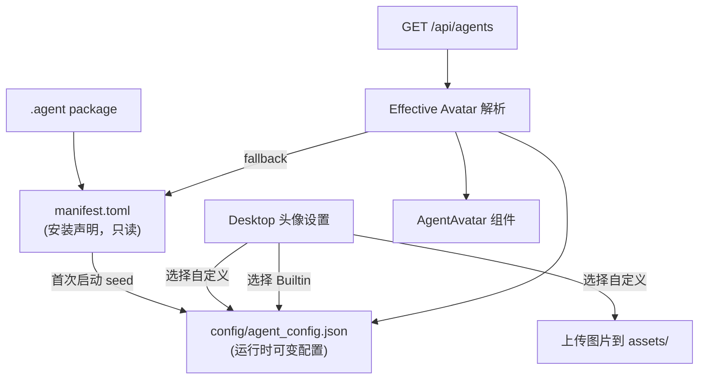

# ADR-017: Agent 头像运行时配置 — manifest 为安装默认值，agent_config.json 为运行时可变配置

**状态**：草案（待实施）
**日期**：2026-07-10
**决策者**：架构讨论
**影响范围**：

- `core/acowork-core/src/protocol.rs`（`RuntimeConfigUpdate` / `ConfigSnapshot` 新增 `avatar` / `builtin_avatar` 字段）
- `core/acowork-runtime/src/agent_config.rs`（`AgentConfig` 新增 `avatar` / `builtin_avatar` 字段）
- `core/acowork-runtime/src/agent/session/session_manager.rs`（`RuntimeConfigOverrides` 新增头像字段）
- `core/acowork-runtime/src/startup/session_init.rs`（首次启动从 manifest seed 头像到 agent_config.json）
- `core/acowork-runtime/src/cli.rs`（`RuntimeConfigUpdate` 处理新增头像字段持久化）
- `core/acowork-runtime/src/grpc/client.rs`（protobuf 桥接新增头像字段）
- `core/acowork-core/src/proto_bridge.rs`（同上）
- `core/acowork-gateway/src/http/agents.rs`（新增 `GET/PUT /api/agents/:id/avatar-config`；`list_agents` / `get_agent_detail` 返回 effective avatar）
- `core/acowork-gateway/src/http/agent_config.rs`（DTO 新增头像字段）
- `apps/acowork-desktop/src/components/results/AgentSetupTab.tsx`（头像设置改为双 tab：自定义 / Builtin）
- `apps/acowork-desktop/src/components/common/AgentAvatar.tsx`（渲染来源改为 effective avatar）
- `apps/acowork-desktop/src/lib/avatar.ts`（新增自定义头像列表 URL helper）
- `apps/acowork-desktop/src/lib/types.ts`（新增 `AgentAvatarAsset` 类型）
- `apps/acowork-desktop/src/stores/agentStore.ts`（头像刷新逻辑调整）

---

## 背景

### 问题 1：前端只能设置 builtin icon，无法使用预装自定义头像

当前 Agent 设置页（`AgentSetupTab.tsx`）的头像选择器只展示 builtin icon grid，用户选择后写入前端 localStorage 的 `profile.avatarIconId`。但 agent 包本身已经支持 `manifest.toml` 中的 `avatar = "assets/avatar.jpg"`，即安装目录中的预装自定义头像。这个能力在前端完全没有暴露。

### 问题 2：manifest.toml 被当作运行时可变配置

当前 PublishWizard 通过 `POST /api/agents/:id/manifest/avatar` 直接修改 `manifest.toml` 的 `avatar` / `builtin_avatar` 字段。这违反了 manifest 作为"安装声明文件"的语义——用户修改头像属于个人/本机运行时偏好，不应反向写回 package 声明。

直接写 manifest 带来的问题：

| 问题 | 说明 |
|---|---|
| 包声明被污染 | 用户修改头像后 manifest 不再代表原始 package |
| 升级语义混乱 | package 升级时新 manifest 是否覆盖用户改动？ |
| 发布语义混乱 | 再次 build/publish 可能把用户运行时偏好打进包 |
| 回滚困难 | 无法区分"作者默认值"和"用户设置值" |
| 权责不清 | Gateway/Runtime 已在向 `config/agent_config.json` 收敛运行时配置 |

### 问题 3：缺少自定义头像列表和上传能力

用户无法：
- 查看安装目录中已有的自定义头像文件（如 `assets/avatar.jpg`、`assets/avatar-02.jpg`）
- 上传新的自定义头像到安装目录
- 在多个自定义头像之间切换

---

## 决策

### 核心原则

1. **manifest.toml 只作为安装声明和初始推荐值** — 由 agent 作者或发布流程生成，安装后不再因用户设置头像而修改
2. **运行时头像配置写入 `config/agent_config.json`** — 与 `max_output_tokens`、`max_iterations` 等运行时配置同文件，由 Runtime 管理持久化
3. **初始化时从 manifest seed** — 首次创建 `agent_config.json` 时，`avatar` / `builtin_avatar` 从 `manifest.toml` 拷贝默认值
4. **前端头像设置改为双 tab** — 自定义 tab 列出安装目录中的头像文件并支持上传新文件；Builtin tab 保留现有 icon grid
5. **Gateway 可读写头像配置** — 头像属于 UI metadata，不参与 Runtime 执行逻辑，Gateway 需要能在 agent stopped 时读取

### 有效头像解析优先级

```
1. config/agent_config.json.avatar          ← 用户运行时选择的自定义头像
2. config/agent_config.json.builtin_avatar  ← 用户运行时选择的 builtin icon
3. manifest.toml.avatar                     ← 安装默认值（fallback）
4. manifest.toml.builtin_avatar             ← 安装默认值（fallback）
5. deterministic/random builtin fallback    ← 最终兜底
```

规则：`avatar` 和 `builtin_avatar` 互斥——设置一个时清空另一个。

### 数据流



### 字段设计

`config/agent_config.json` 新增字段（沿用 manifest 字段名，保持一致性）：

```json
{
  "max_output_tokens": 32768,
  "max_iterations": 200,
  "avatar": "assets/avatar-02.jpg",
  "builtin_avatar": null
}
```

或选择 builtin：

```json
{
  "avatar": null,
  "builtin_avatar": "icon-05"
}
```

### API 设计

#### 新增 `GET /api/agents/:id/avatar-config`

获取当前 effective avatar 配置。不要求 agent running。

响应：

```json
{
  "agent_id": "com.example.agent",
  "avatar": "assets/avatar-02.jpg",
  "builtin_avatar": null,
  "source": "config"
}
```

`source` 表示当前生效值的来源：`"config"` | `"manifest"` | `"fallback"`。

#### 新增 `PUT /api/agents/:id/avatar-config`

更新头像配置。不要求 agent running。直接写 `config/agent_config.json`（read-modify-write merge，只改 avatar 字段，保留其他字段）。

请求：

```json
{
  "avatar": "assets/avatar-02.jpg",
  "builtin_avatar": ""
}
```

语义：

| 字段值 | 含义 |
|---|---|
| 非空字符串 | 设置为该值 |
| `""` | 清空该字段 |
| 字段缺省 | 不修改 |

规则：设置 `avatar` 时自动清空 `builtin_avatar`，反之亦然。

#### 新增 `GET /api/agents/:id/manifest/avatar-assets`

列出安装目录中符合命名模式的自定义头像文件。

响应：

```json
{
  "agent_id": "com.example.agent",
  "assets": [
    { "relative_path": "assets/avatar.jpg" },
    { "relative_path": "assets/avatar-02.jpg" }
  ]
}
```

匹配规则：`assets/avatar*.{png,jpg,jpeg,gif,webp,svg}`，排序 `avatar.*` 优先，然后 `avatar-02.*`、`avatar-03.*` 等。

#### 新增 `GET /api/agents/:id/avatar-file?path=assets/avatar-02.jpg`

预览未选中的自定义头像文件。path traversal guard + 扩展名白名单。返回 image bytes。

#### 复用 `POST /api/agents/:id/manifest/file?path=...`

上传新自定义头像到安装目录。已有实现，无需修改。

#### 修改 `GET /api/agents` / `GET /api/agents/:id`

`list_agents` 和 `get_agent_detail` 返回的 `avatar` / `builtin_avatar` 改为 effective 值（config 优先，manifest fallback）。

### 初始化策略

Runtime 启动时（`session_init.rs`）：

```rust
if agent_config.json 不存在:
    agent_cfg.avatar = manifest.avatar.clone();
    agent_cfg.builtin_avatar = manifest.builtin_avatar.clone();
    save_agent_config(work_dir, &agent_cfg);
else:
    // 已有 config，不覆盖。缺失头像字段时 GET API fallback manifest
    load existing config
```

兼容已有安装：`agent_config.json` 已存在但无 avatar 字段时，GET API 返回 manifest 值作为 effective avatar，`source = "manifest"`。不自动写入文件，等用户第一次保存后再写入。

### 并发安全

Gateway 和 Runtime 都可能写 `config/agent_config.json`。必须使用 read-modify-write merge：

- Gateway 更新头像时：load → 只改 `avatar` / `builtin_avatar` → atomic write（tmp + rename）
- Runtime 更新执行配置时：load → 只改执行字段 → atomic write（tmp + rename）

双方都只修改自己负责的字段，保留对方字段不变。

### 前端交互

`AgentSetupTab.tsx` 头像区域改为两个 tab：

```
┌──────────────────────────────────────┐
│  [自定义图标]  [Builtin 图标]         │
├──────────────────────────────────────┤
│                                      │
│  ┌────┐ ┌────┐ ┌────┐ ┌────┐       │
│  │    │ │    │ │    │ │ +  │       │
│  │ 🖼  │ │ 🖼  │ │ 🖼  │ │    │       │
│  │    │ │    │ │    │ │    │       │
│  └────┘ └────┘ └────┘ └────┘       │
│  avatar  av-02  av-03   新增        │
│                                      │
└──────────────────────────────────────┘
```

- 自定义 tab：列出 `avatar-assets` 返回的文件，点击选中，高亮当前。圆圈 `+` 按钮触发文件选择 → 上传 → 刷新列表 → 自动选中新文件
- Builtin tab：保留现有 icon grid，点击选中
- 切换 tab 或选中项时调用 `PUT /api/agents/:id/avatar-config`
- 保存后清除 avatar blob cache + `fetchAgents()` 刷新 UI

---

## 替代方案

### 方案 A：直接写 manifest.toml（已否决）

当前 PublishWizard 的做法。问题见背景部分。

### 方案 B：新建独立文件 `config/agent_profile.json`

将头像配置与执行配置分离，避免 Gateway/Runtime 并发写同一文件。

优点：边界更清晰，Gateway 可以完全拥有 profile 文件
缺点：多一个配置文件，增加复杂度；当前 `agent_config.json` 已经是 per-agent runtime config 的聚集地

**选择不采用**：头像字段数量少（2 个），不值得为它单独建文件。read-modify-write merge 足以保证并发安全。

### 方案 C：头像配置只存前端 localStorage

当前 `AgentSetupTab` 的做法（`profile.avatarIconId`）。

优点：实现简单
缺点：不跨设备同步；不反映 agent 包作者的默认值；与 manifest 预装头像割裂

**选择不采用**：需要服务端持久化以支持跨设备、跨重启的一致性。

---

## 实施计划

### Phase 1：数据结构扩展

**文件**：`core/acowork-runtime/src/agent_config.rs`

- `AgentConfig` 新增 `avatar: Option<String>`、`builtin_avatar: Option<String>`
- 新增 `seed_avatar_from_manifest_if_missing(work_dir, manifest)` helper

**文件**：`core/acowork-runtime/src/agent/session/session_manager.rs`

- `RuntimeConfigOverrides` 新增 `avatar`、`builtin_avatar`
- 更新 `is_empty()`、`merge()`、测试

**文件**：`core/acowork-core/src/protocol.rs`

- `RuntimeConfigUpdate` 新增 `avatar`、`builtin_avatar`
- `ConfigSnapshot` 新增 `avatar`、`builtin_avatar`

**文件**：`core/acowork-core/src/proto_bridge.rs`、`core/acowork-runtime/src/grpc/client.rs`

- 同步 protobuf 桥接字段

### Phase 2：Gateway API

**文件**：`core/acowork-gateway/src/http/agents.rs`

- 新增 `GET /api/agents/:id/avatar-config`
- 新增 `PUT /api/agents/:id/avatar-config`
- 新增 `GET /api/agents/:id/manifest/avatar-assets`
- 新增 `GET /api/agents/:id/avatar-file?path=...`
- 修改 `list_agents` / `get_agent_detail` 返回 effective avatar

**文件**：`core/acowork-gateway/src/http/agent_config.rs`

- DTO 新增 `avatar`、`builtin_avatar` 字段

### Phase 3：Runtime 初始化 & 持久化

**文件**：`core/acowork-runtime/src/startup/session_init.rs`

- 首次启动从 manifest seed avatar 到 agent_config.json

**文件**：`core/acowork-runtime/src/cli.rs`

- `RuntimeConfigUpdate` 处理新增头像字段并持久化

### Phase 4：前端

**文件**：`apps/acowork-desktop/src/lib/types.ts`

- 新增 `AgentAvatarAsset`、`AgentAvatarAssetsResponse`、`AvatarConfigResponse` 类型

**文件**：`apps/acowork-desktop/src/lib/avatar.ts`

- 新增 `resolveAgentAvatarFileUrl(agentId, relativePath)` helper
- 新增 `fetchAvatarAssets(agentId)` helper
- 保存后清除 blob cache 策略

**文件**：`apps/acowork-desktop/src/components/results/AgentSetupTab.tsx`

- 替换当前 inline builtin picker 为双 tab 组件
- 自定义 tab：列表 + 上传按钮
- Builtin tab：保留现有 grid

**文件**：`apps/acowork-desktop/src/components/common/AgentAvatar.tsx`

- 渲染来源改为 effective avatar（从 agent list/detail API 获取）

**文件**：`apps/acowork-desktop/src/stores/agentStore.ts`

- 头像保存后调用 `fetchAgents()` 刷新

---

## 回滚

- 新 API 为增量添加，不影响现有 `/api/agents/:id/config` 和 `/api/agents/:id/manifest/avatar`
- `agent_config.json` 新增字段使用 `skip_serializing_if = "Option::is_none"`，旧版 Runtime 忽略未知字段
- 前端可 feature-flag 控制是否显示新 tab，出问题回退到纯 builtin picker
- PublishWizard 的 manifest avatar 写入逻辑暂时保留不动，后续单独迁移

---

## 待确认

1. 自定义头像文件命名模式是否接受 `avatar-02.jpg` 这种 `-XX` 后缀？还是用其他模式（如 `avatar-2.jpg`）？
2. 是否需要支持删除自定义头像？
3. 上传新头像后是否自动选中？还是只加入列表、用户手动点击选中？
