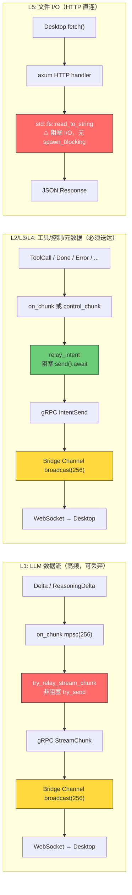
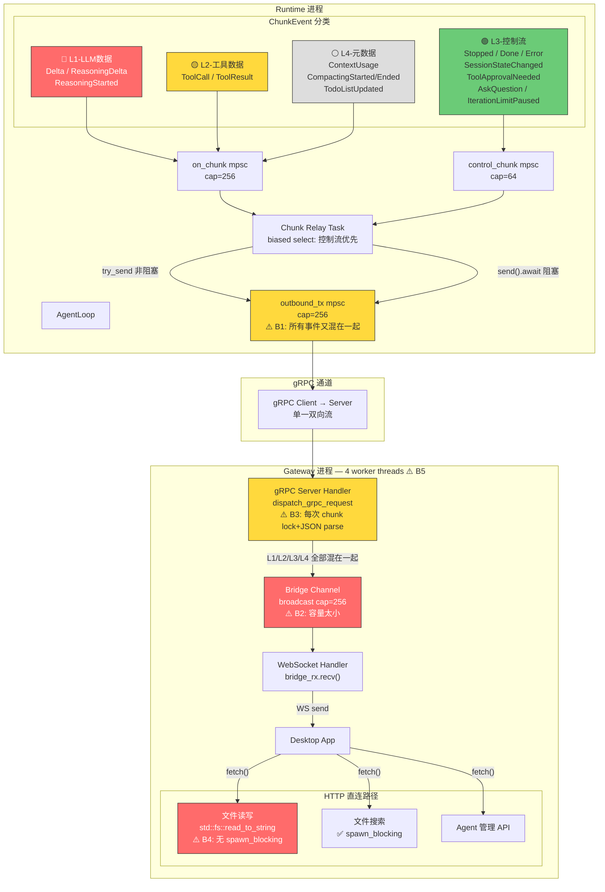
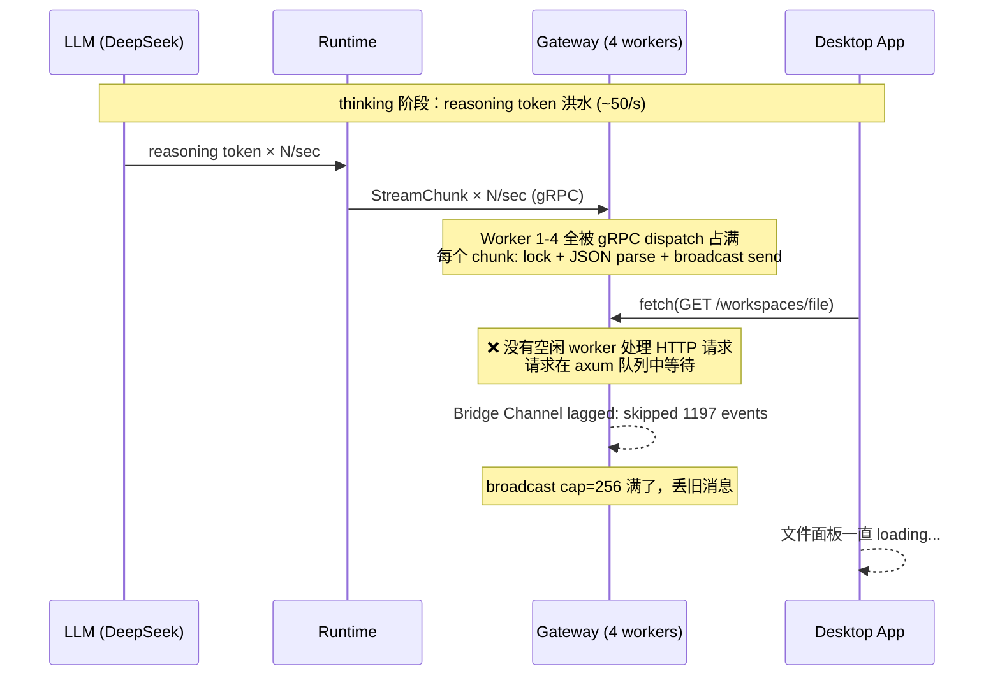
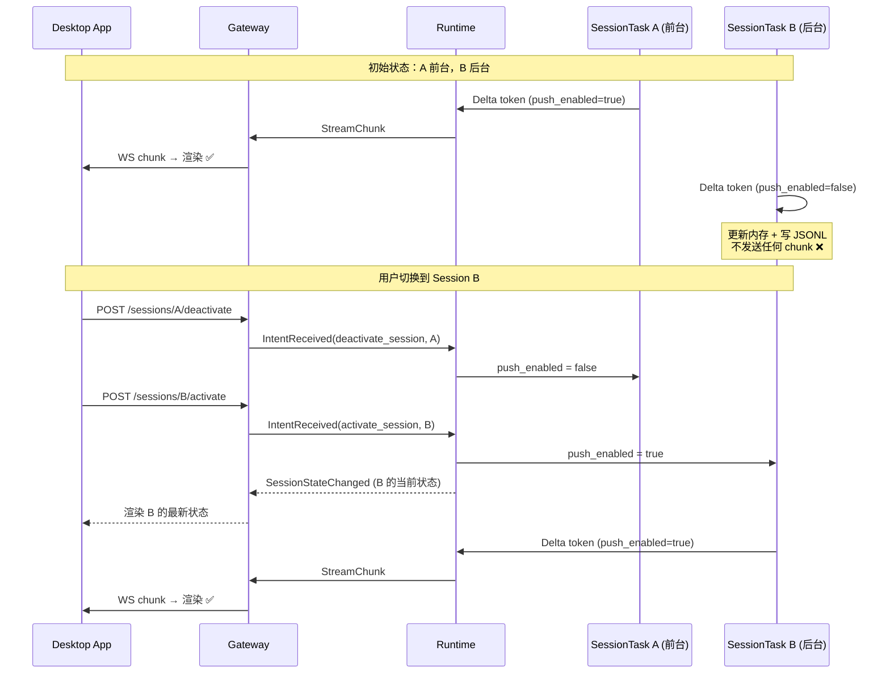
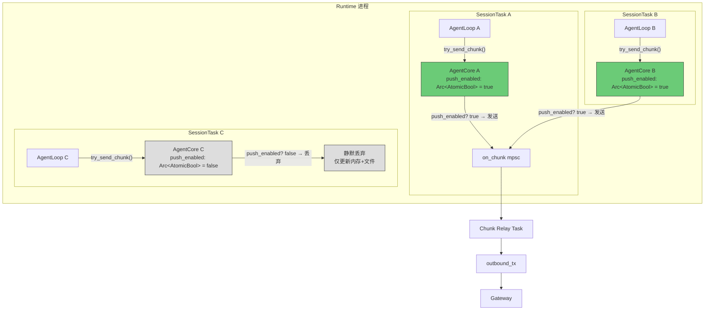
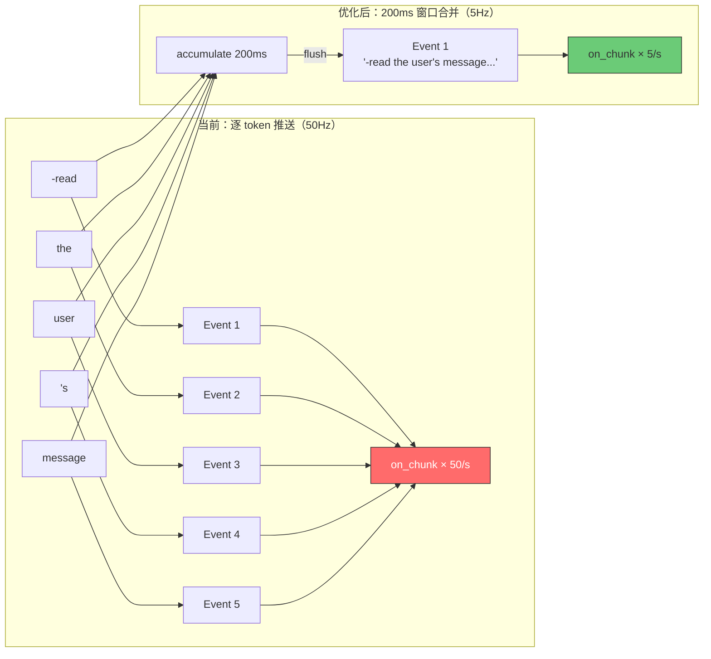
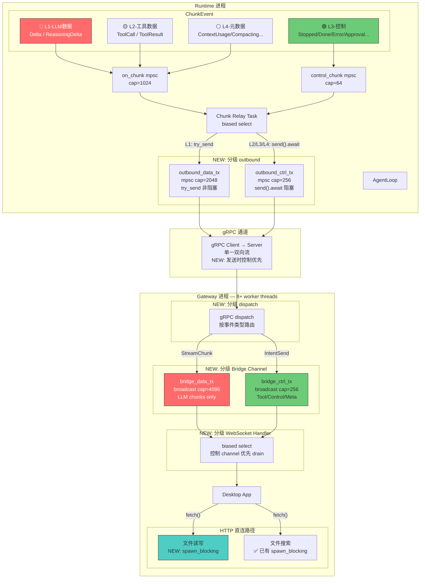

# ADR-020: 端到端数据流分级 — 解决 LLM Streaming 阻塞文件 I/O 及其他控制通道

**状态**：已实施 P0
**日期**：2026-06-29
**决策者**：架构讨论
**影响范围**：

**P0 — 紧急修复 + 参数提取（已完成 ✅）：**
- `core/acowork-gateway/src/http/workspaces.rs`（`read_file` / `read_raw_file` 加 `spawn_blocking`）
- `core/acowork-gateway/src/cli.rs`（worker_threads 4→8，改为引用 `DataFlowConfig`）
- `core/acowork-gateway/src/config.rs`（新增 `DataFlowConfig` 子结构体）
- `core/acowork-runtime/src/config.rs`（新增 `DataFlowConfig` 子结构体）
- `core/acowork-gateway/src/gateway/mod.rs`（Bridge/capability channel 容量引用 config）
- `core/acowork-gateway/src/grpc/server.rs`（gRPC outbound/IPC push 容量引用 config）
- `core/acowork-runtime/src/startup/agent_init.rs`（on_chunk/control_chunk 容量引用 config）
- `core/acowork-runtime/src/grpc/client.rs`（outbound 容量引用 config）

**P1 — Session 级按需推送（5 处，~120 行）：**
- `core/acowork-runtime/src/agent/agent_core.rs`（新增 `push_enabled` 开关，`try_send_chunk` 加过滤）
- `core/acowork-runtime/src/agent/session/session_task.rs`（处理 `EnablePush` / `DisablePush` 消息）
- `core/acowork-runtime/src/cli.rs`（`activate_session` 开启推送，新增 `deactivate_session` 关闭推送）
- `core/acowork-gateway/src/http/chat.rs`（新增 `POST /sessions/{id}/deactivate` 端点）
- `apps/acowork-desktop/src/stores/agentStore.ts`（`switchSession` 调用 deactivate + activate）

**P2 — 事件类型级双 channel（4 处，~170 行）：**
- `core/acowork-gateway/src/gateway/mod.rs`（Bridge Channel 拆分为 data + ctrl）
- `core/acowork-gateway/src/grpc/dispatch.rs`（按事件类型路由到不同 channel）
- `core/acowork-gateway/src/http/chat.rs`（WebSocket handler biased select 双 channel）
- `core/acowork-gateway/src/ipc/server.rs`（IPC dispatch 按事件类型路由）
- `core/acowork-runtime/src/startup/subsystems.rs`（outbound_tx 拆分为 data + ctrl）
- `core/acowork-runtime/src/startup/agent_init.rs`（创建双 channel）
- `core/acowork-runtime/src/grpc/client.rs`（暴露双 sender）

**P3 — 容量与优先级调优（3 处，~40 行）：**
- `core/acowork-gateway/src/grpc/server.rs`（gRPC dispatch 加优先级处理）
- 多处 channel 容量调整

---

## 背景

### 问题现象

用户在聊天框 streaming 状态（特别是 DeepSeek thinking 模式）下，点击右侧文件目录面板中的文件无法打开，一直处于加载中状态。Gateway 日志出现：

```
WARN Bridge channel lagged for com.acowork.senior-engineer: skipped 1197 events
```

用户怀疑文件内容获取和 LLM stream 共用 channel 导致阻塞。

### 初步排查结论

**文件读取和 LLM streaming 不走同一个 channel。** 文件读取是纯 HTTP 端点（`GET /api/agents/{agent_id}/workspaces/file`），直接调用 `std::fs::read_to_string`，不经过 Bridge Channel。

但经过完整代码追踪，发现了更深层的架构问题。

---

## 数据流全景分析

### 系统中存在 7 类数据流

| # | 数据流类型 | 频率 | 可丢弃 | 延迟敏感 | 代表事件 |
|---|-----------|------|--------|---------|---------|
| L1 | LLM 数据流 | 极高 (~50/s) | ✅ | 低 | `Delta`, `ReasoningDelta`, `ReasoningStarted` |
| L2 | 工具数据流 | 低 | ❌ | 中 | `ToolCall`, `ToolResult` |
| L3 | 控制流 | 极低 | ❌ | **高** | `Stopped`, `Done`, `Error`, `SessionStateChanged`, `ToolApprovalNeeded`, `AskQuestion`, `IterationLimitPaused` |
| L4 | 元数据流 | 低 | ✅ | 低 | `ContextUsage`, `CompactingStarted/Ended`, `TodoListUpdated` |
| L5 | 文件 I/O（HTTP） | 低 | ❌ | **高** | 文件读写、目录列表、内容搜索 |
| L6 | Agent 管理（HTTP） | 低 | ❌ | 中 | 安装/启动/停止/配置 |
| L7 | gRPC 请求-响应 | 低 | ❌ | 中 | Memory 查询、Session 查询、Config 查询 |

### 数据流路径对比



> **关键发现**：L1 和 L2/L3/L4 在 Runtime 内部已经分道（`on_chunk` vs `control_chunk`），但在 `outbound_tx` 又汇合，在 Gateway 的 Bridge Channel 再次汇合。L5 虽然走独立 HTTP 路径，但与 gRPC dispatch 共享 tokio worker thread。

### 关键发现：所有 Session 共享同一套 Channel

经过代码追踪确认：**所有运行中的 session（前台+后台）的数据流全部经过同一套 channel，没有任何 session 级别的隔离。**

```
Session A (前台, thinking) ──┐
Session B (后台, thinking) ──┤
Session C (后台, idle)     ──┼──→ 同一个 on_chunk mpsc(256)
                             │         ↓
                             │    同一个 Chunk Relay Task
                             │         ↓
                             │    同一个 outbound_tx mpsc(256)
                             │         ↓
                             │    同一个 gRPC 双向流
                             │         ↓
                             │    同一个 Bridge Channel broadcast(256)
                             │         ↓
                             └──→ 同一个 WebSocket → Desktop App
```

**证据**：

- `agent_init.rs:395-396`：整个 Runtime 进程只创建**一对** `(chunk_tx, chunk_rx)`
- `session_manager.rs:350-351`：每个 `SessionTask` 拿到的是**同一个 `chunk_tx` 的 clone**
- `chat.rs:527`：Gateway WebSocket handler 只按 `agent_id` 过滤，**不过滤 `session_id`**
- `chatStore.ts:1657-1661`：Desktop App 接收所有 session 的事件，注释明确写 "NOT filtered by currentSessionId"

**影响**：如果用户开了 2 个 session 同时跑 thinking，`on_chunk` mpsc(256) 要承受 2× 的 token 速率。这进一步加剧了 channel 拥塞。

### 当前架构：控制流/数据流拆分不彻底

ADR-014 中引入的 `is_control()` 拆分**只在 Runtime 内部生效**。从 `outbound_tx` mpsc channel 开始，所有事件类型又混在一起：



### 瓶颈点矩阵

| # | 瓶颈点 | 位置 | 容量 | 影响 |
|---|--------|------|------|------|
| B1 | `outbound_tx` mpsc | `grpc/client.rs:134` | 256 | L1 高频 token 塞满队列，阻塞 L2/L3 必须送达的事件 |
| B2 | Bridge Channel broadcast | `gateway/mod.rs:644` | 256 | thinking 时 1197 个事件被丢弃 |
| B3 | gRpc dispatch CPU 密集 | `dispatch.rs:241-248` | — | 每个 chunk 都要 `session_mgr.lock()` + JSON parse，占满 worker thread |
| B4 | `read_file` 阻塞 I/O | `workspaces.rs:890` | — | `std::fs::read_to_string` 无 `spawn_blocking`，直接阻塞 worker thread |
| B5 | 仅 4 个 worker threads | `cli.rs:215` | — | HTTP 和 gRPC 争抢同一线程池 |

### 根因：thinking 时文件打不开的完整链路



**核心矛盾**：L1（高频、可丢弃）和 L5（低频、必须响应）在 Gateway 的 4 个 worker thread 上竞争 CPU 时间。虽然它们不走同一个 channel，但共享同一个线程池。

---

## 决策

分两个阶段实施：P0 紧急修复解决当前问题，P1 架构改进彻底消除 channel 竞争。

### P0：紧急修复（零风险，立即生效）

#### P0-1：`read_file` / `read_raw_file` 加 `spawn_blocking`

**当前代码**（`workspaces.rs:884-892`）：
```rust
let content = if mime_type.starts_with("image/") {
    let bytes = std::fs::read(&abs_path)  // 阻塞 I/O！
        .map_err(|e| ApiError::internal(&format!("Failed to read file: {}", e)))?;
    // ...
} else {
    std::fs::read_to_string(&abs_path)    // 阻塞 I/O！
        .map_err(|e| ApiError::internal(&format!("Failed to read file: {}", e)))?
};
```

**改为**：
```rust
let content = if mime_type.starts_with("image/") {
    let abs_path_clone = abs_path.clone();
    let bytes = tokio::task::spawn_blocking(move || {
        std::fs::read(&abs_path_clone)
    })
    .await
    .map_err(|e| ApiError::internal(&format!("Join error: {}", e)))?
    .map_err(|e| ApiError::internal(&format!("Failed to read file: {}", e)))?;
    // ...
} else {
    let abs_path_clone = abs_path.clone();
    tokio::task::spawn_blocking(move || {
        std::fs::read_to_string(&abs_path_clone)
    })
    .await
    .map_err(|e| ApiError::internal(&format!("Join error: {}", e)))?
    .map_err(|e| ApiError::internal(&format!("Failed to read file: {}", e)))?
};
```

**理由**：同文件中的 `content_search`（`workspaces.rs:1419`）和 `filename_search`（`workspaces.rs:1652`）已经正确使用 `spawn_blocking`。`read_file` 是唯一一个直接在 async handler 中做阻塞 I/O 的端点，这是一个遗漏的 bug。

#### P0-2：worker threads 4→8（已提取到 `DataFlowConfig`）

**当前代码**（`cli.rs:214-215`）：
```rust
let rt = tokio::runtime::Builder::new_multi_thread()
    .worker_threads(4)
```

**改为**（引用 `GatewayConfig.data_flow.worker_threads`）：
```rust
let worker_threads = config.data_flow.worker_threads;
// ...
let rt = tokio::runtime::Builder::new_multi_thread()
    .worker_threads(worker_threads)
```

**理由**：4 个 worker thread 对于同时运行 HTTP server + gRPC server + WebSocket handler + embed supervisor + cron scheduler 的 Gateway 进程来说太少。8 个 worker 提供更多并行度，且不会增加内存压力（tokio worker thread 是轻量级的）。

### P0-3：提取性能参数到 `DataFlowConfig`（已完成 ✅）

P0-1 和 P0-2 解决了紧急问题，但所有 channel 容量和线程数仍然是硬编码的。为支持 P1/P2/P3 的调优需求，将所有数据流相关参数提取到 `GatewayConfig` 和 `RuntimeConfig` 的 `data_flow` 子结构体中。

#### Gateway 侧：`GatewayConfig.data_flow`

```rust
/// Data flow tuning configuration (ADR-020).
#[derive(Debug, Clone, Serialize, Deserialize)]
pub struct DataFlowConfig {
    /// Number of tokio async worker threads (default: 8)
    pub worker_threads: usize,
    /// Bridge broadcast channel capacity (default: 256)
    pub bridge_channel_capacity: usize,
    /// gRPC outbound mpsc per-connection capacity (default: 32)
    pub grpc_outbound_capacity: usize,
    /// IPC push mpsc per-connection capacity (default: 32)
    pub ipc_push_capacity: usize,
    /// Capability broadcast channel capacity (default: 64)
    pub capability_broadcast_capacity: usize,
}
```

对应 TOML：
```toml
[data_flow]
worker_threads = 8
bridge_channel_capacity = 256
grpc_outbound_capacity = 32
ipc_push_capacity = 32
capability_broadcast_capacity = 64
```

#### Runtime 侧：`RuntimeConfig.data_flow`

```rust
/// Data flow tuning configuration (ADR-020).
#[derive(Debug, Clone, Serialize, Deserialize)]
pub struct DataFlowConfig {
    /// on_chunk mpsc capacity for L1 data events (default: 256)
    pub on_chunk_capacity: usize,
    /// control_chunk mpsc capacity for L3 control events (default: 64)
    pub control_chunk_capacity: usize,
    /// gRPC outbound mpsc capacity (default: 256)
    pub outbound_capacity: usize,
    /// Reasoning token batch flush interval in ms (default: 200)
    pub reasoning_flush_interval_ms: u64,
}
```

对应 TOML（通过 Gateway `RuntimeConfigUpdate` 下发）：
```toml
[data_flow]
on_chunk_capacity = 256
control_chunk_capacity = 64
outbound_capacity = 256
reasoning_flush_interval_ms = 200
```

#### 替换的硬编码位置

| 文件 | 原硬编码 | 改为 |
|------|---------|------|
| `gateway/cli.rs` | `worker_threads(8)` | `config.data_flow.worker_threads` |
| `gateway/mod.rs` | `broadcast::channel(256)` | `config.data_flow.bridge_channel_capacity` |
| `gateway/mod.rs` | `broadcast::channel(64)` | `config.data_flow.capability_broadcast_capacity` |
| `grpc/server.rs` | `mpsc::channel(32)` | `data_flow_config.grpc_outbound_capacity` |
| `grpc/server.rs` | `mpsc::channel(32)` | `data_flow_config.ipc_push_capacity` |
| `runtime/agent_init.rs` | `mpsc::channel(256)` | `config.data_flow.on_chunk_capacity` |
| `runtime/agent_init.rs` | `mpsc::channel(64)` | `config.data_flow.control_chunk_capacity` |
| `runtime/grpc/client.rs` | `mpsc::channel(256)` | `outbound_capacity` 参数（来自 config） |

> **重要**：P1/P2/P3 中所有新增 channel 的容量必须引用 `DataFlowConfig`，禁止硬编码数字。

### P1：Session 级按需推送（从"全量推"到"按需拉"）

#### 核心思路

当前架构中，**所有 session（前台+后台）的数据流全部实时推送到前端**。后台 session 的 LLM token 洪水白白占用 channel 带宽，而前端根本不渲染这些数据——只是接收后按 `session_id` 路由到正确的 store 然后丢弃渲染。

**核心转变**：后台 session 只更新内存状态和持久化 conversation 文件，不推送任何数据事件到前端。当 session 切换到前台时，前端发起 activate 请求，Runtime 回复当前状态快照并开启实时推送。



#### 设计：支持多前台 Session

不采用单一的"前台 session ID"全局变量，而是每个 SessionTask 独立管理自己的 `push_enabled` 标志。这天然支持未来多个 session 同时在前台（如分屏视图）：



#### P1-1：AgentCore 新增 `push_enabled` 开关

**`agent_core.rs`**：
```rust
pub struct AgentCore {
    // ... existing fields ...

    /// 是否允许向 Gateway 推送数据事件（Delta, ReasoningDelta, ToolCall, ToolResult）。
    /// 控制事件（Stopped, Done, Error, SessionStateChanged 等）不受此开关限制，
    /// 始终推送以保证状态同步。
    /// 使用 Arc<AtomicBool> 以便 SessionTask 可以从外部修改。
    pub(crate) push_enabled: Arc<std::sync::atomic::AtomicBool>,
}
```

**`try_send_chunk` 加过滤**：
```rust
pub fn try_send_chunk(&self, event: ChunkEvent) -> bool {
    let is_control = event.is_control();

    // 后台 session：只推送控制事件，数据事件静默丢弃
    if !is_control && !self.push_enabled.load(std::sync::atomic::Ordering::Relaxed) {
        return false;
    }

    // ... existing logic (auto-route to control_chunk or on_chunk) ...
}
```

**`clone_for_session` 初始化**：
```rust
pub(crate) fn clone_for_session(/* ... */) -> Self {
    Self {
        // ... existing fields ...
        push_enabled: Arc::new(AtomicBool::new(false)), // 默认关闭，等 activate 时开启
    }
}
```

#### P1-2：SessionTask 处理 Push 控制消息

**`session_task.rs`** — 新增消息类型：
```rust
pub enum SessionMessage {
    // ... existing variants ...

    /// 开启实时推送（session 切换到前台）
    EnablePush,
    /// 关闭实时推送（session 切换到后台）
    DisablePush,
}
```

消息处理：
```rust
SessionMessage::EnablePush => {
    self.core.push_enabled.store(true, Ordering::Relaxed);
    // 立即发送当前状态快照，让前端同步
    let _ = self.core.try_send_chunk(ChunkEvent::SessionStateChanged {
        status: self.session.status.clone(),
        model: self.session.model.clone(),
        provider: self.session.provider.clone(),
        workspace_id: self.session.workspace_id.clone(),
        ratio: self.session.ratio,
        reasoning_effort: self.session.reasoning_effort.clone(),
        temperature: self.session.temperature,
    });
}
SessionMessage::DisablePush => {
    self.core.push_enabled.store(false, Ordering::Relaxed);
}
```

#### P1-3：Runtime CLI 处理 activate/deactivate

**`cli.rs`** — 扩展现有 `activate_session` handler：
```rust
if action == "activate_session" {
    // ... existing lazy-resume logic ...

    // 开启推送
    if let Err(e) = session_manager.send_to_session(&session_id, SessionMessage::EnablePush).await {
        tracing::warn!(session_id = %session_id, error = %e, "Failed to enable push");
    }
}
```

新增 `deactivate_session` handler：
```rust
if action == "deactivate_session" {
    let session_id = params.get("session_id").and_then(|v| v.as_str()).unwrap_or("");
    if !session_id.is_empty() {
        if let Err(e) = session_manager.send_to_session(session_id, SessionMessage::DisablePush).await {
            tracing::warn!(session_id = %session_id, error = %e, "Failed to disable push");
        }
    }
    // deactivate 不需要 response，fire-and-forget
    return LoopAction::Continue;
}
```

#### P1-4：Gateway 新增 deactivate 端点

**`chat.rs`**：
```rust
/// `POST /api/agents/{id}/sessions/{session_id}/deactivate`
///
/// 通知 Runtime 停止该 session 的实时数据推送。
/// 与 activate_session 配对使用，由前端 switchSession 调用。
pub async fn deactivate_session(
    State(state): State<AppState>,
    Path((agent_id, session_id)): Path<(String, String)>,
) -> Result<StatusCode, (StatusCode, Json<ApiError>)> {
    let params = serde_json::json!({ "session_id": session_id });
    forward_session_action(&state, &agent_id, "deactivate_session", params).await?;
    Ok(StatusCode::OK)
}
```

路由注册：
```rust
.route("/api/agents/{id}/sessions/{session_id}/deactivate", post(deactivate_session))
```

#### P1-5：前端 switchSession 调用 deactivate + activate

**`agentStore.ts`**：
```typescript
switchSession: async (sessionId: string, agentId?: string) => {
    if (!agentId) return;
    const oldSessionId = useChatStore.getState().getActiveSessionId(agentId);
    if (sessionId === oldSessionId) return;

    // 1. 先关闭旧 session 的推送
    if (oldSessionId) {
        fetch(`${getGatewayUrl()}/api/agents/${agentId}/sessions/${oldSessionId}/deactivate`, {
            method: "POST",
        }).catch(() => {}); // fire-and-forget，不阻塞切换
    }

    // 2. 激活新 session（现有逻辑）
    useChatStore.getState().activateSession(agentId, sessionId);
    // ... existing activate logic ...
}
```

#### 控制事件始终推送

以下事件**不受 `push_enabled` 限制**，即使 session 在后台也始终推送：

| 事件 | 理由 |
|------|------|
| `Stopped` | Session 被用户停止，前端需要更新状态 |
| `Done` | Session 执行完成，前端需要显示最终结果 |
| `Error` | Session 出错，前端需要显示错误信息 |
| `SessionStateChanged` | 状态变更影响 session 列表显示 |
| `ToolApprovalNeeded` | 需要用户确认，必须弹出 |
| `AskQuestion` | 需要用户回答，必须弹出 |
| `IterationLimitPaused` | 需要用户决定是否继续 |

这些事件频率极低，不会造成 channel 拥塞。

#### P1-6：Token 合并发送（减少 channel 写入频率）

**问题**：当前每个 reasoning token（2-5 字符）立即作为独立的 `ChunkEvent::ReasoningDelta` 发送。DeepSeek thinking 模式下 ~50 tokens/s，意味着每秒 50 次 `try_send_chunk` → 50 次 `on_chunk` 入队 → 50 次 gRPC StreamChunk → 50 次 Bridge Channel 写入 → 50 次 WebSocket 推送。而前端 thinking 面板滚动速度极快，用户根本看不清逐 token 的变化，50Hz 刷新完全是浪费。

**方案**：在 `loop_llm.rs` 的 stream 处理循环中，对 reasoning token 做时间窗口合并，200ms 刷一次。



**实现**（`loop_llm.rs`）：

```rust
// 在 stream 处理循环外新增
let mut reasoning_buf = String::new();
let mut last_reasoning_flush = tokio::time::Instant::now();
// 从 config 读取，不再硬编码
let flush_interval_ms = self.core.config.data_flow.reasoning_flush_interval_ms;

// 在 ReasoningContent 分支中替换逐 token 发送：
StreamEvent::ReasoningContent(chunk) => {
    reasoning_in_progress = true;
    accumulated_reasoning_content.push_str(&chunk);
    reasoning_buf.push_str(&chunk);

    let elapsed = last_reasoning_flush.elapsed().as_millis() as u64;
    if elapsed >= flush_interval_ms {
        if !reasoning_buf.is_empty() {
            let _ = self.core.try_send_chunk(ChunkEvent::ReasoningDelta(
                std::mem::take(&mut reasoning_buf)
            ));
        }
        last_reasoning_flush = tokio::time::Instant::now();
    }
}
```

**边界处理**：

```rust
// 1. reasoning 切换到 content 时立即 flush（让 thinking 面板完整显示后再出正文）
StreamEvent::Content(chunk) => {
    if reasoning_in_progress && !reasoning_buf.is_empty() {
        let _ = self.core.try_send_chunk(ChunkEvent::ReasoningDelta(
            std::mem::take(&mut reasoning_buf)
        ));
    }
    reasoning_in_progress = false;
    // ... existing content handling ...
}

// 2. stream 结束时 flush 残留
// 在 stream 循环退出后：
if !reasoning_buf.is_empty() {
    let _ = self.core.try_send_chunk(ChunkEvent::ReasoningDelta(
        std::mem::take(&mut reasoning_buf)
    ));
}
```

**效果**：

| 指标 | 当前 | 200ms 合并后 | 降幅 |
|------|------|-------------|------|
| 每秒 ChunkEvent | ~50 | ~5 | **90%** |
| 每秒 on_chunk 入队 | ~50 | ~5 | **90%** |
| 每秒 gRPC StreamChunk | ~50 | ~5 | **90%** |
| 每秒 Bridge Channel 写入 | ~50 | ~5 | **90%** |
| 每秒 WebSocket 推送 | ~50 | ~5 | **90%** |
| 前端渲染频率 | 50Hz | 5Hz | — |
| 用户感知 | 看不清 | 同样看不清 | 无差异 |

**为什么不合并 Content token**：普通 content token 粒度通常较大（完整单词或短语），且用户确实在逐字阅读正文，合并会影响打字机效果的流畅感。如果后续发现 content token 也是瓶颈，可以用同样的逻辑但设更短的间隔（如 50ms）。

**可配置化**：`reasoning_flush_interval_ms` 已提取到 `RuntimeConfig.data_flow.reasoning_flush_interval_ms`，允许通过 Gateway 配置下发，方便调优：

```rust
// 引用 config 而非硬编码
let flush_interval = self.core.config.data_flow.reasoning_flush_interval_ms;
```

### P2：事件类型级双 channel（data/ctrl 分离）

#### 核心思路

将当前"所有事件混在一个 channel"的架构改为"L1 数据走 data channel，L2/L3/L4 走 ctrl channel"：



#### P2-1：Gateway Bridge Channel 拆分

**`gateway/mod.rs`**：
```rust
// 当前：一个 broadcast channel 承载所有事件
let (bridge_tx, _) = broadcast::channel::<BridgeEvent>(
    config.data_flow.bridge_channel_capacity,  // 默认 256
);

// 改为：数据 channel（LLM chunks，高容量，可丢弃）+ 控制 channel（其他，不可丢弃）
// 容量从 DataFlowConfig 读取，不再硬编码
let (bridge_data_tx, _) = broadcast::channel::<BridgeEvent>(
    config.data_flow.bridge_data_capacity,  // 默认 4096，需新增字段
);
let (bridge_ctrl_tx, _) = broadcast::channel::<BridgeEvent>(
    config.data_flow.bridge_ctrl_capacity,  // 默认 256，需新增字段
);
```

> **P2 实施时需在 `DataFlowConfig` 中新增字段**：`bridge_data_capacity`（默认 4096）、`bridge_ctrl_capacity`（默认 256）。

**`dispatch.rs`**（gRPC dispatch 按事件类型路由）：
```rust
// 当前：所有事件发到同一个 bridge_tx
if let Some(tx) = bridge_tx {
    let event = BridgeEvent { ... };
    let _ = tx.send(event);
}

// 改为：按类型路由
let target_tx: &broadcast::Sender<BridgeEvent> = match event_type {
    BridgeEventType::Chunk | BridgeEventType::ReasoningStarted => bridge_data_tx,
    _ => bridge_ctrl_tx,
};
let _ = target_tx.send(event);
```

**`chat.rs`**（WebSocket handler 用 biased select 优先消费控制 channel）：
```rust
// 当前：单 channel
bridge_event = async { bridge_rx.recv().await } => { ... }

// 改为：双 channel + biased select
loop {
    tokio::select! {
        biased;  // 优先检查控制 channel
        ctrl_event = async { bridge_ctrl_rx.recv().await } => {
            // L2/L3/L4: ToolCall, ToolResult, Done, Error, Stopped...
            // 这些事件必须送达，优先处理
        }
        data_event = async { bridge_data_rx.recv().await } => {
            // L1: Delta, ReasoningDelta
            // 可丢弃，Lagged 时跳过
        }
        msg = socket.recv() => {
            // 用户输入
        }
    }
}
```

#### P2-2：Runtime outbound_tx 拆分

**`agent_init.rs`**：
```rust
// 当前：一个 outbound channel
let (outbound_tx, outbound_rx) = mpsc::channel::<ClientMessage>(
    config.data_flow.outbound_capacity,  // 默认 256
);

// 改为：双 channel，容量从 DataFlowConfig 读取
let (outbound_data_tx, outbound_data_rx) = mpsc::channel::<ClientMessage>(
    config.data_flow.outbound_data_capacity,  // 默认 2048，需新增字段
);
let (outbound_ctrl_tx, outbound_ctrl_rx) = mpsc::channel::<ClientMessage>(
    config.data_flow.outbound_ctrl_capacity,  // 默认 256，需新增字段
);
```

> **P2 实施时需在 Runtime `DataFlowConfig` 中新增字段**：`outbound_data_capacity`（默认 2048）、`outbound_ctrl_capacity`（默认 256）。

**`subsystems.rs`**（relay_chunk_event 按类型路由）：
```rust
// 当前：所有事件走同一个 outbound_tx
ChunkEvent::Delta(delta) => {
    try_relay_stream_chunk(outbound_tx, "agent_chunk", &params);
}
ChunkEvent::ToolCall { .. } => {
    relay_intent(outbound_tx, "agent_tool_call", &params).await;
}

// 改为：L1 走 data，L2/L3/L4 走 ctrl
ChunkEvent::Delta(delta) => {
    try_relay_stream_chunk(&outbound_data_tx, "agent_chunk", &params);
}
ChunkEvent::ReasoningDelta(delta) => {
    try_relay_stream_chunk(&outbound_data_tx, "agent_chunk", &params);
}
ChunkEvent::ToolCall { .. } => {
    relay_intent(&outbound_ctrl_tx, "agent_tool_call", &params).await;
}
// ... 其他 L2/L3/L4 事件同理
```

#### P2-3：gRPC client 双 sender

**`grpc/client.rs`**：
```rust
// 当前
pub fn outbound_sender(&self) -> mpsc::Sender<ClientMessage> {
    self.outbound_tx.clone()
}

// 改为
pub fn outbound_data_sender(&self) -> mpsc::Sender<ClientMessage> {
    self.outbound_data_tx.clone()
}
pub fn outbound_ctrl_sender(&self) -> mpsc::Sender<ClientMessage> {
    self.outbound_ctrl_tx.clone()
}
```

gRPC client 的 send loop 需要从两个 channel 消费，优先发送 ctrl channel 的消息：
```rust
loop {
    tokio::select! {
        biased;
        msg = outbound_ctrl_rx.recv() => {
            // L2/L3/L4 优先发送
        }
        msg = outbound_data_rx.recv() => {
            // L1 数据
        }
    }
}
```

### P3：容量与优先级调优

#### P3-1：Gateway gRPC dispatch 加优先级

**`server.rs:448-478`**：当前 `tokio::spawn` 的 handler 中，`inbound.message()` 和 `cap_rx.recv()` 是平等的 `tokio::select!`。应改为 biased select，优先处理 capability update（控制消息）。

#### P3-2：Channel 容量调整

所有容量通过 `DataFlowConfig` 配置，不再硬编码。P2 实施时需同步扩展 `DataFlowConfig` 字段：

| Channel | 当前字段 | 默认值 | P2 新增字段 | P2 默认值 | 理由 |
|---------|---------|--------|------------|----------|------|
| `on_chunk` mpsc | `on_chunk_capacity` | 256 | — | 1024 | thinking 时 token 速率高，需要更大缓冲 |
| `outbound_data_tx` mpsc | — | — | `outbound_data_capacity` | 2048 | L1 数据专用，大容量避免 `try_send` 丢弃 |
| `outbound_ctrl_tx` mpsc | — | — | `outbound_ctrl_capacity` | 256 | L2/L3/L4 专用，小容量足够（低频） |
| `bridge_data_tx` broadcast | — | — | `bridge_data_capacity` | 4096 | L1 数据专用，大容量避免 Lagged |
| `bridge_ctrl_tx` broadcast | — | — | `bridge_ctrl_capacity` | 256 | L2/L3/L4 专用，小容量足够 |

> **P2 实施时需扩展的 `DataFlowConfig` 字段**：
>
> Gateway 侧新增：`bridge_data_capacity: usize`（默认 4096）、`bridge_ctrl_capacity: usize`（默认 256）
>
> Runtime 侧新增：`outbound_data_capacity: usize`（默认 2048）、`outbound_ctrl_capacity: usize`（默认 256）
>
> Runtime 侧调整默认值：`on_chunk_capacity` 默认值从 256 改为 1024

---

## 效果预期

| 场景 | 改前 | P0 后 | P1 后 | P2 后 |
|------|------|-------|-------|-------|
| thinking 时点开文件 | 一直 loading | ✅ 正常打开 | ✅ 正常打开 | ✅ 正常打开 |
| 1 前台 + 2 后台 thinking | on_chunk 塞满，全部卡 | on_chunk 塞满，全部卡 | ✅ 仅前台占 channel，后台不占 | ✅ 仅前台占 channel |
| 前台 thinking channel 写入频率 | 50Hz（逐 token） | 50Hz | ✅ 5Hz（200ms 合并） | ✅ 5Hz |
| thinking 时 Bridge Channel | 丢 1197 个事件 | 可能仍有少量丢弃 | 可能仍有少量丢弃 | ✅ 0 丢失（data channel 4096 容量） |
| thinking 时 ToolCall 延迟 | 被 L1 chunk 阻塞 | 被 L1 chunk 阻塞 | 被 L1 chunk 阻塞 | ✅ 走独立 ctrl channel |
| thinking 时点 Stop | 可能延迟 | 可能延迟 | ✅ 控制事件始终推送 | ✅ ctrl channel + biased select |
| 大文件读取阻塞其他请求 | ✅ 阻塞 worker thread | ✅ spawn_blocking | ✅ 不阻塞 | ✅ 不阻塞 |
| 切换到后台 session | — | — | ✅ 状态快照同步后实时推送 | ✅ 同 P1 |

---

## 备选方案

### 方案 B：gRPC 多路复用（未采纳）

为 L1 数据和 L2/L3/L4 控制建立两条独立的 gRPC 连接。

**优点**：物理隔离，最彻底。
**缺点**：
- 改动量大（proto 定义、连接管理、重连逻辑全部翻倍）
- 增加 Gateway 和 Runtime 的连接数
- 当前 gRPC 连接已有重连和心跳机制，双连接增加复杂度

### 方案 C：WebSocket 直连 Runtime（未采纳）

Desktop App 直接通过 WebSocket 连接 Runtime 获取 streaming 数据，绕过 Gateway。

**优点**：Gateway 完全不受 L1 数据影响。
**缺点**：
- 违反 Gateway 作为唯一入口的架构原则
- Desktop App 需要知道 Runtime 的地址和端口
- 安全模型复杂化（认证、授权）

---

## 实施计划

| 阶段 | 内容 | 预估工作量 | 风险 |
|------|------|-----------|------|
| P0 | `read_file` spawn_blocking + worker_threads 8 | 0.5h | 零 |
| P1-1 | AgentCore push_enabled + try_send_chunk 过滤 | 1h | 低 |
| P1-2 | SessionTask EnablePush/DisablePush 消息 | 0.5h | 低 |
| P1-3 | Runtime activate/deactivate_session handler | 1h | 低 |
| P1-4 | Gateway deactivate_session 端点 | 0.5h | 低 |
| P1-5 | 前端 switchSession 调用 deactivate + activate | 0.5h | 低 |
| P1-6 | Token 合并发送（reasoning 200ms 窗口） | 1h | 低 |
| P2-1 | Gateway Bridge Channel 拆分 | 2h | 低 |
| P2-2 | Runtime outbound_tx 拆分 | 2h | 低 |
| P2-3 | gRPC client 双 sender | 1h | 低 |
| P3 | 容量调优 + 优先级 | 1h | 零 |
| 测试 | 端到端验证 thinking + 多 session 场景 | 1.5h | — |

**总计**：~12.5h，建议分三个 PR 交付：
- **PR1**：P0（紧急修复，0.5h）
- **PR2**：P1（Session 级按需推送 + Token 合并，4.5h）
- **PR3**：P2 + P3（事件类型级双 channel + 容量调优，6h）

P1 和 P2 可以独立实施，互不依赖。P1 解决"后台不推 + 前台高效推"的问题，P2 解决"前台内部不同类型事件竞争"的问题。P1-6（token 合并）和 P1-1~P1-5（按需推送）组合使用效果最佳：后台 session 完全不产生流量，前台 session 的 reasoning 流量降低 90%。

---

## 相关 ADR

- ADR-014：AgentLoop 主循环模块拆分（引入 `is_control()` 控制流/数据流分离，但仅在 Runtime 内部生效）
- ADR-015：Agent 启动时序（chunk relay task 的启动顺序）
