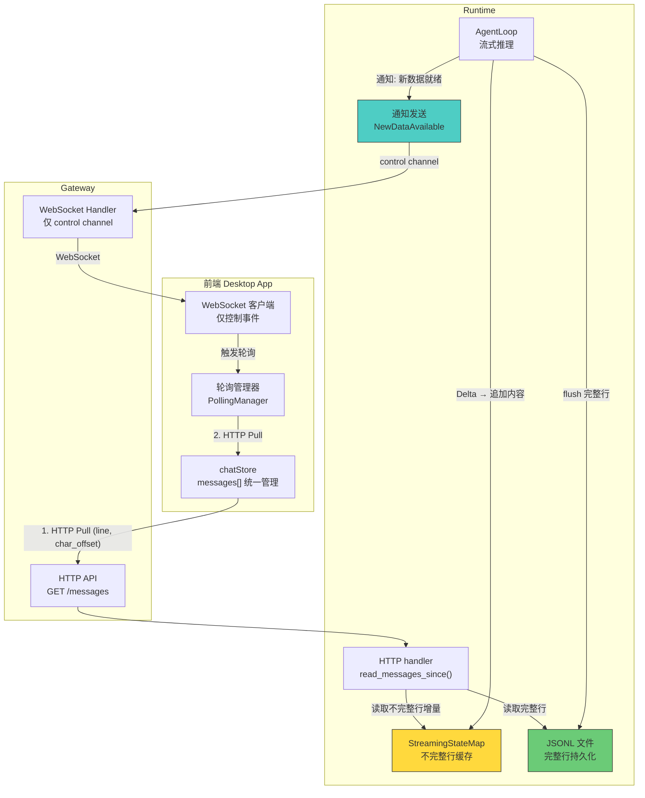
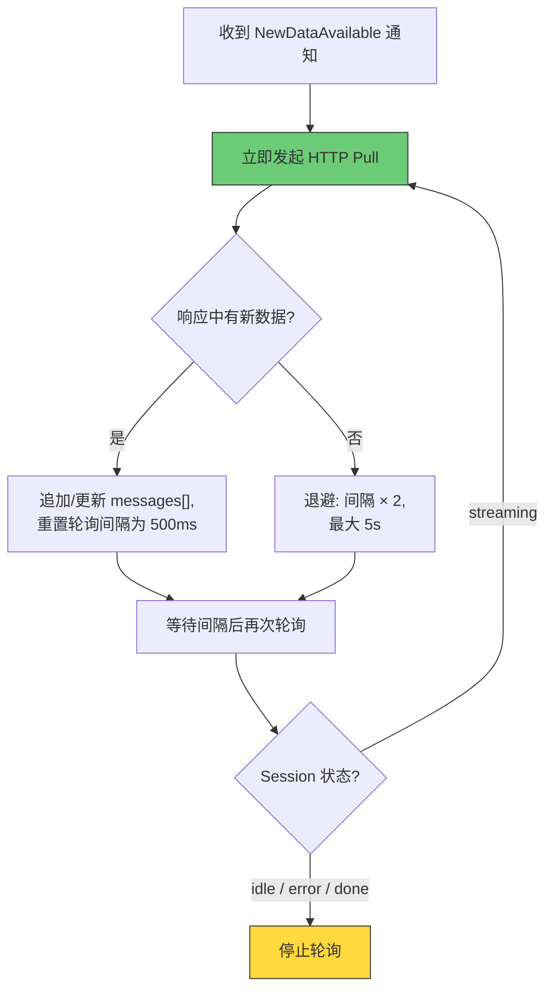
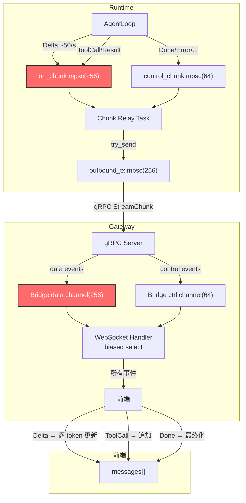
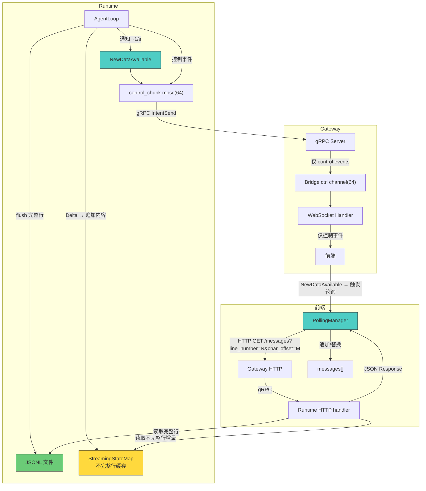

# ADR-021: 统一 Session 数据加载 — 放弃流式传输，采用 HTTP Pull + 通知机制

**状态**：草案
**日期**：2026-07-02
**决策者**：架构讨论
**影响范围**：

- `core/acowork-runtime/src/agent/agent_core.rs`（移除 data channel 的 session 推送，新增 `NewDataAvailable` 通知）
- `core/acowork-runtime/src/agent/session/session_task.rs`（新增 StreamingStateMap 管理）
- `core/acowork-runtime/src/conversation.rs`（新增 `read_messages_since` 接口）
- `core/acowork-runtime/src/cli.rs`（HTTP messages 端点支持 `line_number` + `line_char_offset` 参数）
- `core/acowork-gateway/src/gateway/mod.rs`（Bridge Channel 简化为仅 control channel）
- `core/acowork-gateway/src/http/chat.rs`（WebSocket handler 移除 data channel 消费）
- `core/acowork-gateway/src/grpc/dispatch.rs`（移除 data channel 路由）
- `apps/acowork-desktop/src/stores/chatStore.ts`（移除流式 Delta 处理，新增轮询逻辑）
- `apps/acowork-desktop/src/components/chat/ChatPanel.tsx`（简化 session 切换逻辑）

---

## 背景

### 当前架构的两套数据加载机制

ACowork 的 Session 数据从前端视角存在两套完全不相干的数据加载路径：

```mermaid
graph TD
    subgraph "路径 A: HTTP Pull（旧 Session / 分页加载）"
        A1["前端 loadSessionMessages()"] --> A2["GET /api/agents/{id}/sessions/{sid}/messages"]
        A2 --> A3["Gateway HTTP handler"]
        A3 --> A4["gRPC → Runtime CLI"]
        A4 --> A5["read_messages_paginated(JSONL)"]
        A5 --> A6["返回分页 JSON"]
    end

    subgraph "路径 B: RPC Stream（活跃 Session / 流式推送）"
        B1["Runtime AgentLoop"] --> B2["try_send_chunk(Delta)"]
        B2 --> B3["on_chunk mpsc(256)"]
        B3 --> B4["Chunk Relay Task"]
        B4 --> B5["outbound_tx → gRPC StreamChunk"]
        B5 --> B6["Gateway Bridge Channel"]
        B6 --> B7["WebSocket → 前端"]
        B7 --> B8["chatStore 逐 token 更新 messages[]"]
    end

    style A1 fill:#6bcb77,stroke:#333
    style B1 fill:#ff6b6b,stroke:#333,color:#fff
```



### 当前架构的核心问题

#### 问题 1：两套机制互不兼容，Session 切换逻辑无法融合

当用户从正在流式传输的 Session A 切换到 Session B，再切回 Session A 时：

- **路径 B 的状态**：Session A 的 `streamingMessageId`、`streamBuffer` 等 transient 状态仍保留在前端内存中
- **路径 A 的守卫**：`ChatPanel.tsx:556-569` 通过检查 `streamingMessageId != null` 来决定是否跳过 HTTP Pull
- **结果**：切回时的行为取决于 Session A 的流式是否已完成，产生三种不同的分支，逻辑复杂且脆弱

#### 问题 2：不可控的流数据风暴

ADR-020 已经揭示了数据流分级问题，但 P1（Session 级按需推送）只是"关阀门"而非"换管道"：

- 所有 Session 的 LLM token 共享同一个 `on_chunk mpsc(256)` channel
- DeepSeek thinking 模式下 token 速率可达 ~50/s
- 多个 Session 同时运行时，channel 拥塞导致事件丢弃（已观测到 `skipped 1197 events`）
- `push_enabled = false` 只能丢弃 data 事件，但 Runtime 内部仍在全速生产和传输

#### 问题 3：流式推送与分页加载的语义冲突

- 路径 A 是**拉取模型**：前端主动请求，后端返回完整的分页数据，前端替换整个 `messages[]`
- 路径 B 是**推送模型**：后端逐 token 推送，前端增量修改 `messages[]` 中的某条消息的 `content` 字段
- 两种模型对 `messages[]` 的写入方式完全不同，无法在同一个数据源上共存

#### 问题 4：前端状态管理的复杂性

`chatStore.ts` 中与流式处理相关的状态字段多达 10+ 个：

```typescript
streamingMessageId: string | null;
streamBuffer: string;
thinkingMessageId: string | null;
isInThinkPhase: boolean;
currentTurnId: string | null;
isReasoning: boolean;
pendingSend: boolean;
isStopping: boolean;
// ...
```

这些字段的存在纯粹是为了处理"逐 token 增量更新"这一种数据到达模式。如果统一为 HTTP Pull，这些字段全部可以移除。

---

## 目标

1. **统一数据加载路径**：前端所有 Session 数据加载（新/旧、活跃/空闲）统一走 HTTP Pull
2. **WebSocket 降级为纯控制通道**：只传输 Session 状态变更、工具审批、异常事件等控制信号
3. **消除流数据风暴**：不再有高频 token 推送经过 Bridge Channel
4. **简化前端状态管理**：移除所有流式 transient 状态字段
5. **Session 切换行为可预测**：无论 Session 处于什么状态，切换逻辑一致

---

## 方案设计

### 核心洞察：JSONL 是行存储，StreamingStateMap 是"未完成的行"

```
JSONL 文件（完整行）:
┌─ Line 0:  {"version":1,"session_id":"abc",...}           ← metadata
├─ Line 1:  {"id":"m1","role":"user","content":"hello"}    ← 完整行
├─ Line 2:  {"id":"m2","role":"assistant","content":"hi"}  ← 完整行
├─ Line 3:  (EOF)
│
StreamingStateMap（不完整行）:
  line_number: 3     ← 将成为 Line 3
  role: "thought"
  content: "让我想想这个问题，首先需要分析数据..."
  char_length: 25    ← 当前字符数
```

**坐标系统**：`(line_number, char_offset)`

- `line_number`：JSONL 中已持久化的完整行数（行号从 0 开始，0 是 metadata）
- `char_offset`：不完整行（StreamingStateMap）中已读取的字符位置

当 StreamingStateMap 中的消息满足条件 flush 到 JSONL，`line_number` +1。

### 整体架构



### 核心变更

#### 变更 1：WebSocket 通道简化

**当前**：WebSocket 承载 7 类数据流（L1-L7，见 ADR-020）

**变更后**：WebSocket 仅承载控制事件。**所有控制事件始终推送，不受 activate/deactivate 影响**（`NewDataAvailable` 除外）：

| 事件类型 | 说明 | 受 activate/deactivate 控制？ | 频率 |
|---------|------|---------------------------|------|
| `SessionStateChanged` | Session 状态变更（streaming/idle/error/...） | ❌ 始终推送 | 低 |
| `ToolApprovalNeeded` | 工具调用需要审批 | ❌ 始终推送 | 低 |
| `AskQuestion` | Agent 向用户提问 | ❌ 始终推送 | 低 |
| `Error` | 运行时错误 | ❌ 始终推送 | 极低 |
| `Stopped` | 用户主动停止 | ❌ 始终推送 | 低 |
| `Done` | 流式推理完成 | ❌ 始终推送 | 低 |
| `IterationLimitPaused` | 迭代次数达到上限 | ❌ 始终推送 | 极低 |
| `ContextUsage` | Token 使用量更新 | ❌ 始终推送 | 低 |
| `TodoListUpdated` | Todo 列表更新 | ❌ 始终推送 | 低 |
| **`NewDataAvailable`** | **新增：通知前端有新数据可拉取** | **✅ 仅活跃 session** | 中（~1-2/s） |

> **设计理由**：后台 session 的状态变更（streaming→idle、工具审批、错误）前端必须感知——例如 session 列表需要显示最新状态、审批超时需要告警。只有 `NewDataAvailable` 需要受控，避免前端收到非活跃 session 的无效轮询触发。

`NewDataAvailable` 事件格式：

```json
{
  "type": "new_data_available",
  "session_id": "20260702_100000_abc123",
  "total_lines": 5,
  "streaming_line": 5
}
```

#### 变更 2：前端统一 HTTP Pull

**移除**：
- `streamingMessageId`、`streamBuffer`、`thinkingMessageId`、`isInThinkPhase`、`isReasoning` 等流式 transient 状态
- WebSocket `onmessage` 中的 Delta/ReasoningDelta/ToolCall/ToolResult 处理逻辑
- `ChatPanel.tsx` 中基于 `streamingMessageId` 的守卫条件

**新增**：
- `PollingManager`：管理活跃 Session 的轮询生命周期
- 统一的 `loadSessionMessages(agentId, sessionId, options?)` 调用

**Session 切换逻辑**：

```typescript
// 切换 Session 时，始终执行：
// 1. deactivate 旧 session（停止 NewDataAvailable 通知；control 事件不受影响）
// 2. activate 新 session（开始接收 NewDataAvailable 通知）
// 3. loadSessionMessages({ limit: 50 })  ← 初始加载最新 50 条
// 4. 重置 lineNumber = total_lines, lineCharOffset = 0
// 无需检查 streamingMessageId、sessionStatus 等条件
```

> **为什么切回时先 `?limit=50` 而不是用旧的 `line_number` 增量拉取？**
>
> 如果 Session A 在后台流式了 10 分钟，产生了 200 行新消息，用旧的 `line_number=3` 增量拉取会一次性返回 197 行，响应体可能几十 KB。先 `?limit=50` 加载最新 50 条，重置坐标，后续轮询再用增量模式，数据量永远可控。

#### 变更 3：Runtime 端 StreamingStateMap（不完整行缓存）

```rust
/// 不完整行：当前正在流式但尚未写入 JSONL 的消息
struct StreamingLine {
    line_number: usize,          // 将成为 JSONL 中的行号
    role: String,                // "assistant" | "thought"
    accumulated_content: String, // 当前累积的完整内容
    started_at: String,
}

/// 在 SessionManager 中
streaming_lines: Arc<RwLock<HashMap<SessionId, StreamingLine>>>
```

**数据流**：

```
AgentLoop:
  Delta 到达 → streaming_line.accumulated_content += delta
  flush 条件满足（</thinking>、tool_call、Done）→
    append_message(JSONL) → streaming_lines.remove(session_id)

HTTP handler (轮询查询):
  1. 从 JSONL 读取 line_number 之后的新行
  2. 从 streaming_lines 读取不完整行的增量内容
  3. 返回 { messages: [...], streaming: {...}, total_lines }
```

**flush 触发条件**：

| 触发条件 | 动作 | 说明 |
|---------|------|------|
| 检测到 `</thinking>` | flush thought 消息到 JSONL | thinking 块完整了 |
| 收到 tool_call | flush 当前 assistant 消息到 JSONL | 工具调用是自然断点 |
| 收到 tool_result | flush 当前 tool_result 消息到 JSONL | 工具结果完整 |
| Done 事件 | flush 当前所有缓存到 JSONL | 流式结束 |
| **Error 事件** | **flush 当前累积内容到 JSONL** | **让用户看到部分内容，知道 AI 尝试回答了但出错了** |
| 用户 Stop | flush 当前累积内容到 JSONL | 强制结束 |

#### 变更 4：新增行号坐标查询接口

在现有 `GET /api/agents/{agent_id}/sessions/{session_id}/messages` 端点新增参数：

| 参数 | 类型 | 说明 |
|------|------|------|
| `limit` | u32 | 每页消息组数（默认 50） |
| `cursor` | string | 分页游标（`line:N` 格式） |
| `direction` | string | `backward` / `forward` |
| **`line_number`** | **u32** | **新增：已读取的完整行数** |
| **`line_char_offset`** | **u32** | **新增：不完整行中已读取的字符位置** |

**响应格式**：

```json
{
  "messages": [
    { "line": 1, "id": "m1", "role": "user", "content": "hello", "ts": "..." },
    { "line": 2, "id": "m2", "role": "assistant", "content": "hi", "ts": "..." }
  ],
  "streaming": {
    "line": 3,
    "role": "thought",
    "content": "分析数据...",
    "char_offset": 25
  },
  "total_lines": 3
}
```

**语义**：

| 字段 | 含义 |
|------|------|
| `messages` | `line_number` 之后新增的完整行（从 JSONL 读取） |
| `streaming` | 不完整行的增量内容（`char_offset` 之后的新字符） |
| `streaming.content` | **仅增量**：`line_char_offset` 到当前内容的字符子串 |
| `total_lines` | JSONL 当前总行数（含 metadata） |

---

## 核心难点设计

### 难点 1：分片策略 — 行号坐标系统

**问题**：流式推理过程中，新消息不断追加。前端需要知道"从哪开始拉"。

**方案：行号坐标 `(line_number, char_offset)`**

```
JSONL 文件（完整行）:
┌─ Line 0:  {"version":1,"session_id":"abc",...}           ← metadata
├─ Line 1:  {"id":"m1","role":"user","content":"hello"}    ← 完整行
├─ Line 2:  {"id":"m2","role":"assistant","content":"hi"}  ← 完整行
├─ Line 3:  (EOF)  ← total_lines = 3
│
StreamingStateMap（不完整行）:
  line_number: 3     ← 将成为 Line 3
  content: "让我想想这个问题，首先需要分析数据..."
  char_length: 25
```

**前端坐标**：

```typescript
interface SessionReadPosition {
  lineNumber: number;        // 已读取的完整行数（= JSONL 行数）
  lineCharOffset: number;    // 不完整行中已读取的字符位置
}
```

**时序示例**：

```
初始加载:
  GET /messages?limit=50
  → messages: [{line:1, role:"user", ...}, {line:2, role:"assistant", ...}]
  → streaming: null
  → total_lines: 3
  → 前端: lineNumber=3, lineCharOffset=0

t=5s: thinking 开始
  GET /messages?line_number=3&line_char_offset=0
  → messages: []
  → streaming: {line:3, role:"thought", content:"让我想想这个问题，", char_offset:10}
  → total_lines: 3
  → 前端: 创建 thought 消息，显示"让我想想这个问题，"
  → 前端: lineNumber=3, lineCharOffset=10

t=5.5s: thinking 继续
  GET /messages?line_number=3&line_char_offset=10
  → messages: []
  → streaming: {line:3, role:"thought", content:"首先需要分析数据...", char_offset:25}
  → total_lines: 3
  → 前端: 追加"首先需要分析数据..."到 thought 消息
  → 前端: lineNumber=3, lineCharOffset=25

t=10s: </thinking> 到达，flush 到 JSONL
  JSONL 新增 Line 3: {"id":"m3","role":"thought","content":"让我想想这个问题，首先需要分析数据..."}
  total_lines = 4
  StreamingStateMap: line=4, role="assistant", content="好的，"

  GET /messages?line_number=3&line_char_offset=25
  → messages: [{line:3, role:"thought", content:"让我想想这个问题，首先需要分析数据...", ...}]
    （从 JSONL 读取的完整行，含完整 metadata）
  → streaming: {line:4, role:"assistant", content:"好的，", char_offset:3}
  → total_lines: 4
  → 前端: 用 JSONL 的完整行替换之前 streaming 创建的临时 thought 消息
  → 前端: 创建 assistant 消息，显示"好的，"
  → 前端: lineNumber=4, lineCharOffset=3
```

**关键设计决策：流式消息的 JSONL 写入策略**

当前 `append_message` 在每次 Delta 到达时**不写入** JSONL（只在 Done 时写入最终完整消息）。新方案在**自然边界** flush：

- `</thinking>` 到达 → flush thought 消息
- tool_call 到达 → flush 当前 assistant 消息
- Done 到达 → flush 最终消息

这样 JSONL 保持干净（每条消息只写一次），且 flush 后行号 +1，前端从 JSONL 读到完整消息替换临时消息。

### 难点 2：轮询周期 — HTTP Pull 的频率控制

**问题**：轮询太频繁浪费资源，太慢则用户感知延迟。

**方案：通知驱动 + 退避兜底**



**参数配置**：

| 参数 | 默认值 | 说明 |
|------|--------|------|
| `poll_initial_interval_ms` | 500 | 初始轮询间隔 |
| `poll_max_interval_ms` | 5000 | 最大退避间隔 |
| `poll_backoff_multiplier` | 2.0 | 退避乘数 |
| `poll_max_retries_empty` | 3 | 连续空响应后停止轮询 |

**停止条件**：
1. 收到 `SessionStateChanged` 事件，状态变为 `idle` / `error`
2. 收到 `Done` 事件
3. 连续 N 次轮询返回空数据
4. 用户切换到其他 Session

**与 `NewDataAvailable` 通知的关系**：
- 通知是**触发信号**，不是数据载体
- 通知可能丢失（WebSocket 断连），轮询是兜底机制
- 正常情况下：通知 → 立即拉取 → 继续轮询直到流式结束
- 通知丢失时：轮询间隔内仍会拉取到新数据

### 难点 3：StreamingStateMap 的并发与一致性

**问题**：AgentLoop 写入 `accumulated_content`，HTTP handler 读取它，需要并发控制。

**方案**：`Arc<RwLock<HashMap<SessionId, StreamingLine>>>`

- AgentLoop 持有写锁：`streaming_lines.write().get_mut(&sid).accumulated_content += delta`
- HTTP handler 持有读锁：`streaming_lines.read().get(&sid).cloned()`
- 写锁持有时间极短（一次字符串追加），不会阻塞 HTTP 请求
- flush 时：先 `append_message(JSONL)`，再 `streaming_lines.write().remove(&sid)`

**崩溃恢复**：

- 如果 Runtime 在流式过程中崩溃：`StreamingStateMap` 丢失，但 JSONL 中已有 flush 之前的所有已持久化消息
- 重启后从 JSONL 恢复：最后一条未 flush 的流式消息丢失
- 这是可接受的行为——等同于当前架构中 Runtime 崩溃导致最后一条消息丢失

### 难点 4：行号坐标与分页的交互

**问题**：行号坐标用于增量轮询，分页游标用于翻历史消息，两者如何共存？

**方案**：统一使用行号作为坐标。两套坐标独立运行，互不干扰。

| 场景 | 坐标 | 说明 |
|------|------|------|
| 初始加载 | `limit=50` | 返回最新 50 行 |
| 翻历史 | `cursor=line:10` | 基于行号翻页 |
| 流式轮询 | `line_number=3&line_char_offset=25` | 双维度增量读取 |

翻页不改变 `lineNumber`/`lineCharOffset`。翻页返回的消息按行号插入 `messages[]`，增量轮询追加到末尾。

行号比字节偏移更适合分页——行号天然是离散的、有序的、稳定的。字节偏移在 compaction 后会变，但行号不会（compaction 是替换行内容，不是删除行）。

---

## 边界情况分析

### 边界 1：切回长时间不活跃的 Session

**场景**：Session A 在后台流式了 10 分钟，产生了 200 行新消息。用户切回时，前端 `lineNumber=3`，如果直接增量拉取会返回 197 行。

**处理**：切回时先 `?limit=50` 初始加载（见 §变更 2），重置坐标。后续轮询用增量模式，数据量永远可控。

### 边界 2：Compaction 发生后行内容变化

**场景**：
```
Compaction 前:
  Line 10: {"role":"user","content":"帮我分析这个文件..."}
  Line 11: {"role":"assistant","content":"好的，让我看看..."}

Compaction 后:
  Line 10: {"role":"assistant","content":"<summary>...</summary>","kind":"compaction"}
  Line 11: {"role":"user","content":"帮我分析这个文件..."}
  Line 12: {"role":"assistant","content":"好的，让我看看..."}
```
行号没变，但 Line 10 的内容变了。前端已经显示的是旧内容。

**影响**：低。Compaction 是低频操作（通常几分钟一次），且用户不太可能正在盯着旧消息时 compaction 发生。当前架构也有同样的问题。如果用户翻页重新加载，会看到 compaction 后的内容。

### 边界 3：Error 时缓存中的内容

**场景**：LLM 流式到一半网络错误中断，`StreamingStateMap` 中有部分内容。

**处理**：Error 事件触发 flush，缓存内容写入 JSONL（见 §变更 3 flush 表）。用户至少看到"AI 尝试回答了但出错了"的部分内容。

### 边界 4：前端 line_number 超过后端 total_lines

**场景**：正常情况下不会发生（前端 line_number 是从后端同步的），但如果 JSONL 文件被外部工具修改（如手动删行），可能出现。

**处理**：后端 clamp：
```rust
let line_number = params.line_number.min(total_lines);
let char_offset = if line_number < total_lines { 0 } else { params.char_offset };
```

### 边界 5：轮询与 flush 并发

**场景**：
```
1. 前端发起轮询请求 A（持有读锁）
2. AgentLoop 检测到 </thinking>，开始 flush（等待写锁）
3. 轮询请求 A 返回后，flush 获得写锁
```

**处理**：Rust `RwLock` 保证一致性。轮询要么读到 flush 前的状态，要么读到 flush 后的状态，不会读到中间状态。

### 边界 6：翻页与增量轮询的坐标冲突

**场景**：用户翻历史消息时，增量轮询也在进行。

**处理**：两套坐标独立。翻页不改变 `lineNumber`/`lineCharOffset`。翻页返回的消息按行号插入 `messages[]`，增量轮询追加到末尾。

### 边界 7：流式过程中 tool_call 到达

**场景**：
```
1. assistant 在缓存中累积 "让我查一下..."
2. tool_call 到达 → flush assistant 到 JSONL，tool_call 也写 JSONL
3. 前端下次轮询读到 2 行新数据（assistant + tool_call）
```

**处理**：JSONL 中的行顺序就是正确的时序，前端按顺序追加即可。

### 边界 8：Done 事件先于轮询返回到达

**场景**：
```
1. 前端发起轮询请求 A
2. Done 事件到达 → flush 缓存到 JSONL
3. 轮询请求 A 返回（此时 JSONL 已更新）
```

**处理**：RwLock 保证一致性。前端拿到的是包含完整消息的响应。

### 边界 9：新 Session 首次加载

**场景**：用户创建新 session，发送第一条消息。

**处理**：
```
line_number=0, line_char_offset=0
GET /messages?limit=50
→ messages: [{line:1, role:"user", content:"hello"}]
→ total_lines: 2
→ 前端 lineNumber=2, lineCharOffset=0
```

### 边界 10：增量轮询无 limit 的风险

**场景**：增量轮询 `GET /messages?line_number=3&line_char_offset=25` 没有 `limit` 参数。

**处理**：增量轮询只在活跃 session 的 500ms 间隔内使用，两次轮询之间产生的数据量天然很小（最多几个 Delta token + 1-2 次 flush）。不需要 limit。长时间不活跃后的"追赶"由切回时的 `?limit=50` 初始加载处理。

---

## 前端状态模型

```typescript
interface SessionChatState {
  messages: ChatMessage[];          // 统一的消息列表
  hasMoreMessages: boolean;         // 是否还有更早的消息
  messageCursor: string | null;     // 分页游标（line:N 格式）
  lineNumber: number;               // 新增：已读取的完整行数
  lineCharOffset: number;           // 新增：不完整行中已读取的字符位置
  isLoadingSession: boolean;
  loadError: string | null;

  // 以下字段全部移除：
  // streamingMessageId, streamBuffer, thinkingMessageId,
  // isInThinkPhase, isReasoning, pendingSend, isStopping

  // 保留的控制状态：
  sessionStatus: SessionStatus | null;
  pendingApproval: Record<string, ToolApprovalNeededEvent>;
  pendingQuestion: AskQuestionEvent | null;
  iterationLimitPaused: {...} | null;
  retryWaitInfo: {...} | null;
  tokenUsage: TokenUsage | null;
  contextUsage: ContextUsageInfo | null;
  isCompacting: boolean;
  todos: TodoList[];
}
```

---

## 数据流对比

### 当前架构（ADR-020 P1 之后）



### 新架构



**关键差异**：
- 高频 Delta 不再经过任何 channel，直接更新 `StreamingStateMap`
- WebSocket 只走 control channel，流量降低 95%+
- 前端通过 HTTP Pull 获取数据，与旧 Session 加载路径完全一致
- 坐标系统统一为行号，分页和增量轮询使用同一套坐标

---

## 实施计划

### Phase 1：Runtime 端 StreamingStateMap + 行号坐标接口（~150 行）

1. 实现 `StreamingLine` 结构体 + `HashMap<SessionId, StreamingLine>`（~40 行）
2. 实现 `read_messages_since(path, line_number, char_offset) -> ReadResult`（~50 行）
3. 在 `cli.rs` 的 messages 端点添加 `line_number` + `line_char_offset` 参数支持（~30 行）
4. 修改 AgentLoop：Delta 更新 StreamingStateMap，自然边界 flush 到 JSONL（~20 行）
5. 添加 `NewDataAvailable` 通知发送逻辑（~10 行）

### Phase 2：Gateway 端简化（~100 行）

1. 移除 Bridge data channel
2. 简化 WebSocket handler（移除 biased select 双 channel 逻辑）
3. 简化 gRPC dispatch（移除 data channel 路由）

### Phase 3：前端重构（~400 行）

1. 实现 `PollingManager`
2. 移除 `chatStore.ts` 中所有流式 transient 状态
3. 移除 WebSocket `onmessage` 中的 Delta/ReasoningDelta/ToolCall/ToolResult 处理
4. 简化 `ChatPanel.tsx` 的 Session 切换逻辑
5. 统一 `loadSessionMessages` 调用路径，支持行号坐标

### Phase 4：清理与优化（~80 行）

1. 移除 Runtime 端 `on_chunk` channel（仅保留 `control_chunk`）
2. `push_enabled` 改为 `notify_enabled`，仅控制 `NewDataAvailable` 通知的发送
3. control 事件（Done/Error/Stopped/SessionStateChanged 等）**始终推送**，不再经过 `is_control()` 检查
4. `deactivate` 端点保留，语义收窄为"停止 `NewDataAvailable` 通知"

---

## 风险与缓解

| 风险 | 影响 | 缓解措施 |
|------|------|---------|
| 轮询延迟导致用户感知"卡顿" | 消息显示不如实时推送流畅 | 前端通过 CSS animation 实现打字机效果，与数据到达粒度解耦；通知触发立即拉取 |
| StreamingStateMap 崩溃丢失 | 最后一条未 flush 的流式消息丢失 | flush 在自然边界触发（`</thinking>`、tool_call、Done），丢失窗口小；崩溃后从 JSONL 恢复 |
| `NewDataAvailable` 通知丢失 | 前端不知道有新数据 | 轮询作为兜底，500ms 内必然发现新数据 |
| 行号坐标与现有字节游标不兼容 | 分页系统需要迁移 | 行号游标 `line:N` 格式与现有 `offset:XXXXX` 格式可共存，逐步迁移 |
| Compaction 导致行内容变化 | 前端显示的行内容与 JSONL 不一致 | 低影响，compaction 是低频操作；用户翻页后看到新内容；当前架构也有同样问题 |
| 前端 line_number 越界 | 增量轮询参数超出 JSONL 行数 | 后端 clamp：`line_number = min(line_number, total_lines)` |

---

## 备选方案

### 方案 B：保留 WebSocket 数据推送，但改为"消息快照"推送

不再逐 token 推送 Delta，而是每 200ms 推送一次当前消息的完整快照。

- 优点：改动较小，保留实时性
- 缺点：仍需维护 WebSocket 数据通道；前端仍需处理流式 transient 状态（虽然简化了）

### 方案 C：SSE（Server-Sent Events）替代 WebSocket 数据通道

使用 SSE 推送完整消息（非逐 token），WebSocket 保留为控制通道。

- 优点：SSE 天然适合"完整消息"推送，浏览器原生支持
- 缺点：引入第三个通道，架构更复杂；SSE 是单向的

---

## 决策

**采用方案 A（HTTP Pull + 通知机制）**。

理由：
1. 从根本上解决两套数据加载机制不兼容的问题
2. 彻底消除流数据风暴（ADR-020 的 P1/P2/P3 补丁可以大幅简化）
3. 前端状态管理大幅简化（移除 10+ 个 transient 字段）
4. Session 切换逻辑变为统一的"切换 → HTTP Pull"，不再有分支判断
5. Runtime 端仅需 `StreamingStateMap`（~40 行），无需 Page Cache
6. 行号坐标 `(line_number, char_offset)` 天然对齐 JSONL 的行存储结构，实现简单
7. 增量读取避免重复数据传输，thinking 阶段 30-60 秒的流式内容只传输增量
8. 打字机效果由前端 CSS animation 实现，与数据到达粒度解耦
9. 500ms 轮询对 Gateway 压力可忽略（2 req/s vs Axum 单核 10,000+ req/s 容量）
