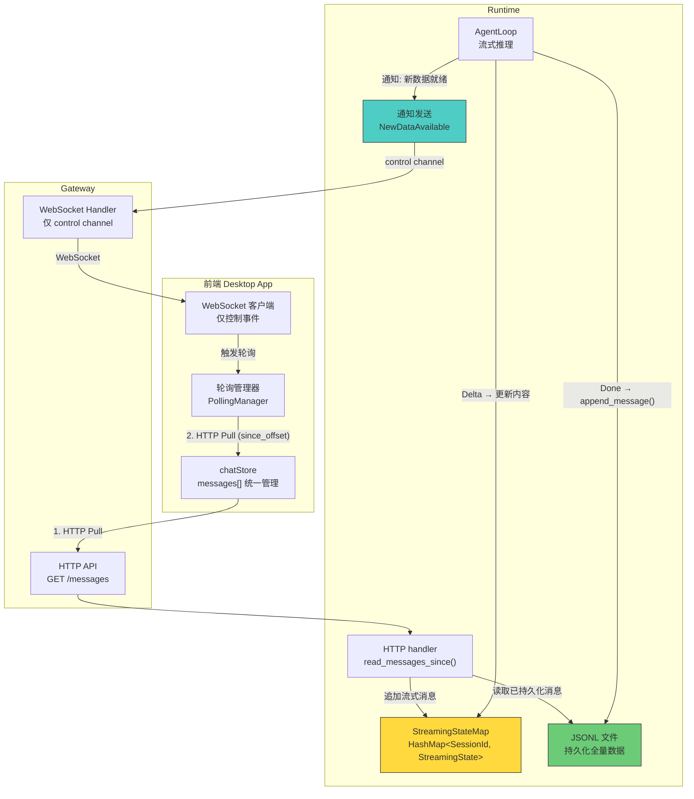
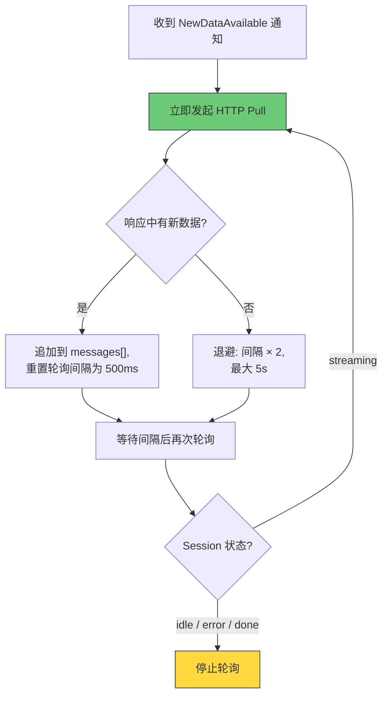
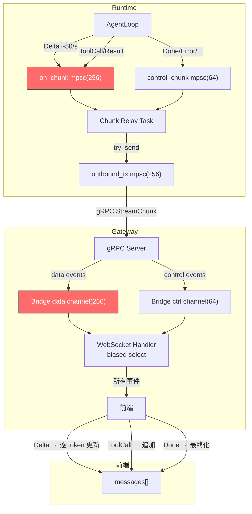
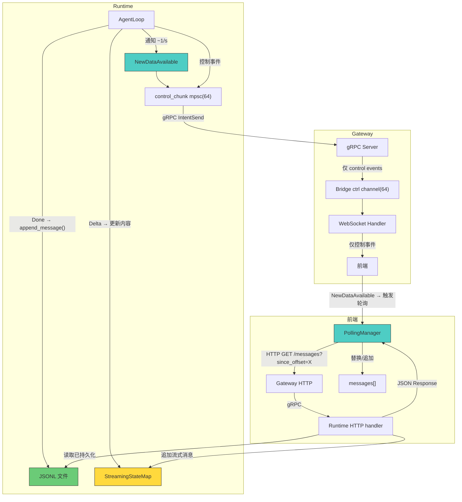

# ADR-021: 统一 Session 数据加载 — 放弃流式传输，采用 HTTP Pull + 通知机制

**状态**：草案
**日期**：2026-07-02
**决策者**：架构讨论
**影响范围**：

- `core/acowork-runtime/src/agent/agent_core.rs`（移除 data channel 的 session 推送，新增 `NewDataAvailable` 通知）
- `core/acowork-runtime/src/agent/session/session_task.rs`（新增 StreamingStateMap 管理）
- `core/acowork-runtime/src/conversation.rs`（新增 `read_messages_since` 接口）
- `core/acowork-runtime/src/cli.rs`（HTTP messages 端点支持 `since_offset` 参数）
- `core/acowork-gateway/src/gateway/mod.rs`（Bridge Channel 简化为仅 control channel）
- `core/acowork-gateway/src/http/chat.rs`（WebSocket handler 移除 data channel 消费）
- `core/acowork-gateway/src/grpc/dispatch.rs`（移除 data channel 路由）
- `apps/acowork-desktop/src/stores/chatStore.ts`（移除流式 Delta 处理，新增轮询逻辑）
- `apps/acowork-desktop/src/components/chat/ChatPanel.tsx`（简化 session 切换逻辑）

---

## 背景

### 当前架构的两套数据加载机制

ACowork 的 Session 数据从前端视角存在两套完全不相干的数据加载路径：

```mermaid
graph TD
    subgraph "路径 A: HTTP Pull（旧 Session / 分页加载）"
        A1["前端 loadSessionMessages()"] --> A2["GET /api/agents/{id}/sessions/{sid}/messages"]
        A2 --> A3["Gateway HTTP handler"]
        A3 --> A4["gRPC → Runtime CLI"]
        A4 --> A5["read_messages_paginated(JSONL)"]
        A5 --> A6["返回分页 JSON"]
    end

    subgraph "路径 B: RPC Stream（活跃 Session / 流式推送）"
        B1["Runtime AgentLoop"] --> B2["try_send_chunk(Delta)"]
        B2 --> B3["on_chunk mpsc(256)"]
        B3 --> B4["Chunk Relay Task"]
        B4 --> B5["outbound_tx → gRPC StreamChunk"]
        B5 --> B6["Gateway Bridge Channel"]
        B6 --> B7["WebSocket → 前端"]
        B7 --> B8["chatStore 逐 token 更新 messages[]"]
    end

    style A1 fill:#6bcb77,stroke:#333
    style B1 fill:#ff6b6b,stroke:#333,color:#fff
```



### 当前架构的核心问题

#### 问题 1：两套机制互不兼容，Session 切换逻辑无法融合

当用户从正在流式传输的 Session A 切换到 Session B，再切回 Session A 时：

- **路径 B 的状态**：Session A 的 `streamingMessageId`、`streamBuffer` 等 transient 状态仍保留在前端内存中
- **路径 A 的守卫**：`ChatPanel.tsx:556-569` 通过检查 `streamingMessageId != null` 来决定是否跳过 HTTP Pull
- **结果**：切回时的行为取决于 Session A 的流式是否已完成，产生三种不同的分支（见上一轮分析），逻辑复杂且脆弱

#### 问题 2：不可控的流数据风暴

ADR-020 已经揭示了数据流分级问题，但 P1（Session 级按需推送）只是"关阀门"而非"换管道"：

- 所有 Session 的 LLM token 共享同一个 `on_chunk mpsc(256)` channel
- DeepSeek thinking 模式下 token 速率可达 ~50/s
- 多个 Session 同时运行时，channel 拥塞导致事件丢弃（已观测到 `skipped 1197 events`）
- `push_enabled = false` 只能丢弃 data 事件，但 Runtime 内部仍在全速生产和传输

#### 问题 3：流式推送与分页加载的语义冲突

- 路径 A 是**拉取模型**：前端主动请求，后端返回完整的分页数据，前端替换整个 `messages[]`
- 路径 B 是**推送模型**：后端逐 token 推送，前端增量修改 `messages[]` 中的某条消息的 `content` 字段
- 两种模型对 `messages[]` 的写入方式完全不同，无法在同一个数据源上共存
- 当前通过大量守卫条件（`streamingMessageId != null`、`isSessionSending`、`lastLoadedSessionId`）勉强维持，但边界情况层出不穷

#### 问题 4：前端状态管理的复杂性

`chatStore.ts` 中与流式处理相关的状态字段多达 10+ 个：

```typescript
streamingMessageId: string | null;
streamBuffer: string;
thinkingMessageId: string | null;
isInThinkPhase: boolean;
currentTurnId: string | null;
isReasoning: boolean;
pendingSend: boolean;
isStopping: boolean;
// ...
```

这些字段的存在纯粹是为了处理"逐 token 增量更新"这一种数据到达模式。如果统一为 HTTP Pull，这些字段全部可以移除。

---

## 目标

1. **统一数据加载路径**：前端所有 Session 数据加载（新/旧、活跃/空闲）统一走 HTTP Pull
2. **WebSocket 降级为纯控制通道**：只传输 Session 状态变更、工具审批、异常事件等控制信号
3. **消除流数据风暴**：不再有高频 token 推送经过 Bridge Channel
4. **简化前端状态管理**：移除所有流式 transient 状态字段
5. **Session 切换行为可预测**：无论 Session 处于什么状态，切换逻辑一致

---

## 方案设计

### 整体架构



### 核心变更

#### 变更 1：WebSocket 通道简化

**当前**：WebSocket 承载 7 类数据流（L1-L7，见 ADR-020）

**变更后**：WebSocket 仅承载控制事件。**所有控制事件始终推送，不受 activate/deactivate 影响**（`NewDataAvailable` 除外）：

| 事件类型 | 说明 | 受 activate/deactivate 控制？ | 频率 |
|---------|------|---------------------------|------|
| `SessionStateChanged` | Session 状态变更（streaming/idle/error/...） | ❌ 始终推送 | 低 |
| `ToolApprovalNeeded` | 工具调用需要审批 | ❌ 始终推送 | 低 |
| `AskQuestion` | Agent 向用户提问 | ❌ 始终推送 | 低 |
| `Error` | 运行时错误 | ❌ 始终推送 | 极低 |
| `Stopped` | 用户主动停止 | ❌ 始终推送 | 低 |
| `Done` | 流式推理完成 | ❌ 始终推送 | 低 |
| `IterationLimitPaused` | 迭代次数达到上限 | ❌ 始终推送 | 极低 |
| `ContextUsage` | Token 使用量更新 | ❌ 始终推送 | 低 |
| `TodoListUpdated` | Todo 列表更新 | ❌ 始终推送 | 低 |
| **`NewDataAvailable`** | **新增：通知前端有新数据可拉取** | **✅ 仅活跃 session** | 中（~1-2/s） |

> **设计理由**：后台 session 的状态变更（streaming→idle、工具审批、错误）前端必须感知——例如 session 列表需要显示最新状态、审批超时需要告警。只有 `NewDataAvailable` 需要受控，避免前端收到非活跃 session 的无效轮询触发。

`NewDataAvailable` 事件格式：

```json
{
  "type": "new_data_available",
  "session_id": "20260702_100000_abc123",
  "latest_offset": 45678,
  "new_message_count": 3
}
```

#### 变更 2：前端统一 HTTP Pull

**移除**：
- `streamingMessageId`、`streamBuffer`、`thinkingMessageId`、`isInThinkPhase`、`isReasoning` 等流式 transient 状态
- WebSocket `onmessage` 中的 Delta/ReasoningDelta/ToolCall/ToolResult 处理逻辑
- `ChatPanel.tsx` 中基于 `streamingMessageId` 的守卫条件

**新增**：
- `PollingManager`：管理活跃 Session 的轮询生命周期
- 统一的 `loadSessionMessages(agentId, sessionId, options?)` 调用

**Session 切换逻辑简化为**：

```typescript
// 切换 Session 时，始终执行：
// 1. deactivate 旧 session（停止 NewDataAvailable 通知；control 事件不受影响）
// 2. activate 新 session（开始接收 NewDataAvailable 通知）
// 3. loadSessionMessages（HTTP Pull 最新数据）
// 无需检查 streamingMessageId、sessionStatus 等条件
```

#### 变更 3：Runtime 端 StreamingStateMap

在 Runtime 内存中维护一个极简的流式消息状态表：

```rust
/// 共享状态：当前正在流式的消息内容
/// AgentLoop 写入，HTTP handler 读取
struct StreamingState {
    message_role: String,        // "assistant" | "thought"
    accumulated_content: String, // 当前累积的完整内容
    started_at: String,
}

/// 在 SessionManager 中
streaming_states: Arc<RwLock<HashMap<SessionId, StreamingState>>>
```

**数据流**：

```
AgentLoop:
  Delta 到达 → streaming_state.accumulated_content += delta
  Done 到达 → append_message(JSONL) → streaming_states.remove(session_id)

HTTP handler (since_offset 查询):
  1. read JSONL from offset → [msg_5]
  2. if let Some(state) = streaming_states.get(session_id) {
       追加 { role: state.message_role, content: state.accumulated_content, is_partial: true }
     }
  3. return [msg_5, msg_6_partial]
```

**为什么不需要 Page Cache**：

`since_offset` 查询天然是"只读新数据"的——前端每次收到响应都会更新 `last_known_offset`，下次请求的 `since_offset` 一定更大，不存在重复读取同一段 JSONL 的场景。缓存命中率为零。

分页加载（cursor 翻页）是用户手动触发的低频操作，JSONL 文件在 SSD 上 `seek + read + parse` 50 条消息耗时 <5ms，缓存没有意义。

**复杂度对比**：

| | Page Cache 方案 | StreamingStateMap 方案 |
|---|---|---|
| 数据结构 | LRU cache + byte_range + streaming_state | `HashMap<SessionId, StreamingState>` |
| 代码量 | ~200 行 | ~40 行 |
| 缓存失效逻辑 | 新消息写入、compaction、session 关闭 | 无（只有 Done 时 remove） |
| 并发控制 | 需要处理 cache 和 JSONL 的一致性 | 一把 RwLock |
| 内存占用 | 每个 session 最多 3 个 page × N 条消息 | 每个活跃 session 1 条消息的字符串 |

#### 变更 4：新增 `since_offset` 查询接口

在现有 `GET /api/agents/{agent_id}/sessions/{session_id}/messages` 端点新增参数：

| 参数 | 类型 | 说明 |
|------|------|------|
| `limit` | u32 | 每页消息组数（默认 50） |
| `cursor` | string | 分页游标（`offset:XXXXX` 格式） |
| `direction` | string | `backward` / `forward` |
| **`since_offset`** | **u64** | **新增：只返回该字节偏移之后的消息** |

`since_offset` 语义：
- 返回 JSONL 文件中字节偏移 > `since_offset` 的所有消息
- 不受 `limit` 限制（因为是增量拉取，数据量天然可控）
- 与 `cursor` 互斥（同时提供时以 `since_offset` 为准）
- 响应中包含 `latest_offset` 字段，供前端下次轮询使用

---

## 核心难点设计

### 难点 1：分片策略 — 如何标记内存中的 Session 数据

**问题**：流式推理过程中，新消息不断追加到 JSONL。前端需要知道"从哪开始拉"。

**方案：字节偏移分片（Byte-Offset Segmentation）**

```
JSONL 文件结构：
┌──────────────────────────────────────────────────────┐
│ offset 0:     {"version":1,"session_id":"...",...}    │ ← metadata header
│ offset 245:   {"id":"...","role":"user","content":...} │ ← message 1
│ offset 512:   {"id":"...","role":"assistant",...}     │ ← message 2
│ offset 890:   {"id":"...","role":"tool_call",...}     │ ← message 3
│ offset 1150:  {"id":"...","role":"tool_result",...}   │ ← message 4
│ offset 1420:  {"id":"...","role":"assistant",...}     │ ← message 5 (流式中)
│ offset 1680:  {"id":"...","role":"assistant",...}     │ ← message 5 更新
│ offset 1950:  {"id":"...","role":"assistant",...}     │ ← message 5 最终版
└──────────────────────────────────────────────────────┘
```

**关键设计决策：流式消息的 JSONL 写入策略**

当前 `append_message` 在每次 Delta 到达时**不写入** JSONL（只在 Done 时写入最终完整消息）。新方案保持这一策略：

**Delta 只更新 StreamingStateMap，Done 时写 JSONL**

- `StreamingStateMap` 中维护"当前正在流式的消息"的实时内容
- `since_offset` 查询时，从 JSONL 读取已持久化消息，再追加 `StreamingStateMap` 中的流式消息
- Done 事件到达后，将最终内容写入 JSONL，从 `StreamingStateMap` 中移除
- 优点：JSONL 保持干净（每条消息只写一次），文件 I/O 最小，实现极简

```rust
struct StreamingState {
    /// 当前正在流式的消息 ID
    message_id: String,
    /// 当前累积的内容
    accumulated_content: String,
    /// 消息角色（assistant / thought）
    role: String,
    /// 起始时间戳
    started_at: String,
}

// AgentLoop 中:
fn on_delta(&mut self, delta: &str) {
    if let Some(state) = self.streaming_states.get_mut(&session_id) {
        state.accumulated_content.push_str(delta);
    }
}

fn on_done(&mut self, conversation: &ConversationSession) {
    if let Some(state) = self.streaming_states.remove(&session_id) {
        conversation.append_message(&state.role, &state.accumulated_content, None);
    }
}
```

**前端视角的分片**：

前端维护 `last_known_offset: u64`，表示"我已经拉取到 JSONL 的哪个字节位置"。

```
初始加载:
  GET /messages?limit=50
  → 返回 messages[0..50] + latest_offset: 45678
  → 前端记录 last_known_offset = 45678

收到 NewDataAvailable { latest_offset: 51200 }:
  GET /messages?since_offset=45678
  → 返回 messages[51..55] + latest_offset: 51200
  → 前端更新 last_known_offset = 51200
  → 前端将新消息追加到 messages[] 末尾
```

### 难点 2：轮询周期 — HTTP Pull 的频率控制

**问题**：轮询太频繁浪费资源，太慢则用户感知延迟。

**方案：自适应轮询策略**



**参数配置**：

| 参数 | 默认值 | 说明 |
|------|--------|------|
| `poll_initial_interval_ms` | 500 | 初始轮询间隔 |
| `poll_max_interval_ms` | 5000 | 最大退避间隔 |
| `poll_backoff_multiplier` | 2.0 | 退避乘数 |
| `poll_max_retries_empty` | 3 | 连续空响应后停止轮询 |

**停止条件**：
1. 收到 `SessionStateChanged` 事件，状态变为 `idle` / `error`
2. 收到 `Done` 事件
3. 连续 N 次轮询返回空数据
4. 用户切换到其他 Session

**与 `NewDataAvailable` 通知的关系**：
- 通知是**触发信号**，不是数据载体
- 通知可能丢失（WebSocket 断连），轮询是兜底机制
- 正常情况下：通知 → 立即拉取 → 继续轮询直到流式结束
- 通知丢失时：轮询间隔内仍会拉取到新数据

### 难点 3：StreamingStateMap 的并发与一致性

**问题**：AgentLoop 写入 `accumulated_content`，HTTP handler 读取它，需要并发控制。

**方案**：`Arc<RwLock<HashMap<SessionId, StreamingState>>>`

- AgentLoop 持有写锁：`streaming_states.write().get_mut(&sid).accumulated_content += delta`
- HTTP handler 持有读锁：`streaming_states.read().get(&sid).cloned()`
- 写锁持有时间极短（一次字符串追加），不会阻塞 HTTP 请求
- Done 事件时：先 `append_message(JSONL)`，再 `streaming_states.write().remove(&sid)`

**崩溃恢复**：

- 如果 Runtime 在流式过程中崩溃：`StreamingStateMap` 丢失，但 JSONL 中已有 Done 之前的所有已持久化消息
- 重启后从 JSONL 恢复：最后一条流式消息不在 JSONL 中（因为 Done 没来得及写），用户看到的消息少最后一条
- 这是可接受的行为——等同于当前架构中 Runtime 崩溃导致最后一条消息丢失

### 难点 4：`since_offset` 与分页的交互

**问题**：`since_offset` 返回的是增量数据，但前端可能需要将其与现有分页数据合并。

**方案**：

```
前端 messages[] 维护模型:

messages = [
  ...olderPages,     // 通过 cursor 分页加载的历史消息
  ...currentPage,    // 当前视图页（最新 50 条）
  ...streamingNew,   // 通过 since_offset 拉取的流式新消息
]

当流式完成（Done 事件）:
  1. 清除 streamingNew
  2. 重新 loadSessionMessages(limit=50) 获取完整的最新页
  3. 这样确保 messages[] 与 JSONL 完全一致
```

**前端状态模型简化**：

```typescript
interface SessionChatState {
  messages: ChatMessage[];          // 统一的消息列表
  hasMoreMessages: boolean;         // 是否还有更早的消息
  messageCursor: string | null;     // 分页游标
  lastKnownOffset: number;          // 新增：最后已知的 JSONL 字节偏移
  isLoadingSession: boolean;
  loadError: string | null;

  // 以下字段全部移除：
  // streamingMessageId, streamBuffer, thinkingMessageId,
  // isInThinkPhase, isReasoning, pendingSend, isStopping

  // 保留的控制状态：
  sessionStatus: SessionStatus | null;
  pendingApproval: Record<string, ToolApprovalNeededEvent>;
  pendingQuestion: AskQuestionEvent | null;
  iterationLimitPaused: {...} | null;
  retryWaitInfo: {...} | null;
  tokenUsage: TokenUsage | null;
  contextUsage: ContextUsageInfo | null;
  isCompacting: boolean;
  todos: TodoList[];
}
```

---

## 数据流对比

### 当前架构（ADR-020 P1 之后）



### 新架构



**关键差异**：
- 高频 Delta 不再经过任何 channel，直接更新 `StreamingStateMap`
- WebSocket 只走 control channel，流量降低 95%+
- 前端通过 HTTP Pull 获取数据，与旧 Session 加载路径完全一致

---

## 实施计划

### Phase 1：Runtime 端 StreamingStateMap + `since_offset` 接口（~150 行）

1. 实现 `StreamingState` 结构体 + `HashMap<SessionId, StreamingState>`（~40 行）
2. 实现 `read_messages_since(path, since_offset) -> Vec<ConversationEntry>`（~50 行）
3. 在 `cli.rs` 的 messages 端点添加 `since_offset` 参数支持（~30 行）
4. 修改 AgentLoop：Delta 更新 StreamingStateMap，Done 写 JSONL + remove（~20 行）
5. 添加 `NewDataAvailable` 通知发送逻辑（~10 行）

### Phase 2：Gateway 端简化（~100 行）

1. 移除 Bridge data channel
2. 简化 WebSocket handler（移除 biased select 双 channel 逻辑）
3. 简化 gRPC dispatch（移除 data channel 路由）

### Phase 3：前端重构（~400 行）

1. 实现 `PollingManager`
2. 移除 `chatStore.ts` 中所有流式 transient 状态
3. 移除 WebSocket `onmessage` 中的 Delta/ReasoningDelta/ToolCall/ToolResult 处理
4. 简化 `ChatPanel.tsx` 的 Session 切换逻辑
5. 统一 `loadSessionMessages` 调用路径

### Phase 4：清理与优化（~80 行）

1. 移除 Runtime 端 `on_chunk` channel（仅保留 `control_chunk`）
2. `push_enabled` 改为 `notify_enabled`，仅控制 `NewDataAvailable` 通知的发送
3. control 事件（Done/Error/Stopped/SessionStateChanged 等）**始终推送**，不再经过 `is_control()` 检查
4. `deactivate` 端点保留，语义收窄为"停止 `NewDataAvailable` 通知"

---

## 风险与缓解

| 风险 | 影响 | 缓解措施 |
|------|------|---------|
| 轮询延迟导致用户感知"卡顿" | 消息显示不如实时推送流畅 | 前端通过 CSS animation 实现打字机效果，与数据到达粒度解耦；通知触发立即拉取 |
| StreamingStateMap 崩溃丢失 | 最后一条流式消息不完整 | Done 事件触发 JSONL 写入是原子操作；崩溃后从 JSONL 恢复，仅丢失最后一条未完成消息 |
| `NewDataAvailable` 通知丢失 | 前端不知道有新数据 | 轮询作为兜底，500ms 内必然发现新数据 |
| `since_offset` 查询的 JSONL 读取 | 磁盘 I/O | SSD 上 seek + read 增量行 <1ms；`since_offset` 只需读文件尾部 |

---

## 备选方案

### 方案 B：保留 WebSocket 数据推送，但改为"消息快照"推送

不再逐 token 推送 Delta，而是每 200ms 推送一次当前消息的完整快照。

- 优点：改动较小，保留实时性
- 缺点：仍需维护 WebSocket 数据通道；前端仍需处理流式 transient 状态（虽然简化了）

### 方案 C：SSE（Server-Sent Events）替代 WebSocket 数据通道

使用 SSE 推送完整消息（非逐 token），WebSocket 保留为控制通道。

- 优点：SSE 天然适合"完整消息"推送，浏览器原生支持
- 缺点：引入第三个通道，架构更复杂；SSE 是单向的

---

## 决策

**采用方案 A（HTTP Pull + 通知机制）**。

理由：
1. 从根本上解决两套数据加载机制不兼容的问题
2. 彻底消除流数据风暴（ADR-020 的 P1/P2/P3 补丁可以大幅简化）
3. 前端状态管理大幅简化（移除 10+ 个 transient 字段）
4. Session 切换逻辑变为统一的"切换 → HTTP Pull"，不再有分支判断
5. Runtime 端仅需 `StreamingStateMap`（~40 行），无需 Page Cache
6. 打字机效果由前端 CSS animation 实现，与数据到达粒度解耦
7. 500ms 轮询对 Gateway 压力可忽略（2 req/s vs Axum 单核 10,000+ req/s 容量）
