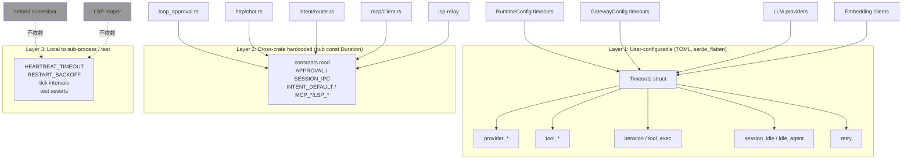

# ADR-023: 统一 Timeout 配置管理 — 跨 crate 单一真相源

**状态**：草案（待决策）
**日期**：2026-07-02
**决策者**：架构讨论
**前置**：ADR-016（集中化异常处理架构） — RetryConfig 已示范"可调策略放入 core"
**影响范围**：

**新增模块**：
- `core/acowork-core/src/timeout_config.rs`（**新增**，本 ADR 主体）
- `core/acowork-core/src/lib.rs`（导出 `pub mod timeout_config;` 与 `pub use timeout_config::{Timeouts, RetryConfig, ...};`）

**用户可配置字段（Runtime 端整合）**：
- `core/acowork-runtime/src/config.rs`（`RuntimeConfig` 内的 `provider_*_timeout_ms` / `tool_http_timeout_ms` / `session_idle_timeout_secs` 改为 `#[serde(flatten)] timeouts: Timeouts`）
- `core/acowork-runtime/src/providers/router.rs`（`ProviderTimeouts::from(&RuntimeConfig)` 直接读取 `Timeouts`）

**用户可配置字段（Gateway 端整合 + 默认值修复）**：
- `core/acowork-gateway/src/config.rs`（`GatewayConfig::idle_timeout_secs` 与 `iteration_timeout_ms` 接入 `Timeouts`；**默认值修复**：`iteration_timeout_ms` 从 `30_000` 提升到 `900_000`）
- `core/acowork-gateway/src/lifecycle/manager.rs`（`LifecycleManager::new` 的 `idle_timeout` 参数从 `Timeouts::idle_agent` 读取）
- `core/acowork-gateway/src/http/agents.rs`（4 处临时硬编码 `idle_timeout = 300` 改为从 `Timeouts::idle_agent` 读取）

**用户可配置字段（Embed 子进程 HTTP 客户端）**：
- `core/acowork-runtime/src/embedding/ollama.rs`（30s/5s 硬编码 → `Timeouts::tool_http` / 新增 `connect_timeout`）
- `core/acowork-runtime/src/embedding/remote.rs`（同上）

**跨 crate 硬编码常量 re-export**（仅在引用点换名，调用点不变）：
- `core/acowork-runtime/src/agent/loop_approval.rs`（`APPROVAL_TIMEOUT_SECS` 改为 `use acowork_core::timeout_config::constants::*`）
- `core/acowork-gateway/src/http/chat.rs`（`SESSION_IPC_TIMEOUT_SECS`）
- `core/acowork-gateway/src/intent/router.rs`（`DEFAULT_INTENT_TIMEOUT_SECS`）
- `core/acowork-mcp/src/client.rs`（`RECV_TIMEOUT_SECS` / `DEFAULT_TOOL_TIMEOUT_SECS` / `MAX_TOOL_TIMEOUT_SECS`）
- `core/acowork-lsp-relay/src/codebase.rs`（`REQUEST_TIMEOUT` / `INIT_TIMEOUT`）

**前置失败保护（容错）**：
- `core/acowork-gateway/src/main.rs` 或 `core/acowork-gateway/src/gateway/mod.rs`（在 `Gateway::new()` 之后调用 `acowork_core::timeout_config::validate(&timeouts)?`）

**向后兼容**（不改字段名）：
- 用户现有 `gateway.toml` / `runtime.toml` 中所有已存在的 timeout 字段名保持不变，通过 `#[serde(alias)]` 或 `#[serde(flatten)]` 平滑过渡。

**测试**：
- `core/acowork-runtime/src/config.rs`（在 `tests` 模块新增序列化/反序列化回环测试）
- `core/acowork-core/src/timeout_config.rs`（新增 `#[cfg(test)] mod tests`，覆盖 `Default` / `validate` / 序列化）

**不**（明确边界）：
- `core/acowork-embed/src/supervisor.rs` 与 `acowork-core/src/health.rs` 的 heartbeat / restart backoff 保持本地（子进程行为契约）
- `core/acowork-lsp-relay/src/pool.rs` 的 idle reap 保持本地（同上）
- `core/acowork-runtime/src/providers/reliable.rs` 的 `BackoffStrategy` enum 保留（已是结构化策略，非单一常量）
- 测试中的 `Duration::from_millis(50)` 等 tick 间隔保持本地

---

## 背景

### 问题 1：跨 crate 超时常量分散，命名/单位混乱

通过对 `core/` workspace 12 个 crate 的全量扫描，定位到 **40+ 处** timeout / 间隔 / 退避常量，按"语义层 + 是否可配置"分为 6 类（详见附录 A）：

| 类别 | 数量 | 是否值得集中化 |
|---|---|---|
| 用户可配置（TOML） | 9 | ⭐⭐⭐ |
| 硬编码但跨 crate 引用 | 8 | ⭐⭐⭐ |
| LLM Provider HTTP 客户端构造 | 6 | ⭐⭐ |
| 子进程 / 后台任务 timer | ~16 | ⭐（保留本地） |
| 重试 / 退避策略 | 7 | ⭐（结构化策略，不动） |
| 测试 / tick 常量 | N | ✗ |

其中**真正应该集中化的是前两类共 17 项**。当前它们散落在 12+ 个文件中，命名风格不统一（`_SECS` / `_MS` / 无后缀、u64 / Duration / u32 混用），无单一真相源。

### 问题 2：默认值的真实不一致（已识别 bug）

`iteration_timeout_ms` 在两个独立 config 中各自维护默认值且**相差 30 倍**：

| 位置 | 字段 | 默认值 |
|---|---|---|
| `core/acowork-runtime/src/config.rs:180-182` | `RuntimeConfig::iteration_timeout_ms` | `900_000`（15 min） |
| `core/acowork-gateway/src/config.rs:244-246` | `GatewayConfig::iteration_timeout_ms` | `30_000`（30 s）⚠️ |

> **后果**：当 Gateway 主导的 agent 启动调用 Runtime 时，若 Gateway 端默认值（30 s）通过 IPC 下发，会**早于** Runtime 内部兜底（900 s）触发迭代中断，导致长 thinking / 长 tool 调用的 agent 被错误中断。
>
> 该字段在 GatewayConfig 中实际**未被任何调用方读取**（grep 确认），属于死字段；但其存在本身就是隐患，新代码可能误用。

类似地，`session_idle_timeout_secs`（Runtime）和 `idle_timeout_secs`（Gateway）是**同一概念、不同命名、不同字段**，无同步机制。

### 问题 3：embedding 客户端被独立硬编码，与主 LLM 调用超时脱节

```rust
// core/acowork-runtime/src/embedding/ollama.rs:48-52
let http_client = Client::builder()
    .timeout(std::time::Duration::from_secs(30))   // 硬编码 30s
    .connect_timeout(std::time::Duration::from_secs(5)) // 硬编码 5s
    .build()
```

而同一个 agent 的主 LLM 调用可跑 10 分钟（`provider_request_timeout_ms = 600_000`），embedding HTTP 只允许 30 秒——一旦远程 embedding server 慢响应，agent 会在主流程进行到一半时因 30 秒上限失败，但用户对"为什么主调用能跑 10 分钟而 embedding 不行"毫无线索。

类似硬编码还存在于 `embedding/remote.rs` 和 `acowork-embed/download.rs` 中。

### 问题 4：跨 crate 硬编码常量分布在 5+ 文件中

例如：
- `acowork-runtime/src/agent/loop_approval.rs:29` → `const APPROVAL_TIMEOUT_SECS: u64 = 300;`
- `acowork-gateway/src/http/chat.rs:1698` → `const SESSION_IPC_TIMEOUT_SECS: u64 = 10;`
- `acowork-gateway/src/intent/router.rs:23` → `pub const DEFAULT_INTENT_TIMEOUT_SECS: u64 = 30;`
- `acowork-mcp/src/client.rs:20-26` → `RECV_TIMEOUT_SECS / DEFAULT_TOOL_TIMEOUT_SECS / MAX_TOOL_TIMEOUT_SECS`
- `acowork-lsp-relay/src/codebase.rs:45/48` → `REQUEST_TIMEOUT / INIT_TIMEOUT`

调用者读到 `10` / `30` / `180` / `300` 时，需要回到该常量定义处才能确认单位、含义、是否符合当前场景。**这是认知负担，不是 bug**，但在调试某个 IPC 推送等了 10 秒莫名超时时，无法快速排查"这个 10 是哪一类"。

---

## 决策

### 决策 1：在 `acowork-core` 新增 `timeout_config` 模块

新建文件 `core/acowork-core/src/timeout_config.rs`，结构如下：

```rust
//! Centralized timeout configuration for cross-crate timeouts.
//!
//! Three layers, by mutability:
//!   1. **Timeouts (user-configurable, TOML-serializable)**
//!   2. **constants (cross-crate hardcoded Duration constants)**
//!   3. **validate (safety-bound checks at startup)**
//!
//! Sub-process-internal timeouts (embed supervisor, LSP reaper,
//! tick intervals) intentionally do NOT live here — they belong to
//! the sub-process behavior contract.

use std::time::Duration;
use serde::{Deserialize, Serialize};

// ── Layer 1: user-configurable subset ─────────────────────────────────

/// Aggregated timeout configuration. Both `RuntimeConfig` and
/// `GatewayConfig` flatten this via `#[serde(flatten)]` so existing
/// TOML field names are preserved.
#[derive(Debug, Clone, Serialize, Deserialize)]
pub struct Timeouts {
    // LLM provider HTTP layer
    /// Whole LLM HTTP request timeout (thinking + generation).
    /// Was: provider_request_timeout_ms (Runtime). Default: 10 min.
    #[serde(default = "default_provider_request")]
    pub provider_request: Duration,

    /// LLM TCP connect timeout. Was: provider_connect_timeout_ms. Default: 10 s.
    #[serde(default = "default_provider_connect")]
    pub provider_connect: Duration,

    /// Per-chunk stream silence detection (LLM streaming).
    /// Was: provider_stream_read_timeout_ms. Default: 45 s.
    #[serde(default = "default_provider_stream_read")]
    pub provider_stream_read: Duration,

    // Built-in tool layer
    /// Default HTTP timeout for tools (web_fetch, web_search, etc).
    /// Was: tool_http_timeout_ms (Runtime). Default: 30 s.
    #[serde(default = "default_tool_http")]
    pub tool_http: Duration,

    // Agent loop layer
    /// Overall timeout for one iteration (multiple LLM + tool calls).
    /// Was: iteration_timeout_ms (Runtime AND Gateway; defaults mismatched).
    /// Unified default: 15 min.  ⚠ This is a bug fix.
    #[serde(default = "default_iteration")]
    pub iteration: Duration,

    /// Single tool execution timeout. Was: tool_timeout_ms. Default: 10 min.
    #[serde(default = "default_tool_exec")]
    pub tool_exec: Duration,

    // Session lifecycle layer
    /// Session in-memory eviction threshold. Was: session_idle_timeout_secs.
    /// Default: 5 min.
    #[serde(default = "default_session_idle")]
    pub session_idle: Duration,

    /// Gateway-side idle agent kill threshold. Was: idle_timeout_secs.
    /// Kept as a separate field because operator intent may differ
    /// from internal session eviction. Default: 5 min.
    #[serde(default = "default_idle_agent")]
    pub idle_agent: Duration,

    // Retry layer
    /// Bounded retry policy shared across reliable.rs and future callers.
    /// Was: inline in providers/reliable.rs (`max_attempts=3 / base=1s / cap=10s`).
    #[serde(default)]
    pub retry: RetryConfig,
}

#[derive(Debug, Clone, Serialize, Deserialize)]
pub struct RetryConfig {
    pub max_attempts: u32,
    pub backoff_base: Duration,
    pub backoff_cap: Duration,
    /// Server-suggested wait time takes precedence over backoff.
    /// Bool only; the actual ms is read from `Retry-After` header.
    #[serde(default)]
    pub honor_retry_after: bool,
}

impl Default for RetryConfig {
    fn default() -> Self {
        Self {
            max_attempts: 3,
            backoff_base: Duration::from_secs(1),
            backoff_cap: Duration::from_secs(10),
            honor_retry_after: true,
        }
    }
}

// Default factories. Centralized so a single change here updates
// both runtime and gateway.
fn default_provider_request() -> Duration { Duration::from_secs(600) }
fn default_provider_connect() -> Duration { Duration::from_secs(10) }
fn default_provider_stream_read() -> Duration { Duration::from_secs(45) }
fn default_tool_http() -> Duration { Duration::from_secs(30) }
fn default_iteration() -> Duration { Duration::from_secs(900) } // 15 min ⚠ was 30 s in gateway
fn default_tool_exec() -> Duration { Duration::from_secs(600) }
fn default_session_idle() -> Duration { Duration::from_secs(300) }
fn default_idle_agent() -> Duration { Duration::from_secs(300) }

impl Default for Timeouts {
    fn default() -> Self {
        Self {
            provider_request: default_provider_request(),
            provider_connect: default_provider_connect(),
            provider_stream_read: default_provider_stream_read(),
            tool_http: default_tool_http(),
            iteration: default_iteration(),
            tool_exec: default_tool_exec(),
            session_idle: default_session_idle(),
            idle_agent: default_idle_agent(),
            retry: RetryConfig::default(),
        }
    }
}

// ── Layer 2: cross-crate hardcoded constants ─────────────────────────

pub mod constants {
    use std::time::Duration;

    /// Tool approval / user question wait. Was: APPROVAL_TIMEOUT_SECS=300.
    pub const APPROVAL: Duration = Duration::from_secs(300);

    /// HTTP→Runtime response wait. Was: SESSION_IPC_TIMEOUT_SECS=10.
    pub const SESSION_IPC: Duration = Duration::from_secs(10);

    /// Default Intent routing wait. Was: DEFAULT_INTENT_TIMEOUT_SECS=30.
    pub const INTENT_DEFAULT: Duration = Duration::from_secs(30);

    /// MCP receive timeout for init / list. Was: RECV_TIMEOUT_SECS=30.
    pub const MCP_RECV: Duration = Duration::from_secs(30);

    /// MCP default per-tool call. Was: DEFAULT_TOOL_TIMEOUT_SECS=180.
    pub const MCP_DEFAULT_TOOL: Duration = Duration::from_secs(180);

    /// MCP tool ceiling (safety). Was: MAX_TOOL_TIMEOUT_SECS=600.
    pub const MCP_MAX_TOOL: Duration = Duration::from_secs(600);

    /// LSP JSON-RPC request timeout. Was: REQUEST_TIMEOUT=30.
    pub const LSP_REQUEST: Duration = Duration::from_secs(30);

    /// LSP initialize handshake timeout. Was: INIT_TIMEOUT=60.
    pub const LSP_INIT: Duration = Duration::from_secs(60);
}

// ── Layer 3: safety-bound validation ─────────────────────────────────

/// Fail-fast validation at startup. Returns Err with a descriptive
/// message identifying which field violates which constraint.
///
/// Intentionally strict on lower bounds (0 would mean "disabled"
/// which we forbid for safety), loose on upper bounds (operators
/// may legitimately raise them).
pub fn validate(t: &Timeouts) -> Result<(), String> {
    use std::time::Duration;

    let min = Duration::from_secs(1);
    let fields: &[(&str, Duration)] = &[
        ("provider_request", t.provider_request),
        ("provider_connect", t.provider_connect),
        ("provider_stream_read", t.provider_stream_read),
        ("tool_http", t.tool_http),
        ("iteration", t.iteration),
        ("tool_exec", t.tool_exec),
    ];
    for (name, d) in fields {
        if *d < min {
            return Err(format!(
                "Timeouts.{name} must be >= 1s, got {}s",
                d.as_secs()
            ));
        }
    }
    if t.session_idle.is_zero() || t.idle_agent.is_zero() {
        return Err(
            "Timeouts.session_idle / idle_agent must be > 0 \
             (use the disable path explicitly if needed)"
                .to_string(),
        );
    }
    if t.retry.max_attempts == 0 {
        return Err("Timeouts.retry.max_attempts must be >= 1".into());
    }
    if t.retry.backoff_base.is_zero() || t.retry.backoff_cap < t.retry.backoff_base {
        return Err(format!(
            "Timeouts.retry: backoff_cap ({:?}) must be >= backoff_base ({:?})",
            t.retry.backoff_cap, t.retry.backoff_base
        ));
    }
    // Cross-field invariant:
    if t.iteration < t.tool_exec {
        tracing::warn!(
            iteration_secs = t.iteration.as_secs(),
            tool_exec_secs = t.tool_exec.as_secs(),
            "Timeouts.iteration < tool_exec: a single tool can outlive \
             its parent iteration. Check operator intent."
        );
    }
    Ok(())
}

#[cfg(test)]
mod tests {
    use super::*;

    #[test]
    fn defaults_are_all_positive() {
        let t = Timeouts::default();
        validate(&t).expect("defaults must validate");
    }

    #[test]
    fn zero_duration_is_rejected() {
        let mut t = Timeouts::default();
        t.iteration = Duration::from_secs(0);
        assert!(validate(&t).is_err());
    }

    #[test]
    fn serialize_field_names_match_toml_keys() {
        // Catch renames: the TOML keys that existing user configs use
        // must survive `#[serde(flatten)]` integration.
        let toml = toml::to_string(&Timeouts::default()).unwrap();
        assert!(toml.contains("provider_request"));
        assert!(toml.contains("session_idle"));
        assert!(toml.contains("idle_agent"));
    }
}
```

### 决策 2：Runtime / Gateway 接入 `Timeouts`，同时修复 iteration bug

`RuntimeConfig` 改造：

```rust
// core/acowork-runtime/src/config.rs (示意改动)

#[derive(Debug, Clone, Serialize, Deserialize)]
pub struct RuntimeConfig {
    // ...existing identity / work_dir / log fields unchanged...
    pub max_iterations: u32,   // legacy field — kept for TOML compat
    pub iteration_timeout_ms: u64,  // ⚠ DEPRECATED, alias to timeouts.iteration
    pub tool_timeout_ms: u64,       // ⚠ DEPRECATED, alias to timeouts.tool_exec

    /// Centralized timeouts (flattened into the same TOML section).
    /// All existing field names (provider_request_timeout_ms etc.)
    /// remain serializable via #[serde(flatten)] + alias.
    #[serde(flatten)]
    pub timeouts: acowork_core::timeout_config::Timeouts,
}
```

`GatewayConfig` 同样接入 `#[serde(flatten)] timeouts: Timeouts`，**并修复默认值**：

```rust
fn default_iteration_timeout_ms() -> u64 { 900_000 }  // was 30_000
```

> 旧用户的 `gateway.toml` 中如果显式写了 `iteration_timeout_ms = 30000`，新代码读到的就是 30 s（与现有行为一致），**不会改变其配置语义**——只修复未配置时 Gateway 默认值与 Runtime 不一致的 bug。

### 决策 3：保留子进程 / tick 常量，不强制集中

下列常量**显式保留在各自 crate**，原因见决策 1 文件级注释：

| 常量 | 位置 | 理由 |
|---|---|---|
| `HEARTBEAT_TIMEOUT` / `STARTUP_GRACE` / `RESTART_BACKOFF_*` / `MAX_RESTART_ATTEMPTS` | `acowork-core/src/health.rs` | Sub-process 行为契约，独立进程不支持中心化热更新 |
| `RECONNECT_MAX` | `acowork-embed/src/embed_supervisor.rs` | 同上 |
| `DEFAULT_IDLE_TIMEOUT` / `REAPER_INTERVAL` | `acowork-lsp-relay/src/pool.rs` | LSP 进程独立治理 |
| `REQUEST_TIMEOUT` / `INIT_TIMEOUT` LSP 探测 | `acowork-lsp-relay/src/config.rs` | LSP 子进程启动契约 |
| `MAX_DELAY_MS` gRPC retry cap | `acowork-runtime/src/grpc/client.rs` | 与 gRPC channel state 绑死 |
| 测试 `Duration::from_millis(N)` | 散落在各 `#[cfg(test)]` | 不污染生产配置 |

### 决策 4：embedding HTTP 客户端从 `Timeouts` 读取

```rust
// core/acowork-runtime/src/embedding/ollama.rs (示意改动)
use acowork_core::timeout_config::Timeouts;

impl OllamaEmbeddingProvider {
    pub fn with_config_and_timeouts(
        base_url: &str,
        model: &str,
        dimension: usize,
        timeouts: &Timeouts,
    ) -> Self {
        let http_client = Client::builder()
            .timeout(timeouts.tool_http)        // was hardcoded 30s
            .connect_timeout(timeouts.provider_connect) // was hardcoded 5s
            .build()
            ...
    }
}
```

`EmbeddingManager::new` 接受 `Timeouts` 而非裸的 `tool_http_timeout_ms`。调用链：`RuntimeConfig → Timeouts → ProviderTimeouts → 各 provider`。

---

## 关键定义

### 1. 单一真相源（Single Source of Truth）

所有跨 crate 可见的"用户能调的"超时最终都从 `acowork_core::timeout_config::Timeouts` 一处取值。"用户能调的"判定标准：

1. 跨进程 / 跨 crate 边界出现，且
2. 现场运维可能调整，且
3. 调整后行为应保持 runtime 与 gateway 一致。

### 2. 三层职责分层



### 3. 字段重命名 vs 字段同名的取舍

未来若计划把 `iteration_timeout_ms`（字段名）改为 `iteration`，可视为 v3.x 之后的一次性大版本迁移。**本 ADR 不做字段重命名**，避免对存量 toml 配置文件造成 surprise。

字段统一通过 `RetryConfig` 等子结构来表达"语义组"——每个 `Timeouts` 字段名保留 `*_secs` / `*_ms` 的现有命名，以最大化兼容现有 TOML 与 `serde` 调用。

---

## 迁移策略

### 阶段 1：建立 `timeout_config.rs` 与 `validate()`（无破坏性）

1. 在 `acowork-core/src/timeout_config.rs` 新建 `Timeouts` / `RetryConfig` / `constants` / `validate()`。
2. 在 `acowork-core/src/lib.rs` 导出 `pub mod timeout_config;` 和常用 re-export。
3. 新增 `#[cfg(test)] mod tests` 覆盖 default / serialize / validate。
4. **不改任何消费方**。本阶段仅落地基础设施。

完成后预期：
- `cargo build -p acowork-core` 通过。
- `cargo test -p acowork-core timeout_config` 全绿。

### 阶段 2：接入 Runtime / Gateway，修复默认值（核心阶段）

1. `RuntimeConfig`：`#[serde(flatten)] timeouts: Timeouts`。现有字段保留为 `pub` + `#[serde(default)]`，使其从 `Timeouts` 透明回填，反序列化时若 TOML 提供旧字段（`provider_request_timeout_ms` 等），则写入 `Timeouts` 相应字段；序列化时同时输出新旧字段（短暂双字段期）。
2. `GatewayConfig`：同上 + 修复 `default_iteration_timeout_ms` 为 `900_000`。
3. `lifecycle/manager.rs` 与 `http/agents.rs`：把 `idle_timeout = 300` 临时硬编码改为 `Time::from(timeouts.idle_agent)`。
4. `providers/router.rs`：`ProviderTimeouts::from(&RuntimeConfig)` 改为读取 `timeouts` 字段。
5. 启动期调用 `validate(&timeouts)?`，违反约束 fail-fast。

完成后预期：
- 现有用户 TOML 0 修改即可加载。
- `iteration_timeout_ms` 默认值在两端一致为 900s。
- `cargo test` / `cargo clippy --all-targets -- -D warnings` 通过。

### 阶段 3：embedding / dl 客户端接入（解耦硬编码）

1. `embedding/{ollama,remote}.rs` 改为 `with_config_and_timeouts(..., &Timeouts)`，从 `timeouts.tool_http` / `timeouts.provider_connect` 读取。
2. `acowork-embed/src/download.rs` 暂不接入（独立进程，超时语义绑死在子进程契约里）。

完成后预期：
- 主 LLM 调用与 embedding HTTP 不再各自硬编码，全部走 `Timeouts`。
- 启动一个 embedding-server-pod-cluster 时，可通过 toml 统一调整。

### 阶段 4：跨 crate 硬编码常量 re-export（清空噪音）

对 8 个跨 crate 硬编码常量，**只改 re-export 引用**，不改任何行为：

```rust
// core/acowork-runtime/src/agent/loop_approval.rs
use acowork_core::timeout_config::constants::APPROVAL;

// ...
let timeout_future = tokio::time::timeout(APPROVAL, async { ... });
```

调用点的字面量消失，但所有行为值完全不变。这一阶段是**纯重构 / 可读性提升**，对运行行为零影响。

完成后预期：
- 8 个 `const FOO: u64 = N;` 声明删除，改为 `use`。
- `grep -r "const.*SECS\|const.*MS" core/acowork-runtime/src/agent core/acowork-gateway/src core/acowork-mcp/src core/acowork-lsp-relay/src` 仅剩子进程内部硬编码。

### 阶段 5：未来可选项（不在本 ADR 内，仅记录方向）

- 字段重命名（`*_ms` → 直接用 `Duration`）+ 一次性破坏性迁移。
- `validate()` 暴露给 CLI（`acowork-gateway config-validate`）。
- Timeouts 接入 IPC，Gateway 可推送至 Runtime（消除本 ADR 修复的默认值不一致 bug 的 root cause）。

---

## 测试要求

必须补齐以下测试，避免"集中化但没验证"：

### 配置与序列化

1. **`Timeouts::default()` 全部 `validate()` 通过** — 防止默认值被无意改坏。
2. **`toml::to_string(&Timeouts::default())` 包含所有预期字段名** — 防止字段重命名破坏存量配置（断言字段名匹配旧 TOML 键）。
3. **回环测试**：`Timeouts → TOML → Timeouts` 不丢失任何字段。
4. **旧 TOML 兼容**：现有 `gateway.toml` 样例文件（如 `docs/reference` 中的样例）反序列化无警告无字段丢失。

### Runtime / Gateway 接入

5. **`RuntimeConfig::default().timeouts.iteration == 15 min`**（修复 iteration 默认值后）。
6. **`GatewayConfig::default().timeouts.iteration == 15 min`**（与 runtime 一致）。
7. **embed 子进程启动路径**走 `Timeouts::tool_http` 而非硬编码 30s。

### Validate 行为

8. **`validate(&Timeouts { iteration: 0, ..default() })` 返回 Err**。
9. **`validate(&Timeouts { retry: RetryConfig { max_attempts: 0, .. } })` 返回 Err**。
10. **`validate(&Timeouts { retry: RetryConfig { backoff_base: 5s, backoff_cap: 1s, .. } })` 返回 Err**。

### 行为不变性（防 regression）

11. **8 个跨 crate 常量 re-export 后，所有 call-site 的字面量值不变**（这一阶段是纯重构）。
12. **现有 70+ 项 `cargo test` 全绿**。

---

## 风险与缓解

### 风险 1：现有用户 `.toml` 文件被破坏（影响最大）

**概率**：中（`#[serde(flatten)]` 命名空间冲突、`#[serde(alias)]` 写错）。
**影响**：高（agent 无法启动）。
**缓解**：
- 阶段 1 必须先写"反序列化兼容性测试"，再接入任何消费方。
- 字段名一律保留旧名（仅在内部类型用 `Duration`）。
- 上线时观察 `[WARN]` 日志：所有"unknown field"应为零。

### 风险 2：默认值修复引发回归

**概率**：低（GatewayConfig 的 `iteration_timeout_ms` 实际未被读取）。
**影响**：中（有人未来会以 Gateway 默认值开发新功能）。
**缓解**：在 release notes 显式说明该默认值变更；保留字段兼容读取。

### 风险 3：阶段 4 中 re-export 替换时漏改调用点

**概率**：中（8 个常量分散在 5 个文件）。
**影响**：低（编译期立即暴露）。
**缓解**：每个文件改动后 `cargo build` 全绿；编译失败立即定位。

### 风险 4：与 ADR-019、ADR-020 等冲突

**概率**：低（本 ADR 不触及数据流、子进程治理边界）。
**影响**：低。
**缓解**：决策 3 显式列举不动的常量，避免未来误以为"还没集中"而反复追加。

### 风险 5：`#[serde(flatten)]` 在嵌套结构中的兼容性

**概率**：低（行为已稳定）。
**影响**：中（可能产生 ambiguous field 警告）。
**缓解**：阶段 1 加测试覆盖深嵌套（`RuntimeConfig { timeouts: Timeouts { retry: RetryConfig { ... } } }` → TOML）。

---

## 结论

ADR-023 的本质不是"再抽一个公共模块"，而是**明确 timeout 的职责分层**：

- **用户可配置** → `Timeouts`（TOML 兼容、serde 透明、单字段来源）；
- **跨 crate 硬编码** → `constants`（强类型 `Duration`，零单位猜测）；
- **子进程内部** → 留在原处（契约绑死，避免过度耦合）。

阶段性成果：

1. 修复 `iteration_timeout_ms` 30× 默认值不一致的真实 bug。
2. 消除 `idle_timeout_secs` ↔ `session_idle_timeout_secs` 命名分歧。
3. 主 LLM 与 embedding 客户端超时口径统一。
4. 8 处跨 crate 常量命名与单位规范化。

这是把"防御性编程"显性化的过程：**默认值应当是经过设计的，而不是散落各处的历史遗留**。

---

## 附录 A：现状全量清单（信息来源）

### A.1 用户可配置（9 项）

| 字段 | 位置 | 默认值 |
|---|---|---|
| `provider_request_timeout_ms` | `core/acowork-runtime/src/config.rs:73` | 600_000 |
| `provider_connect_timeout_ms` | 同上 :75 | 10_000 |
| `provider_stream_read_timeout_ms` | 同上 :78 | 45_000 |
| `tool_http_timeout_ms` | 同上 :81 | 30_000 |
| `iteration_timeout_ms` | 同上 :57 | **900_000** |
| `iteration_timeout_ms` | `core/acowork-gateway/src/config.rs:84` | **30_000 ⚠** |
| `tool_timeout_ms` | runtime 配置 :60 | 600_000 |
| `session_idle_timeout_secs` | runtime 配置 :85 | 300 |
| `idle_timeout_secs` | gateway 配置 :78 | 300 |

### A.2 跨 crate 硬编码（8 项）

| 常量 | 位置 | 值 |
|---|---|---|
| `APPROVAL_TIMEOUT_SECS` | `core/acowork-runtime/src/agent/loop_approval.rs:29` | 300 s |
| `SESSION_IPC_TIMEOUT_SECS` | `core/acowork-gateway/src/http/chat.rs:1698` | 10 s |
| `DEFAULT_INTENT_TIMEOUT_SECS` | `core/acowork-gateway/src/intent/router.rs:23` | 30 s |
| `RECV_TIMEOUT_SECS` | `core/acowork-mcp/src/client.rs:20` | 30 s |
| `DEFAULT_TOOL_TIMEOUT_SECS` | 同上 :23 | 180 s |
| `MAX_TOOL_TIMEOUT_SECS` | 同上 :26 | 600 s |
| `REQUEST_TIMEOUT` | `core/acowork-lsp-relay/src/codebase.rs:45` | 30 s |
| `INIT_TIMEOUT` | 同上 :48 | 60 s |

### A.3 Embedding HTTP 客户端硬编码（6 项）

| Provider | 位置 | request | connect |
|---|---|---|---|
| Ollama embedding | `core/acowork-runtime/src/embedding/ollama.rs:48-52` | 30 s ⚠ | 5 s ⚠ |
| Remote embedding | `core/acowork-runtime/src/embedding/remote.rs:50-54` | 30 s ⚠ | 5 s ⚠ |
| HF model download | `core/acowork-embed/src/download.rs:190-194` | 600 s | 30 s |
| Anthropic provider | `core/acowork-runtime/src/providers/anthropic.rs:59-63` | 从 config | 从 config |
| OpenAI provider | `core/acowork-runtime/src/providers/openai.rs:64-68` | 从 config | 从 config |
| Ollama provider | `core/acowork-runtime/src/providers/ollama.rs:42-46` | 从 config | 从 config |

### A.4 明确不在本 ADR 范围（仅记录）

- `acowork-core/src/health.rs`：`HEARTBEAT_TIMEOUT=10s`、`STARTUP_GRACE=10s`、`RESTART_BACKOFF_MIN/MAX=1s/60s`、`RESTART_WINDOW=5min`、`MAX_RESTART_ATTEMPTS=5`。
- `acowork-embed/src/embed_supervisor.rs`：`RECONNECT_MAX=30s`、`ONNX_LOAD_MAX_RETRIES=3`、`ONNX_LOAD_RETRY_DELAY=2s`。
- `acowork-embed/src/server.rs`：embedding 推理 30s / 模型加载 60s。
- `acowork-gateway/src/lifecycle/embed.rs`：5 处子进程 HTTP timeout（2s/60s/30s/5s/15s）。
- `acowork-lsp-relay/src/pool.rs`：`DEFAULT_IDLE_TIMEOUT=600s`、`REAPER_INTERVAL=60s`。
- `acowork-lsp-relay/src/config.rs`：`--version` probe 2s、进程 startup 5s。
- `acowork-runtime/src/providers/reliable.rs`：`BackoffStrategy` enum（已是结构化策略）。
- `acowork-runtime/src/grpc/client.rs`：`REQUEST_TIMEOUT=30s`、`MAX_DELAY_MS` exponential cap。
- 各 `#[cfg(test)]` 中的 `Duration::from_millis(N)` 测试断言。
