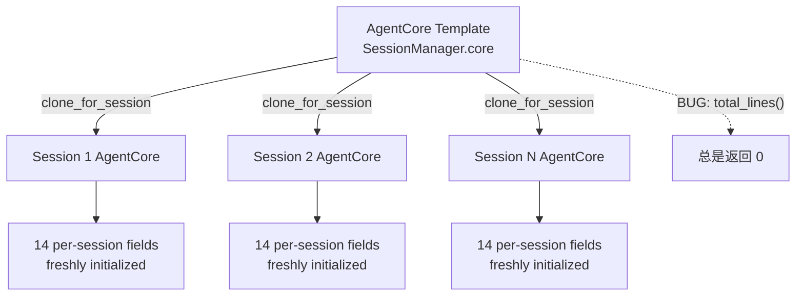

# AgentCore 会话字段泄漏分析报告

> **日期**: 2025-07-15  
> **审查者**: Senior Software Engineer @ AgentCowork.AI  
> **严重级别**: 🔴 高 — 架构缺陷 + 潜在并发数据泄漏  
> **文件**: `core/acowork-runtime/src/agent/agent_core.rs`

---

## 1. 问题概述

`AgentCore` 的文档注释声称它是：

```rust
//! `AgentCore` holds all resources that are shared across sessions:
//! runtime config, manifest, LLM provider, tool registry, streaming channel,
//! Gateway model capabilities, and Grafeo memory store. These resources
//! persist for the lifetime of the agent process and are independent of
//! any individual session.
```

**但这与实际情况不符。** `AgentCore` 中混入了 **14 个会话级别（per-session）**的字段。这些字段通过 `clone_for_session()` 在每次创建新会话时被复制，但它们在结构上仍然属于 `AgentCore`，导致以下问题：

1. **语义混乱**：无法从结构体定义区分哪些是真正的全局共享字段
2. **`SessionManager::total_lines()` Bug**：读取的是模板 core 的 `total_lines`（永远为 0），而非实际会话数据
3. **生命周期模糊**：字段的初始化分散在 3 个不同位置（`new` / `clone_for_session` / `SessionTask::new`）

---

## 2. 字段分类

### 2.1 真正的 Agent 级别字段（✅ 正确放置）

| 字段 | 类型 | 共享方式 |
|------|------|----------|
| `config` | `RuntimeConfig` | `clone()` |
| `manifest` | `AgentManifest` | `clone()` |
| `provider` | `Arc<dyn Provider>` | `Arc::clone()` |
| `tools` | `Vec<Arc<dyn Tool>>` | `clone()` |
| `mcp_tools` | `Option<Vec<Arc<dyn Tool>>>` | `clone()` |
| `all_tools` | `Vec<Arc<dyn Tool>>` | `clone()` |
| `global_provider_list` | `Arc<RwLock<Vec<ProviderListItem>>>` | `Arc::clone()` |
| `provider_list_version` | `u64` | Copy |
| `provider_key_vault` | `Arc<RwLock<HashMap<String, String>>>` | `Arc::clone()` |
| `provider_compact_models` | `HashMap<String, Option<String>>` | `clone()` |
| `temperature_override` | `Option<f32>` | Copy |
| `system_prompt_override` | `Option<String>` | `clone()` |
| `memory_store` | `Option<Arc<GrafeoStore>>` | `Arc::clone()` |
| `memory_session` | `Option<Arc<MemorySessionHandle>>` | `Arc::clone()` |
| `embedding_provider` | `Option<Arc<dyn EmbeddingProvider>>` | `Arc::clone()` |
| `metrics_aggregator` | `Arc<Mutex<MetricsAggregator>>` | `Arc::clone()` |
| `consolidation_scheduler` | `Option<Arc<ConsolidationScheduler>>` | `Arc::clone()` |
| `consolidation_bg_task` | `Option<ConsolidationBgTask>` | Template only |
| `approval_gate` | `Option<Arc<dyn ApprovalGate>>` | `Arc::clone()` |
| `shell_approval_threshold` | `ShellApprovalThreshold` | Copy |
| `streaming_lines` | `StreamingStateMap` | `Arc::clone()` (keyed by session_id) |
| `debug_observer` | `DebugObserverSlot` | Fresh per session (by design) |

### 2.2 会话级别字段（🔴 不应该在 AgentCore 中）

| 字段 | 初始化位置 | 生命周期 | 风险等级 |
|------|-----------|----------|----------|
| `session_id` | `clone_for_session` | Per-session | 🟡 |
| `chunk_tx` | `clone_for_session` | Per-session | 🔴 |
| `notify_enabled` | `clone_for_session` (默认 false); `SessionTask.run()` 通过 EnableNotify 设为 true | Per-session | 🔴 |
| `last_notify_ts` | `clone_for_session` (初始化为 0) | Per-session throttle | 🟡 |
| `total_lines` | `clone_for_session` (初始化为 0)，首次使用时惰性初始化 | Per-session JSONL | 🔴 |
| `committed_lines` | `clone_for_session` (从 SessionManager 传入) | Per-session | 🟡 |
| `streaming_flush_count` | `clone_for_session` (初始化为 0); 每次 `consume_stream` 重置 | Per-stream / Per-session | 🟡 |
| `urgent_stop` | `clone_for_session` (每次创建新的 Notify) | Per-session | 🟡 |
| `status_tx` | `SessionTask::set_status_tx()` (在 clone_for_session 后设置) | Per-session | 🟡 |
| `snapshot_slot` | `SessionTask::set_snapshot_slot()` (在 clone_for_session 后设置) | Per-session | 🟡 |
| `retry_session_status` | `SessionTask::new()` (在 clone_for_session 后设置) | Per-session | 🟡 |
| `retry_wait_handle` | `SessionTask::new()` (在 clone_for_session 后设置) | Per-session | 🟡 |
| `current_work_dir` | `clone_for_session` (默认 config.work_dir); `SessionTask` 通过 SetWorkDir 更新 | Per-session | 🟡 |
| `approval_handle` | `AgentLoop::new_with_observer()` → `core.approval_handle = Some(...)` | Per-session | 🟡 |

---

## 3. 已确认的 Bug

### 🔴 Bug 1: `SessionManager::total_lines()` 永远返回 0

**位置**: `session_manager.rs:1243-1244`

```rust
pub fn total_lines(&self) -> usize {
    self.core.total_lines.load(std::sync::atomic::Ordering::Relaxed)
}
```

`self.core` 是 `SessionManager` 持有的 **模板 AgentCore**（`Arc<AgentCore>`），它的 `total_lines` 永远不会被更新。每个会话在 `clone_for_session()` 中获得自己的 `total_lines: Arc::new(AtomicUsize::new(0))`，写入只发生在 per-session clone 上。

**影响**: CLI 模式 `cli.rs:2978` 调用 `session_manager.total_lines()` 来获取 JSONL 行数，**实际永远得到 0**。这会破坏 CLI 的 `read_messages_since` 回退逻辑。

### 🟡 Bug 2: `get_committed_lines()` 冷启动覆盖

**位置**: `agent_core.rs:688-706`

```rust
fn get_committed_lines(&self, session_id: &str) -> usize {
    let cached = self.committed_lines.load(Ordering::Relaxed);
    if cached > 0 {
        return cached;
    }
    // Cold start: scan file once to initialize.
    let count = self.current_work_dir.as_ref().map(|wd| { ... }).unwrap_or(0);
    self.committed_lines.store(count, Ordering::Relaxed);
    count
}
```

这个方法存在竞态：在冷启动扫描和 `store` 之间，writer 线程可能已经向 `committed_lines` 写入了正确的值。`store(count, Relaxed)` 会覆盖 writer 线程写入的真实值。虽然对于新会话（writer 尚未启动）这种竞态不太可能触发，但如果是会话恢复场景（writer 已经启动），就可能发生。

### 🟡 Bug 3: `get_total_lines()` 有同样的竞态

**位置**: `agent_core.rs:659-676`

与 Bug 2 同理，`get_total_lines` 的冷启动扫描也可能覆盖 `flush_streaming_line` 中的 `fetch_add`。

---

## 4. 架构问题分析

### 4.1 `clone_for_session` 是一个反模式



`clone_for_session` 在 1095 行处有 60+ 行的手动字段复制。每次向 `AgentCore` 添加新字段时，开发者必须记得在 `clone_for_session` 中正确处理它——是共享（`Arc::clone`）还是重新创建（`Arc::new`）。这极易出错。

### 4.2 初始化分散在三个位置

会话级别字段的初始化分散在：

1. **`AgentCore::new()` / `new_with_observer()`** (行 223-262): 创建默认值
2. **`AgentCore::clone_for_session()`** (行 1095-1152): 覆盖为 per-session 值
3. **`SessionTask::new()`** (行 384-506): 再次覆盖 `retry_session_status`、`retry_wait_handle`、`current_work_dir`、`status_tx`、`snapshot_slot` 等

这意味着要理解一个字段的最终值，必须追踪 3 个不同的位置。

### 4.3 `SessionManager` 与 `AgentCore` 职责重叠

`SessionManager` 已经维护了 per-session 的映射：

```rust
// session_manager.rs
urgent_stops: HashMap<String, Arc<Notify>>,              // ← 与 AgentCore.urgent_stop 重复
session_committed_lines: HashMap<String, Arc<AtomicUsize>>, // ← 与 AgentCore.committed_lines 重复
```

但 `AgentCore` 仍然保有这些字段的副本，导致双重簿记。

---

## 5. 并发安全分析

### 5.1 当前的安全保障

目前，由于 **每个会话有自己的 `AgentLoop`**（其中包含自己的 `AgentCore`），且 `AgentLoop` 运行在独立的 tokio task 中，这些 per-session 字段不会跨会话共享。`Arc<Atomic*>` 的使用仅在同一会话的 `AgentLoop` 和 writer 线程之间共享——这是正确的。

**只要 `clone_for_session` 为每个会话创建独立的 `Arc`，就不会发生跨会话数据泄漏。**

### 5.2 潜在的未来风险

如果未来有人错误地将 per-session 字段改为 `Arc::clone()` 而非 `Arc::new()`（例如从一个会话 clone 到另一个会话而非从模板 clone），就会导致两个会话共享相同的计数器/状态，造成严重的数据错乱。

---

## 6. 修复建议

### 方案 A: 引入 `SessionCore` 结构体（推荐）

将会话级别字段提取到新的 `SessionCore` 结构体中：

```rust
/// Per-session state that lives alongside AgentCore in AgentLoop.
pub struct SessionCore {
    pub(crate) session_id: Option<String>,
    pub(crate) chunk_tx: Option<mpsc::Sender<SessionChunkEvent>>,
    pub(crate) notify_enabled: Arc<AtomicBool>,
    pub(crate) last_notify_ts: Arc<AtomicI64>,
    pub(crate) total_lines: Arc<AtomicUsize>,
    pub(crate) committed_lines: Arc<AtomicUsize>,
    pub(crate) streaming_flush_count: Arc<AtomicU64>,
    pub(crate) urgent_stop: Option<Arc<Notify>>,
    pub(crate) status_tx: Option<watch::Sender<SessionStatus>>,
    pub(crate) snapshot_slot: Option<Arc<RwLock<Option<SessionStateSnapshot>>>>,
    pub(crate) retry_session_status: Option<Arc<RwLock<SessionStatus>>>,
    pub(crate) retry_wait_handle: Option<RetryWaitHandle>,
    pub(crate) current_work_dir: Option<String>,
    pub(crate) approval_handle: Option<ApprovalHandle>,
}
```

`AgentLoop` 变为：

```rust
pub struct AgentLoop {
    pub(crate) core: AgentCore,       // 真正的共享状态
    pub(crate) session_core: SessionCore,  // 会话级别状态
    pub(crate) session: SessionState,
    // ...
}
```

**优点**:
- 消除 `clone_for_session` 的复杂性
- `AgentCore` 真正成为不可变的共享模板（可以放入 `Arc` 并在会话间共享引用）
- `SessionManager` 可以直接从 `SessionCore` 读取 per-session 数据，无需维护重复的 HashMap

**缺点**:
- 需要大量重构（但风险可控，因为字段访问模式已明确）

### 方案 B: 最小修复（短期缓解）

1. **修复 `SessionManager::total_lines()`**：改为从 `session_committed_lines` 读取，或接受 `session_id` 参数
2. **修复 `get_total_lines` / `get_committed_lines` 竞态**：使用 `compare_exchange` 替代 `load` + `store`
3. **添加编译期保障**：给 AgentCore 添加 `#[deprecated]` 注释或使用模块可见性限制

### 方案 C: 渐进式迁移

1. 第一步：将 `SessionCore` 作为 AgentCore 的嵌套字段引入
2. 第二步：逐个迁移字段，更新所有引用点
3. 第三步：删除 `clone_for_session`，改为 `AgentCore::new_session_core() -> SessionCore`

---

## 7. 影响范围预估

| 文件 | 受影响行数 | 变更类型 |
|------|-----------|----------|
| `agent_core.rs` | ~200 行 | 移除字段、删除 clone_for_session、新增 SessionCore |
| `session_task.rs` | ~30 行 | 改用 `session_core.xxx` 而非 `core.xxx` |
| `session_manager.rs` | ~20 行 | 修复 total_lines bug、简化 per-session 映射 |
| `loop_.rs` | ~15 行 | 新增 `session_core` 字段 |
| `loop_llm.rs` | ~5 行 | 字段访问路径更新 |
| `loop_session.rs` | ~5 行 | 字段访问路径更新 |
| `loop_tools.rs` | ~5 行 | 字段访问路径更新 |
| `cli.rs` | ~3 行 | 修复 total_lines 调用 |

---

## 8. 总结

| 维度 | 评估 |
|------|------|
| **当前正确性** | ⚠️ 基本正确（per-session 隔离依赖 `clone_for_session` 手动保证），但有 1 个确认 bug |
| **可维护性** | 🔴 差 — `clone_for_session` 是 60+ 行的手动复制，极易遗漏 |
| **语义清晰度** | 🔴 差 — 无法从结构体定义区分 agent/session 级别字段 |
| **Bug 隐患** | 🟡 中 — `SessionManager::total_lines()` 已确认失效；存在冷启动竞态 |
| **建议优先级** | **高** — 短期先修 bug，中期执行方案 A 重构 |

---

> *ADR 建议编号: 待分配*  
> *相关 ADR: ADR-021 (NewDataAvailable 通知), ADR-022 (流式行管理)*
