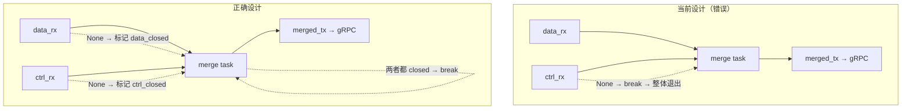
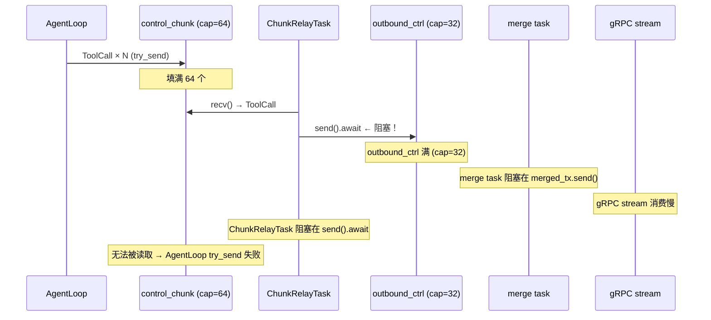

# 25 — ADR-020 数据流分级架构评审

**Date**: 2026-06-29
**Reviewer**: Senior Engineer
**Status**: 🔴 需修复（3 个设计缺陷 + 1 个实现疏漏）

## Scope

| 层级 | 文件 | 改动概要 |
|------|------|---------|
| P0 | `core/acowork-gateway/src/http/workspaces.rs` | `read_file` / `read_raw_file` 加 `spawn_blocking` |
| P0 | `core/acowork-gateway/src/cli.rs` | worker_threads 4→8，引用 `DataFlowConfig` |
| P0 | `core/acowork-gateway/src/config.rs` | 新增 `DataFlowConfig` 子结构体 |
| P0 | `core/acowork-runtime/src/config.rs` | 新增 `DataFlowConfig` 子结构体 |
| P0 | `core/acowork-gateway/src/gateway/mod.rs` | Bridge/capability channel 容量引用 config |
| P0 | `core/acowork-gateway/src/grpc/server.rs` | gRPC outbound/IPC push 容量引用 config |
| P0 | `core/acowork-runtime/src/startup/agent_init.rs` | on_chunk/control_chunk 容量引用 config |
| P0 | `core/acowork-runtime/src/grpc/client.rs` | outbound 容量引用 config + merge_outbound_channels |
| P1 | `core/acowork-runtime/src/agent/agent_core.rs` | `push_enabled` 开关，`try_send_chunk` 加过滤 |
| P1 | `core/acowork-runtime/src/agent/session/session_task.rs` | `EnablePush` / `DisablePush` 消息处理 |
| P1 | `core/acowork-runtime/src/cli.rs` | `activate_session` 开启推送，`deactivate_session` 关闭 |
| P1 | `core/acowork-gateway/src/http/chat.rs` | `POST /sessions/{id}/deactivate` + WebSocket biased select |
| P2 | `core/acowork-gateway/src/gateway/mod.rs` | Bridge Channel 拆分为 data + ctrl |
| P2 | `core/acowork-gateway/src/grpc/dispatch.rs` | 按事件类型路由到不同 bridge channel |
| P2 | `core/acowork-gateway/src/http/chat.rs` | WebSocket handler biased select 双 channel |
| P2 | `core/acowork-gateway/src/ipc/server.rs` | IPC dispatch 按事件类型路由 |
| P2 | `core/acowork-runtime/src/startup/subsystems.rs` | ChunkRelayTask 双 channel 消费 + relay_chunk_event 路由 |
| P2 | `core/acowork-runtime/src/startup/agent_init.rs` | 创建 on_chunk + control_chunk 双 channel |
| P2 | `core/acowork-runtime/src/grpc/client.rs` | 暴露 `outbound_data_sender()` / `outbound_ctrl_sender()` |

## 整体判断

**ADR-020 的架构方向是正确的**——事件分级（L1/L2/L3/L4）、按需推送（P1）、双通道隔离（P2）都是合理的设计决策。但存在 **3 个设计级缺陷**，在 LLM streaming 高频场景下会形成级联故障。

---

## 一、设计正确之处

### 1.1 事件分级抽象（L1/L2/L3/L4）

```
L1 数据流（可丢弃）  → 高容量 channel + try_send
L2/L3 控制流（必须送达）→ 独立 channel + 阻塞 send
```

这个分层与消息系统的 QoS 模型一致，解决了 ADR-014 遗留的"控制流被数据流饿死"问题。

### 1.2 Gateway 侧 WebSocket biased select

```rust
tokio::select! {
    biased;
    ctrl_event = bridge_ctrl_rx.recv() => { ... }  // 最高优先级
    data_event = bridge_data_rx.recv() => { ... }   // 次优先级
    msg = socket.recv() => { ... }                   // 最低优先级
}
```

即使 L1 数据洪水般涌入，控制事件和用户输入也不会被饿死。这是正确的优先级反转防护。

### 1.3 Session 级 push_enabled 方向正确

后台 session 不应该消耗 channel 带宽。从"全量推"到"按需推"的转变是合理的架构演进。

---

## 二、设计缺陷

### 🔴 缺陷 #1：`merge_outbound_channels` 的退出语义错误

**位置**：`core/acowork-runtime/src/grpc/client.rs:1369-1401`

**当前代码**：

```rust
async fn merge_outbound_channels(
    mut data_rx: Receiver<ClientMessage>,
    mut ctrl_rx: Receiver<ClientMessage>,
    merged_tx: Sender<ClientMessage>,
) {
    loop {
        tokio::select! {
            biased;
            msg = ctrl_rx.recv() => {
                match msg {
                    Some(m) => { merged_tx.send(m).await; }
                    None => break,  // ← 一个通道关闭 → 整体退出
                }
            }
            msg = data_rx.recv() => {
                match msg {
                    Some(m) => { merged_tx.send(m).await; }
                    None => break,  // ← 同上
                }
            }
        }
    }
}
```

**问题**：这是两个独立通道合并为一个的逻辑。任意一个通道关闭意味着"该通道的生产者已全部退出"，但**另一个通道可能还有活跃的生产者**。当前设计将"部分完成"错误地等同于"全部完成"。



**这不是实现疏漏，是设计缺陷**——merge 语义本身就应该是"两个都关闭才退出"。

**修复方向**：

```rust
async fn merge_outbound_channels(...) {
    let mut data_closed = false;
    let mut ctrl_closed = false;
    loop {
        if data_closed && ctrl_closed { break; }
        tokio::select! {
            biased;
            msg = ctrl_rx.recv(), if !ctrl_closed => {
                match msg {
                    Some(m) => { let _ = merged_tx.send(m).await; }
                    None => { ctrl_closed = true; }
                }
            }
            msg = data_rx.recv(), if !data_closed => {
                match msg {
                    Some(m) => { let _ = merged_tx.send(m).await; }
                    None => { data_closed = true; }
                }
            }
        }
    }
}
```

---

### 🔴 缺陷 #2：ChunkRelayTask 的阻塞 send 造成背压级联

**位置**：`core/acowork-runtime/src/startup/subsystems.rs:316-513`

**问题链路**：



**根因**：ChunkRelayTask 同时承担了"读取上游"和"写入下游"两个职责。当写入下游阻塞时，读取上游也被阻塞。ADR-020 将事件分为 L1（可丢弃）和 L2/L3（必须送达），但对"必须送达"的实现方式是阻塞 `send().await`，**没有考虑阻塞对读取侧的级联影响**。

**这是设计缺陷**：读写耦合在同一个 task 中。正确的设计应该将读写分离：

```
方案 A：读写分离为两个 task
┌──────────────┐     mpsc(64)     ┌──────────────┐
│  read_loop   │ ───────────────→ │  write_loop  │
│ 只从上游读   │                  │ 只向下游写   │
│ try_recv     │                  │ send_timeout │
└──────────────┘                  └──────────────┘

方案 B：使用 send_timeout + 重试
将 send().await 替换为 send_timeout(Duration::from_millis(100))
+ 小延迟重试，不阻塞读取循环
```

**修复方向**（推荐方案 A）：

```rust
// subsystems.rs — 将 ChunkRelayTask 拆分为 reader + writer
let (bridge_tx, bridge_rx) = mpsc::channel::<SessionChunkEvent>(64);

// Reader task: 只负责从 chunk_rx/control_chunk_rx 读取
tokio::spawn(async move {
    while let Some(event) = read_next_event(&mut chunk_rx, &mut control_rx).await {
        let _ = bridge_tx.send(event).await; // 内部 channel，不会满
    }
});

// Writer task: 只负责写入 outbound，内部做超时+重试
tokio::spawn(async move {
    while let Some(event) = bridge_rx.recv().await {
        relay_with_retry(&outbound_data_tx, &outbound_ctrl_tx, event).await;
    }
});
```

---

### 🟡 缺陷 #3：push_enabled 的静默失败 + 激活生命周期不完整

**位置**：`core/acowork-runtime/src/agent/agent_core.rs:348-377`

**问题 3a — 静默失败**：

```rust
pub fn try_send_chunk(&self, event: ChunkEvent) -> bool {
    let is_control = event.is_control();
    if !is_control && !self.push_enabled.load(Ordering::Relaxed) {
        return false;  // ← 静默返回 false，无日志
    }
    // ...
}
```

调用方（`loop_llm.rs:142-145`）的日志是：

```rust
if !self.core.try_send_chunk(ChunkEvent::Delta(chunk.clone())) {
    tracing::debug!("on_chunk channel full or closed, dropping delta");
}
```

**日志消息与实际原因不符**。当 `push_enabled=false` 时，channel 既没有 full 也没有 closed，而是被主动过滤。这导致问题诊断时被误导——最初看到 "channel full or closed" 会去排查 channel 容量问题，而实际是 push_enabled 未激活。

**问题 3b — 激活生命周期与消息处理脱节**：

```
前端时序：
  1. create_session  → 新 session 创建
  2. switchSession   → 前端切换到新 session
  3. activate_session → 激活的是旧 session！（时序 bug）
  4. chat_message    → 发到新 session（push_enabled=false）

正确的生命周期绑定：
  chat_message 到达 → 自动激活 push（或返回错误）
```

当前设计将激活责任完全推给前端，但前端和 Runtime 之间的时序无法保证。正确的设计应该是：

```
方案 A：chat_message 到达时自动激活 push
  → 无需前端显式 activate，消息到达即激活

方案 B：chat_message 到达时检查 push_enabled，若 false 则返回错误
  → 前端必须显式 activate 后才能发消息，否则收到明确错误
```

**修复方向**（推荐方案 A）：

在 `cli.rs` 的 `chat_message` 处理中，发送消息给 SessionTask 之前，先发送 `EnablePush`：

```rust
// cli.rs — handle_chat_message 中
"chat_message" => {
    // 自动激活 push（P1 生命周期绑定）
    session_manager.enable_push(&session_id).await;
    // 然后发送消息
    session_manager.send_chat_message(&session_id, content, message_id).await;
}
```

---

## 三、实现疏漏

### 🟢 疏漏 #1：activate_session 激活了错误的 session

**位置**：`apps/acowork-desktop/src/stores/agentStore.ts`

**现象**：
- Gateway log line 814：前端 activate 的是 `20260628_233455_46fe47`（旧 session）
- Runtime log line 162：chat_message 发到 `20260629_205154_212548`（新 session）

**根因**：`switchSession` 中先创建新 session，但 activate 请求的 `session_id` 指向了旧 session。这是前端时序问题，属于实现 bug，非架构缺陷。

---

## 四、修复优先级

| 优先级 | 缺陷 | 影响 | 修复复杂度 | 建议 |
|--------|------|------|-----------|------|
| **P0** | #3 push_enabled 静默失败 | 前端完全无响应 | 低（~10 行） | chat_message 到达时自动 EnablePush |
| **P1** | #2 ChunkRelayTask 阻塞级联 | 控制事件被丢弃 | 中（~80 行） | 读写分离为两个 task |
| **P1** | #1 merge 退出语义 | 单通道关闭导致数据丢失 | 低（~20 行） | 改为双关闭才退出 |
| **P2** | #4 activate 错误 session | 旧 session 被意外激活 | 低（前端修复） | 修复 switchSession 时序 |

---

## 五、总结

ADR-020 的分层架构设计方向正确，但 **分层之间的耦合关系没有被充分分析**：

| 层 | 职责 | 耦合问题 |
|----|------|---------|
| AgentLoop → ChunkRelayTask | 事件生产 → 事件消费 | ✅ 解耦正确（mpsc channel） |
| ChunkRelayTask 内部 | 读上游 + 写下游 | 🔴 **读写耦合**（缺陷 #2） |
| ChunkRelayTask → gRPC | 事件中继 → 网络发送 | ✅ 解耦正确（mpsc channel） |
| merge_outbound_channels | 双通道合并 | 🔴 **退出语义错误**（缺陷 #1） |
| push_enabled 控制 | 推送开关 | 🟡 **生命周期脱节**（缺陷 #3） |

**核心教训**：在异步数据流架构中，任何 `send().await` 阻塞点都必须分析其对上游读取循环的背压影响。当读写在同一 task 中时，下游阻塞 = 上游饿死。
