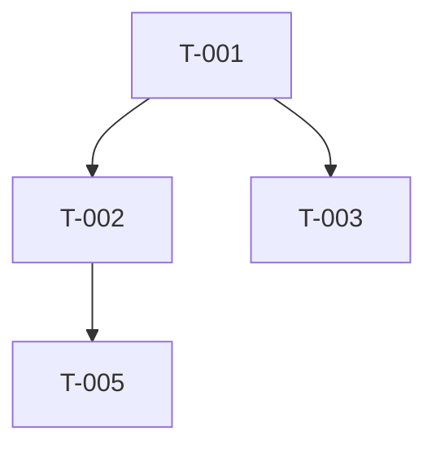

# Task Decomposition Skill

## Core Rule

Do not decompose vague scope. Start from an approved PRD, design, milestone, or clearly stated goal with acceptance criteria.

Each task must be small enough to complete, review, and verify independently.

## Execution Steps

1. **Confirm source of truth**
   - Use `memory_recall` to retrieve PRD, prior breakdowns, decisions, velocity, estimation accuracy, and constraints
   - Use `file_read` to inspect requirements, architecture/design docs, backlog, and existing plans
   - Confirm goal, in-scope items, non-goals, acceptance criteria, and required delivery date
   - If the source has unresolved scope questions, stop and ask before decomposing

2. **Map deliverables and boundaries**
   - Identify epics, workstreams, milestones, and acceptance outcomes
   - Apply MECE: work items should be mutually exclusive and collectively cover the goal
   - Include engineering, QA, documentation, release, security, operations, stakeholder review, and rollout work
   - Define boundaries so each task has one clear owner and output

3. **Create actionable tasks**
   - Use action verbs and concrete deliverables
   - Target 0.5-3 days per task; split anything larger
   - Add Definition of Ready and Definition of Done
   - Add verification method: test, review, demo, document, deployment check, or stakeholder approval
   - Avoid vague tasks like "handle edge cases" or "finish integration"

4. **Estimate with uncertainty**
   - Use historical velocity from `memory_recall` when available
   - Use three-point estimation for uncertain work: Optimistic, Most Likely, Pessimistic
   - Calculate expected effort with PERT: `(O + 4M + P) / 6`
   - Apply utilization factor for meetings, review, support, and context switching
   - Add explicit contingency for high-uncertainty or external dependency work

5. **Sequence dependencies**
   - Map dependency types: Finish-to-Start, Start-to-Start, Finish-to-Finish
   - Identify critical path and parallelizable work
   - Mark external dependencies, approval gates, integration points, and risky sequencing assumptions
   - Do not schedule dependent implementation before prerequisite decisions or designs are ready

6. **Self-review and handoff**
   - Check that every requirement maps to at least one task
   - Check every task has owner role, estimate, dependency, priority, and Done criteria
   - Check no task hides multiple unrelated concerns
   - Use `file_write` to save the breakdown when requested
   - Use `memory_store` to persist task structure, estimates, assumptions, and dependency decisions

## Output Format

```markdown
# Task Breakdown: [Project/Milestone Name]

## Overview
- **Goal**: [What will be delivered]
- **Source of truth**: [PRD/design/backlog path]
- **Scope**: [Included]
- **Non-goals**: [Excluded]
- **Total estimated effort**: [person-days/story points]
- **Confidence**: [High/Medium/Low and why]

## Workstreams
| Workstream | Outcome | Owner Role |
|------------|---------|------------|
| ... | ... | ... |

## Task List
| ID | Task | Owner Role | Priority | Estimate | Dependencies | DoR | DoD | Verification | Status |
|----|------|------------|----------|----------|--------------|-----|-----|--------------|--------|
| T-001 | [Actionable task] | [Role] | Must | 2d | — | [Ready criteria] | [Done criteria] | [Test/review/demo] | Not Started |

## Dependency Graph


## Critical Path
T-001 → T-002 → T-005 ([X] days)

## Requirement Coverage
| Requirement | Covered By Tasks | Gaps |
|-------------|------------------|------|
| REQ-001 | T-001, T-002 | None |

## Risks and Assumptions
| Item | Type | Impact | Mitigation |
|------|------|--------|------------|
| ... | ... | ... | ... |

## Self-Review
- [x] All requirements mapped
- [x] Each task has one owner role
- [x] Each task has DoR, DoD, and verification
- [x] Critical path identified
- [x] External dependencies visible
```

## Red Flags

Stop and revise if you see:

- Task larger than 3 days without reason
- Task without verification method
- Multiple owners for one task
- Hidden dependency on an unresolved decision
- No task for testing, docs, rollout, or stakeholder review
- Critical path not identified
- Requirements not mapped to tasks
